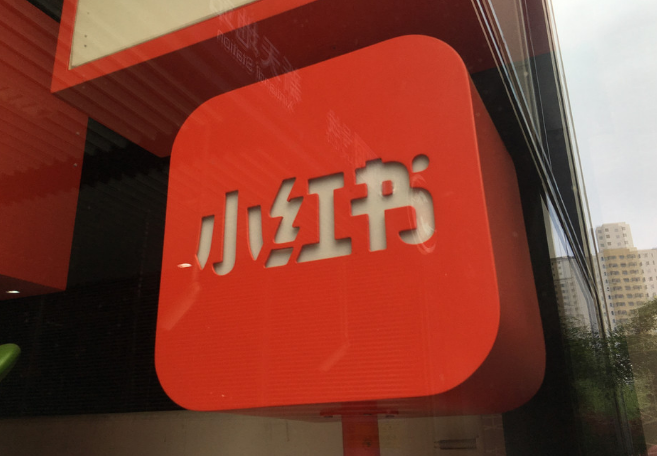

# 一线｜小红书COO柯南：小红书电商起源于人，挑战是节奏和产品链路

腾讯新闻 《一线》作者 张小珺

“这个产品已经非常复杂了。”在近日小红书首次link电商伙伴周的媒体沟通会上，小红书COO柯南谈到小红书作为社区运营电商的细节和思考。

首先，相比一些其他平台电商起源于货，小红书电商起源于人。

柯南称，小红书买手，要做的第一件事是在这个社区找到用户和粉丝——因此，用户是一切的原点。与之相对的是，市场上更多电商起源于货，通过商品价格或产品力反过来把它售卖给广大用户。

差异在于，若是前者，小红书买手要做的是理解用户细分需求，通过需求找到购物场景——需要什么样的价值和东西？区别于站外，它不一定是广大人民群众都知道的硬通货，核心优势也不仅仅是价格。买手是根据用户需求，呈现出价格背后的价值——包括功能、专业、审美、风格、个性化独特设计等，需要通过人的讲解、展示更好传递给粉丝和用户。

其次，在他们的生态里，两个颗粒度最重要：1、个体；2、商家和平台。而经营链路没有标准答案。

柯南说，很多小红书买手不是全职买手，这类买手是非职业/半职业，他们可能周一到周五要工作，直播频次是一周一次或者一周两次。对于他们，日常笔记内容很重要，是积累粉丝到底对什么感兴趣的过程，而后帮他们选品，周末直播连接用户和售卖。

还有一类是商家，他们可能进来不发内容直接开播，原因是他们有具有人设的主理人，这个主理人开直播，人设感和真实性比发笔记、拍图文更真实有效。

第三，社区型产品做电商挑战是，业务节奏和产品链路。

柯南接着说，社区相对内容平台更考虑个体，做社区产品的一个长久挑战是，在人群越来越多元的过程中，怎么样融合不一样的人群？在这个基础上，社区的用户价值去链接交易价值。“对于我们来说，（交易价值）跟用户价值的丰富度是最不冲突的。”原因就是“让大家买到”是顺着用户需求提供价值。

“这个产品已经非常复杂了。”她提到社区做电商有两个挑战：其一是节奏。

“小红书作为一个APP，不管是产品框架还是内容丰富性上是蛮复杂的，包括它是双列，有信息流，也有搜索流。”据他们观察，大多数男性用户刚开始用小红书不用信息流，而是用搜索，先把它当一个搜索引擎；“还有用户觉得我们是年轻人的搜索指南”。所以，在这么复杂的产品上怎么把用户的购买链路和交易链路嫁接进去？怎么有节奏地服务更不一样人群的扩张、人群价值的扩张？

其二是产品链路，要保证产品不要太复杂。“我们要解决的是让很多用户在这里买东西，但是找不到购物车。直播入口在哪里？有没有一个固定的直播入口？我们又不想持续在什么底部、顶部塞更多东西。因为今天已经很复杂了。”柯南称。

