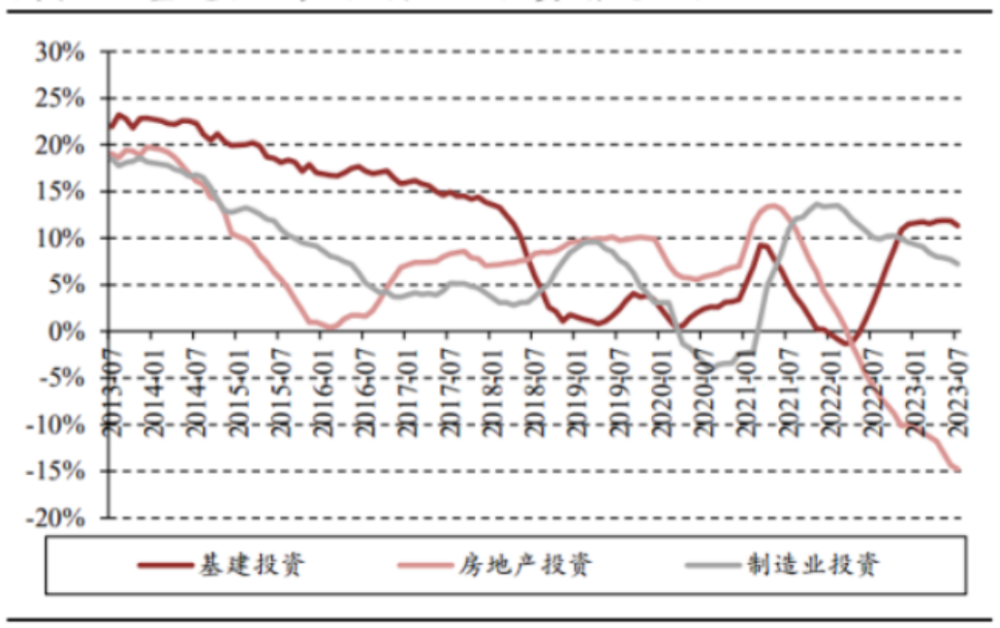

# 三家子公司的公开信，揭开平安系的基建投资野心

_图源：视觉中国_

特约作者 | 温世君

编辑 | 陈弗也

出品 | 棱镜·腾讯小满工作室

公开对战，平安建设、平安建投、平安银行三家“内讧”，让巨型非国有资本集团平安系再次成为热点。

8月21日，平安建设集团有限公司（以下简称“平安建设”）发布“严正声明”，8月16日，他们发现，其全资子公司杭州平康建设有限公司（以下简称“杭州平康”）名下多个账户合计1.8亿元现金，被原财务总监（声明称已“失联”）等人“未经该公司合规报批流程”，集中调到平安银行账户中。

该声明表示，由于上述银行账号的网银盾被原财务总监等人控制，平安建设要求注销，并申请新的网银盾。但此过程中不仅出现“无关人员抢夺资料的行为”，而且在平安建设“员工果敢出手将资料夺回，再次继续办理”后，遭到了平安银行杭州分行的“无故拖延”，这导致1.8亿人民币滞留该行无法使用。

两天后，平安建设再次发布“严正声明”，指责平安银行与平安建设投资有限公司（以下简称“平安建投”）“互相勾结”，声称平安银行之所以拖延为其办理网银盾业务，是因为要为其兄弟单位平安建投争取诉讼保全时间。

根据该声明，8月22日，平安银行接到了上海中级人民法院的诉讼保全裁定，冻结了杭州平康和平安建设的2.6亿资金，此后，平安银行才恢复对平安建设的业务办理。

此后，平安银行、平安建投发布声明予以回应。平安银行回应称，他们在办理相关公司业务时，发现客户身份存疑，依据司法指令对相关账户依法冻结；平安建投则表示，平安建设的声明“歪曲事实、以偏概全，严重误导市场公众”，已向公安部门、市场监督管理局报案。

三家“平安”出演了一场罗生门，撕开了平安系资本版图的一角。

**退股纠纷，双方对簿公堂**

与平安银行、平安建投相比，平安建设并非平安系嫡系，双方的纠纷从去年就已开始。

根据平安建投的声明，2020年9月，平安建投入股鲲鹏建设（鲲鹏控股下属公司，后更名为“平安建设”），持有48%股权。去年7月，平安建投向鲲鹏控股提出股权退出计划，但双方一直未就退出价格等条件达成一致。

鲲鹏控股持有平安建设49%的股权，鲲鹏控股的实控人毛晨阳担任平安建设的总经理。

_图：平康建设、平安建设、平安建投所涉及的股权结构图，来源：作者绘制_

声明内容显示，近一年来，双方在公司治理层面的矛盾开始暴露。平安建投称，毛晨阳非法掌控平安建设的公章、证照，擅自变更杭州平康的法人及财务负责人，试图非法转移杭州平康在平安银行杭州分行账户的1.8亿元资金。

查询上海市第一中级人民法院开庭公告可以得知，平安建投起诉鲲鹏控股、平安建投起诉平康建设与平安建设的两次诉讼，将于9月5日、10月24日开庭。

平安建投和平安建设的这段“联姻”时间并不长。

2020年9月19日，平安建投和鲲鹏建设正式签署股权合作协议。9月27日，鲲鹏建设完成股东工商变更，平安建投持股48%成为第二大股东。

2021年4月，鲲鹏建设更名为平安建设。以平安建设实缴注册资本54517.69万元计算，平安建投实缴出资26168.49万元。

平安建投的出资金额，与平安建设在“严正声明”中提及的被法院保全冻结的“2.6亿的资金”一致。

根据公开信息，这次“内讧”发生后，有媒体向平安建设“相关负责人”询问平安建投的实际出资金额。该负责人表示：“增资款应该是有2.6亿左右，其他打了多少（款）具体我不是很清楚。”

**“联姻”背后：平安系的万亿基建野心**

此时恨未平，彼时情也深。对于平安建投和平安建设来说，这本是一场各取所需的联姻。

平安系手持几乎全部金融“牌照”，保险资金、银行理财资金规模又非常庞大，对于他们来说，基础设施建设既是资产配置的必选题，也可以抵押发债或者作为打包成投资产品的“优质底层资产”。何况，基础设施建设本身就是利润丰厚的“肥肉”。

平安官网数据显示，他们“支持国家重大基础设施项目投资，并持续加码城市轨道交通、高速公路、铁路、港口、机场、能源等领域的投资力度”；截至2022年底，平安资管在基础设施建设上的累计投资规模超4000亿，占全部投资资产规模的比重约28%。

平安建投成立于2019年12月，注册资金150亿元（实缴20亿元）。

彼时“新基建”概念风头正盛，平安也请来了基建老兵——原中国建筑总经济师、原中南建设总裁鲁贵卿，后者出任平安建投董事长兼CEO。

鲁贵卿曾公开表示，平安建投依托于平安集团的优势，以参股、控股、全资等股权投资和股债结合的灵活多样的投资方式，聚焦于基础设施领域投资、建设、运营全链条专业服务，“未来8年计划基建资产配置规模超万亿”。

当时，市场普遍认为，平安集团后续会把基建领域相关业务逐渐归拢于平安建设，打造“马明哲的万亿基建投资版图”。

投资需要的资金、运营需要的经验，平安建投都有，但万亿雄心缺一个关键角色——建设资质。

而对于鲲鹏建设来说，他们也需要投靠一棵大树。

2020年12月，平安建投和当时尚未更名的鲲鹏建设处在蜜月期，《建筑》杂志在一篇名为《从“平安建投入股鲲鹏建设”看民营建筑企业发展抉择》文章中，专访了时任鲲鹏建设董事长，也就是今天平安建设总经理的毛晨阳。

毛晨阳在采访中谈到了行业尤其是民营基础设施建设企业的普遍困境，他说：“中小建筑企业落后了，没有竞争力了，不受待见了，接活儿难了，利润薄了，甚至没有利润了，日子难过了……一批一批中小建筑企业倒下了，消失了。”

基础设施建设行业有一个说法：“一流的项目给央企，二流的项目给地方国企，三流的项目给大的民企，四流项目给中小民企，五流的项目给挂靠老板。”

毛晨阳当时说，留给中小民营建筑企业挣扎的时间不多了，关键性的时间窗口更少了，而现在正是最关键的时刻。

**你要我资质，我要你资本**

平安建投当时想要的，鲲鹏建设有；而鲲鹏建设想要的，平安建投也有。

在上述采访中，毛晨阳回顾了自己的创业史：“1993至1999年，我参与温州鹿城区8平方公里基础设施的新区建设，任新区开发总公司下属的市政工程公司总经理。2000年，新区建设完成之后……以舍弃50万元奖金的代价换取了市政公司的经营权。”

这是温州第一家改制给个人的国有企业，也就是后来的鲲鹏建设。这之后，恰逢中国迎来了基建腾飞的时代。

毛晨阳非常明白公司的优势，他说，在全国民营建筑企业中，拥有“双特双行甲”资质的企业只有十几家，鲲鹏是取得该资质的第一家企业……鲲鹏建设在铁（铁路建设）、公（公路建设）、城（城市建设）、投（投资建设）、环（环保水务）、产（产业园）五大领域都有资质。

 _图：平安建设持有的资质情况。数据来源：平安建设集团，作者制图_

平安建设官网也显示，其拥有市政公用工程施工总承包特级、建筑工程施工总承包特级、市政行业工程设计甲级、建筑行业工程设计甲级等20余项建筑业资质。

资质对于基础设施建设行业的重要性，如同金融行业的牌照，是一切的野心的前提。入股鲲鹏建设，平安建投拿到了想要的资质。

正如平安建投在2020年9月20日官方微信公众号中所言，入股鲲鹏建设后，“平安建投将正式具备建设资质，后期将发挥‘资金+资质+专业能力’优势，更加有效地参与基础设施领域的投资、建设与运营”。

时任平安建投董事长的鲁贵卿更是在签约仪式上表示：“平安建投已经基本具备了进入基建行业的基本条件”。

但对于基础设施建设来说，还有另几道硬门槛：

首先是金融工具。基础设施建设往往需要规模巨大的投资，除政府直接投资外，还要依靠非标债务、一般债券、专项债券、PPP（政府和社会资本合作）、特许经营、股权合作等金融和类金融工具来实现融资。

如今，基础设施建设不仅是工程技术问题，也是专业的金融技术问题。这是鲲鹏建设的短板，却是平安系的强项。

其次是资金或者现金流。基础设施建设经常需要施工企业垫款，而且回款周期往往较长。资金也是一个难题，正如毛晨阳在前述采访中直言：“从金融环境来看，中小民营建筑企业贷不到款，即使贷到了款，利息高达10%-12%……”

**“不再开展建投业务”**

双方合作，各取所需，平安建投看中了鲲鹏建设的资质，鲲鹏建设则是看上了平安系的金融能量。此外，平安系的品牌声誉和信任度，也是鲲鹏建设需要的。

合作完成后，鲲鹏建设从一个地方色彩浓厚的民企，变身为平安系这棵大树下的“平安建设”，更名也为其带来了增信作用。这对于依赖于不断参与招投标获得项目的基础设施建设行业，尤为重要。

不过，好景不长，去年7月，平安建投向平安建设提出了撤股。

从宏观方面看，在平安建投谋篇布局的这两年里，特别是2021年中-2022年中这段时间，国内基础设施建设投资增速动力不足。

_图：近十年基建投资、房地产投资、制造业投资增速情况，数据来源：国家统计局，中银证券绘制_

同时，由于疫情等因素带来的大面积停工，以及地方债务风险的逐渐积累和房地产行业的下行，也让基础设施建设行业进入相对的收缩周期。

2022年初，鲁贵卿在任职仅8个月后，卸任平安建投母公司平安不动产董事长。同时，市场也传出平安不动产未来半年拟裁员50%的消息。

当年5月，原银保监会印发《关于银行业保险业支持城市建设和治理的指导意见》，强调银行保险机构要按照风险可控、商业可持续原则，坚持审慎合规经营，坚决遏制新增地方政府隐性债务。

4个月后，鲁贵卿一位原中建的老部下在一篇文章中写到，此前，他们在闲谈中，鲁贵卿告诉他：由于原银保监会的要求，中国平安不再开展建投业务，他已卸任建投董事长兼CEO，改任中国平安高级顾问。未来几年，他将逐渐清闲下来，进入新的生活状态。

国家企业信用信息公示系统显示，2022 年 8 月10日，平安建投的法人代表由鲁贵卿变更为李加彬。

而平安建投的官方公众号，在此次“内讧”公告发布之前，上一次更新，还是在2022年5月31日。

