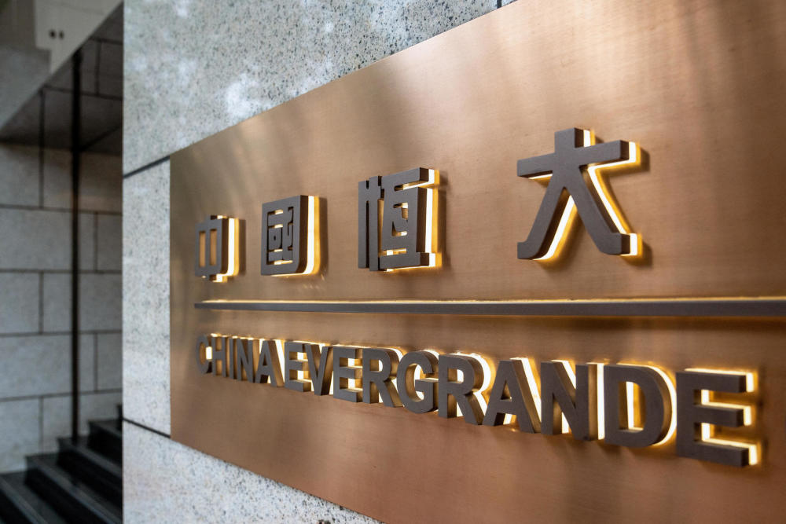

# 中国恒大解除摘牌危机：今日“踩点”复牌，停牌已超17个月

红星资本局8月27日消息， 25日晚，中国恒大（03333.HK）发布公告称已完成各项复牌指引，已向香港联交所申请于8月28日（即今日）上午9点起正式复牌。

在距离“摘牌”大限还剩不到30天时，中国恒大终于宣布复牌日期。此前，中国恒大于2022年3月21日起停牌。按照相关规定，若上市公司持续停牌18个月，港交所便有权将股份摘牌，至今中国恒大已停牌超过17个月。

**公布“累积”的多个财报**

**恒大债务或已超过万亿元**

公布财报，是恒大债务重组必不可少的一个环节，而且在面临退市红线的情况下，这一步骤已经不可拖延。

7月17日，中国恒大连续发布2021年、2022年业绩公告以及2022年中期业绩公告。

财报显示，恒大集团2021年和2022年净亏损合计超过8000亿元。特别是2021年，亏损超过6000亿元。2021年12月31日止，年度业绩公告显示，恒大集团收入为2500.1亿元，毛亏损184.5亿元；年内经营性亏损1137.5亿元，撇减发展中物业及持作出售之已完工物业、投资物业公平值亏损4049.5亿元，土地被收回有关的亏损、金融资产减值损失及其他非经营性亏损1802.0亿元，所得税抵免126.8亿元，净亏损合计6862.2亿元。

2022年12月31日止年度业绩公告显示，恒大集团收入为2300.7亿元，毛利249.9亿元；年内经营性亏损433.9亿元，土地被收回有关的亏损、金融资产减值损失及其他非经营性亏损693.7亿元，所得税开支130.5亿元，净亏损合计1258.1亿元。

在此之后，中国恒大公布了对恒大物业134亿元质押担保被执行的调查结果及补救措施。

据中新经纬报道，目前，从销售来看，恒大基本已经失去了造血能力。2022年恒大实现合约销售317亿元人民币(扣除抵款后的金额为196亿元人民币)，较2021年(4430亿元)下滑超过九成。除了完成合约义务的“保交楼”之外，只有出售资产来进行偿债。

恒大明确提到，未来三年的核心任务是保交楼，为完成这个任务预计需要2500亿-3000亿元人民币融资才能保证复工复产。这意味着恒大如果在目前债务冻结的情况下，保持正常运转，不能靠自身实现，仍需要不断有新的投入。如果恒大债务重组能够实现，则外部至少需要投入3000亿元。如此巨额的投入可能使得外部投资者“望而却步”。

总体来看，恒大目前的“窟窿”可能超过万亿元，如此巨额损失，包括许家印在内的恒大股东显然已经无法承担。在恒大失去造血能力的情况下，这需要包括境内外的债权人、购房者、个人和上下游企业，以及恒大的员工共同承担。

**澄清破产传闻**

**“恒大系”全员复牌**

8月21日晚间，中国恒大披露了一份内控评估及对前任审计师提出的某些问题检讨的主要结果公告，主要目的是完成香港联交所对其发出的额外复牌指引要求。这源于2022年8月30日，中国恒大接获联交所的额外复牌指引，具体包括管理层的诚信及/或对公司管理及运营有重大影响的任何人的诚信，或会对投资者构成风险，并损害对市场的信心，需证明没有合理的监管疑虑；同时进行独立的内部监控检讨，需证明公司已制定足够的内部监控及程式，以履行上市规则项下的责任。

日前，“恒大在美国申请破产保护”成为市场热议焦点。有消息称，中国恒大集团8月17日依据美国《破产法》第15章在位于曼哈顿的美国破产法院申请破产保护。

而8月18日，中国恒大在港交所发布澄清公告称：“公司目前正在正常按照计划推进境外债务重组。由于集团的美元债券受纽约法管辖，公司根据美国法典第11篇第15章，向美国法院申请承认香港和英属维尔京群岛(BVI)法律体系下的境外债务重组协议安排，系正常推进境外重组程序的一部分，不涉及破产申请。”

据证券时报报道，相比恒大系的两家上市公司——中国恒大、恒大汽车（00708.HK），恒大物业（06666.HK）是基本面相对较好的一家。

继6月5日一口气补发了之前所有未能按时刊发的业绩报告后，恒大物业在8月2日晚公告称，已达成所有复牌指引并于2023年8月3日复牌。8月24日，恒大物业发布的2023年中期报告显示，上半年实现收入61.45亿元，较2022年同期的57.88亿元增长6.2%，其中来自非关联方的收入占比约98.9%；净利润7.90亿元，净利率约为12.9%。

7月28日，恒大汽车成为首个复牌的恒大系上市公司。8月25日，恒大汽车发布半年报，期内恒大汽车完成了地产业务剥离，降低净负债431亿元。并将通过债转股减债173亿元。数据显示，恒大汽车上半年亏损68.7亿元，其中有10.6亿元为原地产业务亏损、37.2亿元为资产处置、资产减值等非经营性亏损，汽车业务真正的经营性亏损仅20.9亿元(当中还包括5.1亿元的借款利息，债转股落实后将不再新增)。

如果中国恒大顺利复牌，恒大系三家上市公司将全部完成复牌。公司在复牌后，是否能够扭转颓势恢复正常经营，还有待市场检验。

编辑 肖子琦

