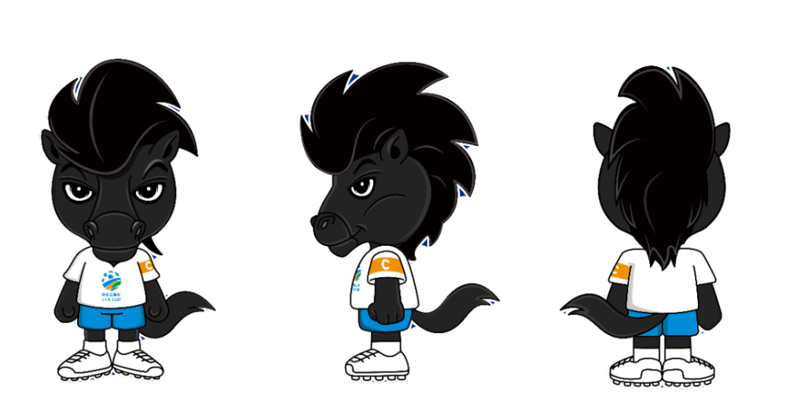
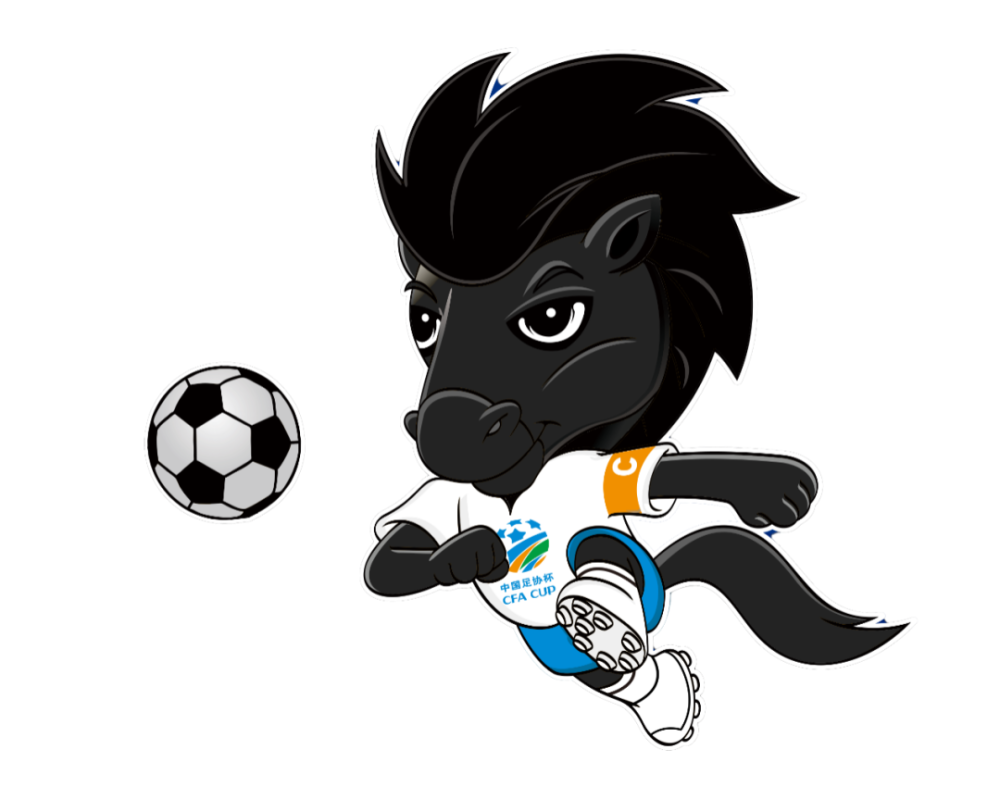

# 中国足协杯官方吉祥物“黑马队长”正式亮相

中国足协消息，8月28日，中国足协杯正式发布备受期待的官方吉祥物——“黑马队长”。在2018年末，中国足协面向社会广泛征集中国足协杯赛官方吉祥物的设计创意，汇聚了来自近百名设计师和设计公司的103份创意方案。经过精心筛选，十五份优秀作品在2019年3月8日至3月26日期间迎来了超过两万人的热情投票。在众多设计中，设计师胡仁炜创作的“小黑马”方案因其与中国足协杯赛事品牌理念的契合，脱颖而出，成为中国足协杯赛的官方吉祥物。经过适度的优化完善，这一吉祥物正式命名为“黑马队长”，即将于2023年8月30、31日的足协杯八强战赛场与球迷们见面。

