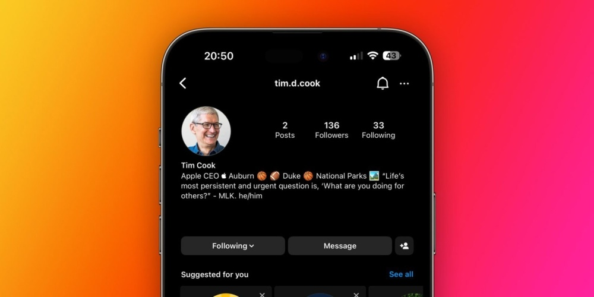
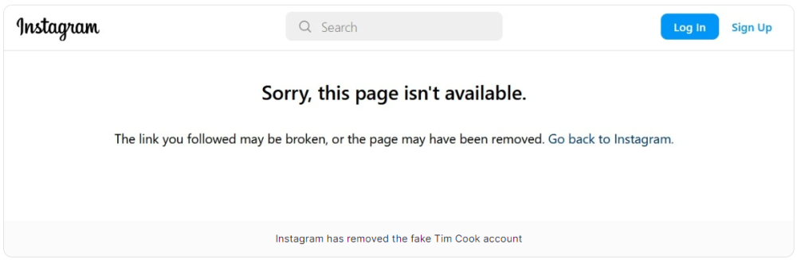

# 乌龙了！Instagram上的库克账号是假的，现已被删除

IT之家8月28日消息 苹果公司的首席执行官蒂姆・库克是一个不太喜欢活跃在社交媒体上的人，据 9to5Mac 今天早些时候报道，库克在 Instagram
上开通了个人账号，不过该账号已经被证实是冒充的。

这个账号是 @tim.d.cook，其第一条帖子发表于 8 月 20 日，是关于世界摄影日的，并附有两张用 iPhone
拍摄的照片，非常像是库克本人的发帖风格。第二条帖子发表于 8 月 23 日，展示了一个 30
秒的广告，这是苹果上周开始的一项活动的一部分，该活动旨在宣传苹果与 3DPets 的合作。3DPets 利用 iPhone 上的激光雷达和
TrueDepth 摄像头来为狗狗制作假肢，这个帖子也很像是库克会在他的 Instagram 账号上发的东西。

而事实证明，这个账号是假的，Instagram 已经删除了这个账号。

值得注意的是，苹果本身有一个官方 Instagram 帐户，用于分享用 iPhone 拍摄的照片和视频。

