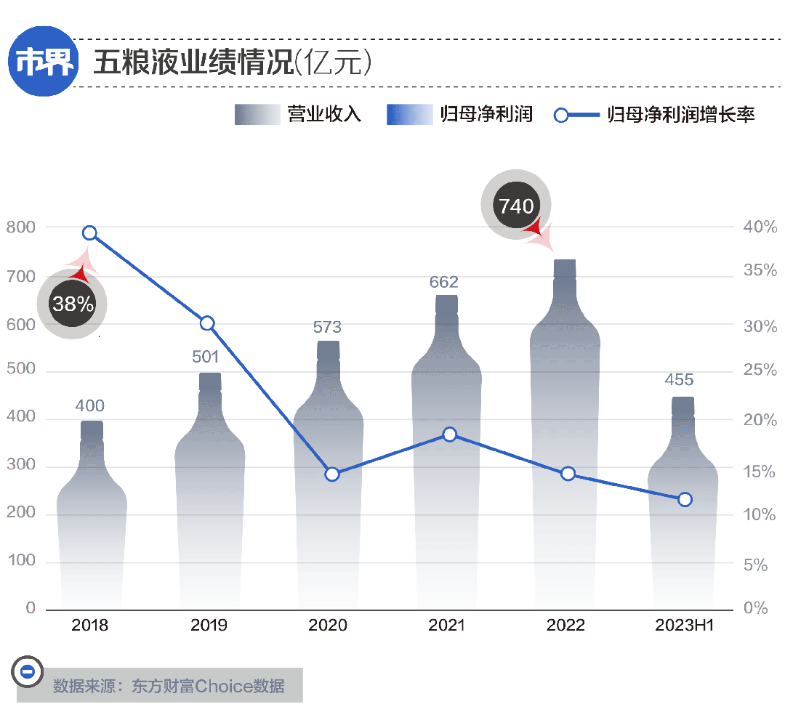
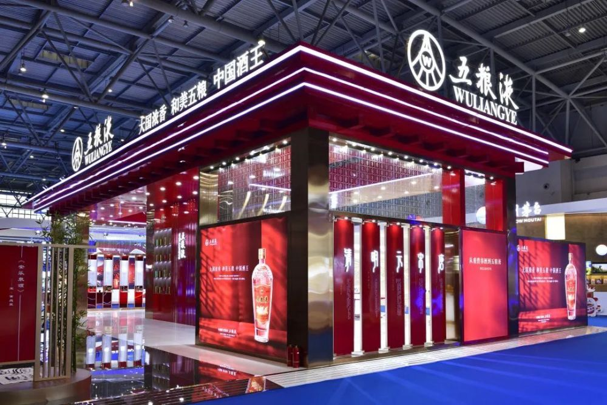
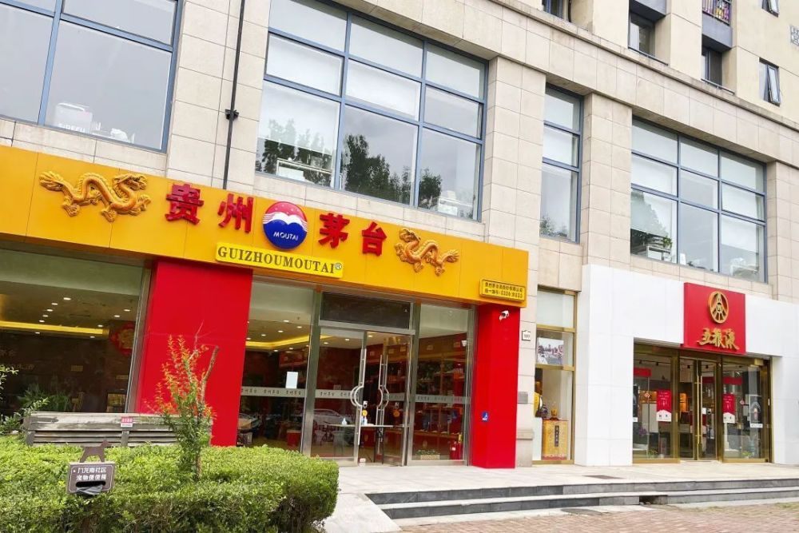
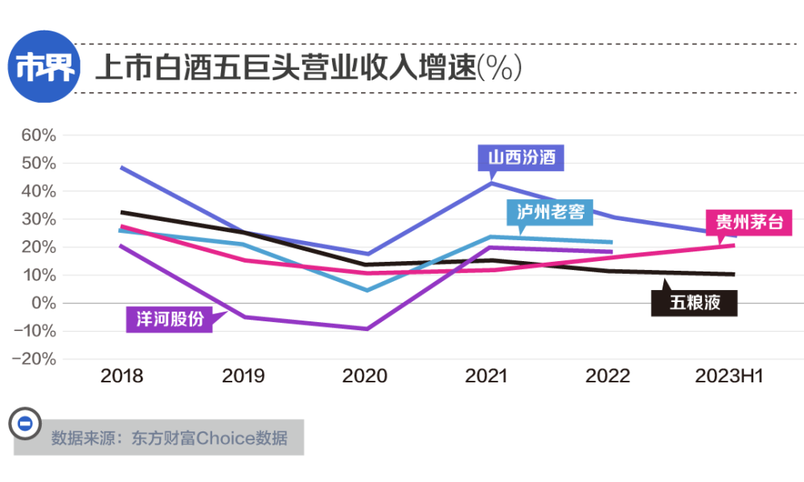

# 五粮液，离茅台越来越远

增速创7年来最低

“比不上茅台，有点失望。”五粮液公布上半年业绩后，股吧里不少股民难掩失望。

8月25日晚间，五粮液发布了半年报：2023年上半年，五粮液实现营业收入455.06亿元，同比增长10.39%；归母净利润为170.37亿元，同比增长12.83%。

虽然两位数增长看上去还可以，但拉长时间线来看，今年上半年，五粮液的营业收入与归母净利润增速，同比之下，均创下2016年以来的新低。

增速放缓，不光体现在与自己比较，与同行相比，五粮液上半年也不容乐观。

以营收规模论，在白酒上市公司五巨头——贵州茅台、五粮液、洋河股份、山西汾酒、泸州老窖中，目前发布了半年报的有贵州茅台、五粮液与山西汾酒。

2023年上半年，五粮液营收与归母净利润的增速均不如贵州茅台与山西汾酒。

从图表可以看出，从2022年开始，五粮液就成了五巨头中增速最慢的一个。而如果拆分一下上半年，2023年第二季度，五粮液的营业收入与归母净利润均同比仅增长了5.1%左右，稀释了上半年整体的增长。

在五巨头中，五粮液似乎正在掉队。

2023年以来，白酒行业处于新一轮调整期，库存高企、动销不畅以及价格倒挂成了行业比较普遍的问题。中国酒业协会理事长宋书玉此前就指出，“消化库存是2023年的主要任务”。

在5月下旬举行的股东大会上，五粮液表示：“今年五粮液的动销从年初开始持续爆发式增长，全国26个营销大区第八代五粮液的销售都实现了两位数的增长，很多大区甚至实现了20%以上的增长。公司动销旺盛，产品开瓶率也很高，所以库存消化很快。”

这句话至少说明了两点：五粮液今年以来的动销情况比去年好，但同时，渠道也存在库存压力，上半年也在消化库存。

分区域来看，上半年，五粮液在东部、西部、中部三个区域实现了营收的增长，分别同比增长了11.07%、9.22%、26.89%，但是，南部、北部区域却都在下滑，同比分别下降了8.69%、6.73%。

招商证券分析称，这说明，五粮液的区域分化进一步加剧，强势市场表现明显好于其他市场。

在持续精简之下，五粮液的产品结构历经“1+9+8”矩阵、“1+5+N”矩阵、“1+3+5”矩阵、主品牌“1+3”系列酒“4+4”矩阵等多次演变，到现在，五粮液在完善主品牌“1+3”及系列酒聚焦4个全国性战略品牌。

五粮液作为主品牌，1即千元价格带核心大单品第八代五粮液，3即超高端产品501五粮液、高端战略单品经典五粮液，以及低度五粮液与定制酒、文化酒；在系列酒品牌上，4个全国性大单品是指五粮春、五粮醇、五粮特头曲、尖庄。

在财报中，五粮液将产品分为两大阵营——五粮液产品、其他酒产品。五粮液产品就是以“1+3”为核心，而其他酒产品包括五粮浓香酒、果酒、露酒、生态酒等酒产品。

上半年，五粮液产品实现营业收入351.79亿元，同比增长10.03%；其他酒产品的营业收入为67.13亿元，同比增长2.65%。

_▲（图源/视觉中国)_

相比之下，2022年上半年，即使五粮液的核心市场华东地区受到大环境的影响，营收占比超77%的五粮液产品还实现了17.82%的增长。

在5月的股东大会上，五粮液也提到了渠道库存与价格倒挂问题：消费场景的缺失，经销商有库存，为了留足经销商的利润空间，五粮液没有对主要产品进行提价。“受多因素影响，普五价格确实有所倒挂，但今年有信心实现顺价。”

系列酒拖了后腿

即使五粮液降速了，上半年的增长也主要由五粮液产品驱动，而相较之下，其他酒产品却拖了后腿。

在2020年与2021年年报中，五粮液还将产品阵容分为五粮液产品、系列酒产品两大阵营。这一划分方法与贵州茅台基本一致。不过，从2022年开始，财报中的划分变成了五粮液产品、其他酒产品。

虽然所谓的其他酒产品，包含了五粮浓香酒、果酒、露酒、生态酒等酒产品，但是，主要还是以五粮春、五粮醇、五粮特头曲、尖庄为代表的浓香系列酒。

2020年，系列酒的营收增长了9.81%。2021年增长50.71%，五粮液解释称，公司集中打造五粮春、五粮醇、五粮特曲、尖庄四大全国性战略品牌，将成长品牌和总经销品牌作为战略协同，品牌结构持续优化，系列酒实现了量价齐升。

不过，到2022年的时候，变身为“其他酒产品”后，上半年却出现了负增长，为-6.09%，全年仍然负增长，为-3.11%。

2023年上半年，营收占比近15%的其他酒产品，仅增长了2.65%。虽然实现了正向增长，但这是在去年同期负增长的基础上实现的，且在五粮液整体业绩增长中拖了后腿。

这与贵州茅台系列酒的表现，大相径庭。

2023年上半年，“茅台酒”收入592.79亿元，首次半年突破五百亿，相比上年同期的499.65亿元增长了18.64%；“系列酒”收入100.74亿元，首次半年突破百亿，相比上年同期的75.98亿元大增32.59%。

茅台酒与系列酒共同驱动了贵州茅台上半年的稳健增长，而且系列酒的增幅更大。

贵州茅台近几年愈发重视系列酒的发展，比如茅台1935的出现。

自茅台1935于2022年上市以来，其一直是贵州茅台主推的“系列酒”，甚至没有之一。茅台1935以1188元的官方指导价，直接将几百元的“系列酒”拉到了千元以上，走进了第八代五粮液的价格带。

在贵州茅台推出的数字营销平台“i茅台”App上，茅台1935是其主推的产品。带着茅台二字强大的品牌号召力，茅台1935也引发了不少人去“抢”。

贵州茅台对茅台1935在2023年的销售目标为百亿，而整个“系列酒”的目标为二百亿。可见，贵州茅台对茅台1935寄予了厚望。

_▲（图源/视觉中国)_

反观五粮液的系列酒（或者称为其他酒产品），虽然五粮液也愈发重视，近些年也在调整产品结构，主推五粮春、五粮醇、五粮特头曲、尖庄，但是，并没有像茅台1935这样的大单品出现。

2月份，五粮液在深圳举行了发布会，系列酒旗下的尖庄品牌推出了新品“尖庄•荣光”，有500ml装与100ml装，建议零售价分别为59元/瓶和25元/瓶。

尖庄在五粮液产品体系中是主打低端市场的，以没有外包装盒的光瓶酒产品居多。“尖庄•荣光”的推出，意味着，五粮液在重新审视并且更加重视光瓶酒市场。

白酒行业是存量竞争的市场，酒企们越来越难找到新的突破口，既想“向上”往高端甚至超高端走，又想“向下”往中低端走，以尝试找到新的增长极。

不过，从上半年的业绩表现来看，即使有新品加持，系列酒也并没有撑起五粮液的“半边天”。

五粮液系列酒所在的赛道，同价格带的产品，越来越拥挤。

王志鹏此前是某头部酒企在四川某个地区的经销商，去年，他自立门户开始销售白酒。他告诉「市界」，在四川，五粮液与泸州老窖是最知名的两大品牌，五粮液的系列酒与泸州老窖的系列酒，所处的价格带都差不多，竞争都很激烈。

他说，在他店里，五粮春的销量和销售额今年“下降了不少”，而五粮液的另一个主要竞争对手“今年发力了”。

离茅台越来越远

贵州茅台在飞，五粮液在追，但是，二者之间的差距却越来越远了。

贵州茅台与五粮液是两代“酒王”。在贵州茅台成为“酒王”之前，白酒行业有一段时期是属于五粮液的时代。

1994年，五粮液的销售总额、利税总额超越“汾老大”，成为了新晋的“白酒一哥”。次年，在第50届国际统计大会上，五粮液被授予“中国酒业大王”的称号。同年，四川长虹与一汽分别获得了“中国彩电大王”“中国汽车大王”的称号。

五粮液1998年在深交所上市后，2001年，上交所才迎来了贵州茅台。

后来的故事却出现了新的走向。在五粮液上市且大肆开发OEM产品的时候，茅台已经开始主动拓展市场了。从2003年开始，白酒行业开启了“黄金十年”，茅台的故事越讲越动听，五粮液却在分散精力去清理各种乱七八糟的产品。

那个时期，五粮液廉价的子孙品牌开枝散叶很快，有媒体用“泛滥”形容。五粮液家族产品越来越庞大，品牌、定价、包装、管理，各方面都问题频出。

短期来看，这为五粮液带来了收入与利润。但是，长期而言，却严重伤害了五粮液的招牌。

2013年，贵州茅台在营收与净利润上实现了对五粮液的全面超越。从此，五粮液将“酒王”的宝座拱手让给了贵州茅台。

从领先者变成了追赶者的五粮液，又先后遇到了白酒行业的调整期、酱酒热等行业重要变化，自然，一路追得艰难。

从近几年来看，追赶贵州茅台的五粮液，确实离贵州茅台越来越远了。

从2019-2022年，五粮液与贵州茅台的营收差距依次为353.12亿元、375.94亿元、399.81亿元、501.31亿元，归母净利润差距依次为238.04亿元、267.42亿元、290.83亿元、360.25亿元。

而在2023年上半年，贵州茅台的营收与归母净利润分别超出五粮液240.7亿元、189.43亿元。

贵州茅台近几年通过推新品、营销变革等重要举措，一个“i茅台”App就改变了茅台的渠道，进而驱动着这艘巨轮继续稳定前行。而五粮液，却是另一番景象。

五粮液开拓线上市场，增加直营收入。上半年，五粮液直销收入175.82亿元，同比增长11.09%，营收占比为38.6%；而贵州茅台直销收入同比大增50%，占比为45.2%。这背后，“i茅台”一上线就成了一个现象级App。

新品方面，五粮液2020年推出的战略性高端大单品经典五粮液，官方售价高达2899元/瓶，与飞天茅台的市场零售价接近，二者可谓对标产品。

不过，市场并没有给予较大的认可度。经典五粮液的实际零售价可降至2000元以内，很多渠道甚至在1800元左右。

而五粮液最核心的产品——普五，虽然是千元价格带的领跑者，通过更新换代与提价，官方指导价涨到了1499元，但是，实际成交价一直在千元左右。

 _▲（图源/视觉中国)_

王志鹏店里的第八代五粮液，零售价在980元到1050元之间。「市界」走访北京市场发现，零售价格在1050元左右。有经销商称，“不开票还能便宜一些”。

第八代五粮液不仅有国窖1573等老竞争对手，而且还有贵州茅台推出系列酒茅台1935来实实在在地抢市场。第八代五粮液占据的飞天茅台身后的价格带，而现在贵州茅台自己也不想放弃这个价格带。

贵州茅台对茅台1935很重视，2023年，剑指百亿。

有行业观察者称，五粮液现在大致的处境是，经典五粮液没做起来，系列酒也没壮大，普五所在的市场还被不断蚕食。

在存量市场竞争，贴身肉搏会越来越激烈。五粮液要想追上贵州茅台，很难。

（文中王志鹏为化名）

作者 | 雷彦鹏

编辑 | 陈 芳

运营 | 刘 珊

