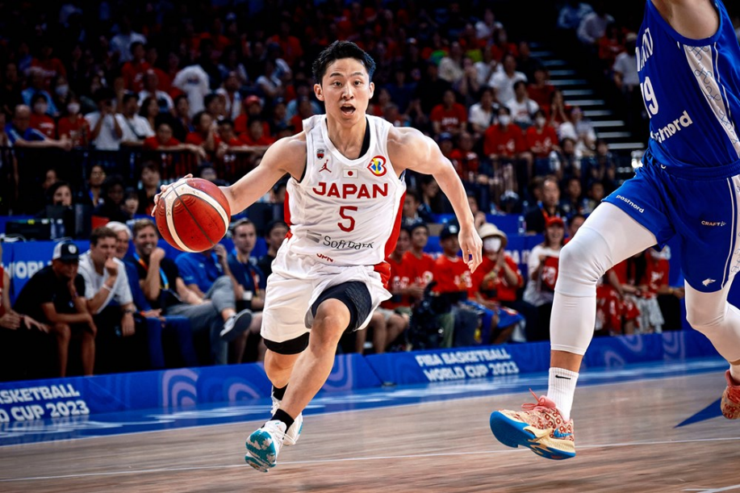
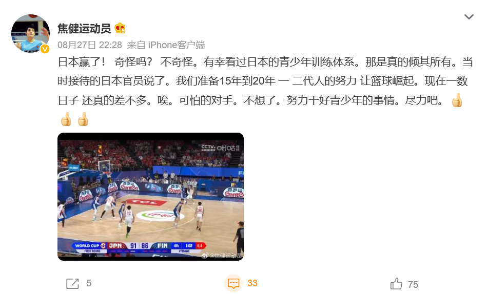
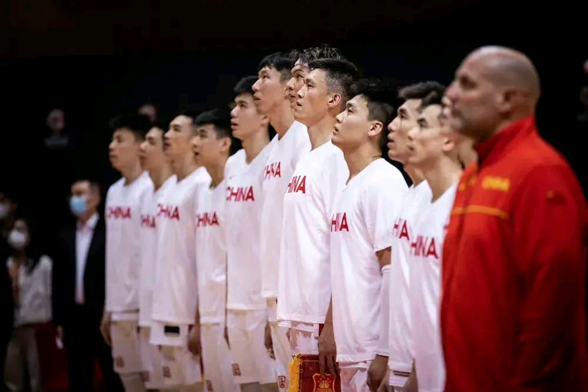
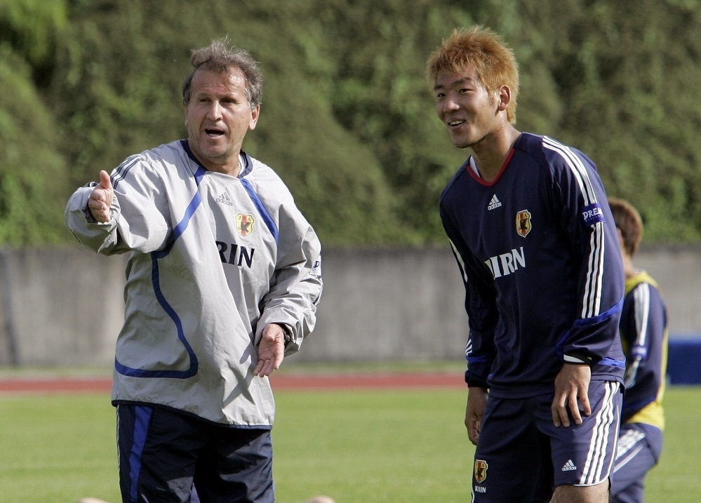

# 体谈 | 中国男篮的确需要学日本，但不是要学“小快灵”

篮球世界杯，日本1.72米后卫河村勇辉打出现象级表现，率队逆转芬兰队。让国人惊叹的同时，“中国男篮'高大化'的改造是路线错误，应该向日本学习重拾'小快灵'”的声音也开始涌现。显然，这并不理性。对于身处三岔路口的中国男篮来说，认准一条道勇往无前，至少有33%的概率到达终点，在这个过程中，依赖的是披荆斩棘的勇士，依赖的是“走的人多了也便成了路”的探索精神。对路线的犹豫、反复只会适得其反。

**撰文丨阅过山丘**

**编辑丨冯小**

去年的足球世界杯，日本连克德国、西班牙两大豪门，国人惊呼：《足球小将》
梦想照入现实。正在进行的篮球世界杯，日本打出队史最佳比赛，战胜拥有马尔卡宁的欧洲劲旅芬兰队，国人又是一片哗然：《灌篮高手》也来了？打出现象级表现的1.72米日本河村勇辉，被视作了现实版宫城良田。

今年的世界杯，日本男篮被分在E组，同组三个对手分别是德国、芬兰和澳大利亚，本就是死亡之组，加上八村垒未随队出战，赛前外界一致认定日本不仅难以出线，而且一胜难求。

结果没想到，面对NBA最快进步奖得主马尔卡宁领衔的欧洲劲旅芬兰，日本队在一度落后17分的情况下上演了末节大逆转，身高只有1米72的小后卫河村永辉独得25分9助攻，成为获胜头号功臣，在获得赞誉一片的同时，也引发了我们关于中国篮球是否应该学习日本，重拾“小快灵”的讨论。

中国人对于日本的情感一向复杂：囿于历史恩怨，对这个邻国的好感度有限，但却不妨碍日本车、日本电子产品的风行，境外旅游也长期把日本作为主要目的地；体育领域一向中国俯视日本，却不得不承认，好几代中国青少年的体育经历中，《足球小将》、《灌篮高手》都发挥了重要甚至不可替代的作用。

于是，当日本人一而再、再而三交出令人惊叹的成绩，我们的情感愈发复杂，震惊、羡慕、推崇、反思，最后是哀己不幸怒己不争。“向日本学习”、“日本人都行，我们为什么不行”的论调蔓延社交网络——不仅西方的月亮很圆，东边的月亮仿佛更圆。

所以，我们应该向日本学习吗？如果是，那应该学什么？

竞技体育，成王败寇，日本男篮在与芬兰一战中的表现也的确令人感佩。但仅仅因为这一场比赛，就妄下结论，认为日本篮球已经走在中国前面，甚至呼吁立刻调头，追随其脚步，这显然不是理性的做法。

而真正理性的声音，还是来自篮球行业内部。在日本战胜芬兰之后，前中国男篮队员焦健发微博感慨，说他曾见识过日本篮球青少年训练体系的倾尽所有，日本官员当初表示要经过15到20年的努力让篮球崛起，如今的成绩是厚积薄发的结果。

事实正如焦健所说，日本男篮能有今天的成绩，背后是几代篮球人共同努力的结果，他们多年来一直积极筹备和计划，目标就是成为亚洲最出色的球队，在世界大赛上证明自己。

不过，这条路走得并不轻松，在本届世界杯之前，日本男篮两次亮相世界大赛，都表现惨淡：尽管拥有两位NBA球员——八村垒和渡边雄太，但他们2019年世界杯五战全败场均净负26分输得灰头土脸；2020年东京奥运会，他们凭借东道主身份时隔44年重返奥运舞台，但小组赛连续惨败给西班牙、阿根廷和斯洛文尼亚，未能出线，当时日本国内球迷同样极度失望。

过去几年，中国男篮的确陷入低谷，背后是新老交替等种种原因共同作用的结果，我们应该认清现实，摆正位置，不能因为自己的一场惨败和日本男篮的一场爆冷获胜，就妄自菲薄，乱了方寸。

曾几何时，中国篮球也曾经以“小快灵”著称，是日本乃至全亚洲难求学习和追赶的对象。然而，当初称霸亚洲的中国男篮，却也很难在世界大赛中打出突破性的表现，直到“移动长城”的出现，才真正在世界舞台上拥有了一席之地，有了和欧美诸强掰一掰手腕的实力和勇气。

再后来，姚明退役，但中国男篮延续了内线建队的理念，从易建联到周琦，虽然难以重现北京奥运会的荣光，但也不乏振奋人心的经典战役。过去几年，姚主席大力推进“校园篮球”，同时给国内青年才俊开绿灯，鼓励他们出国锻炼，已经收到一定效果。

前不久的U19篮球世界杯上，以杨瀚森、王俊杰、王浩然为代表的“锋线群”已经开始展现天赋，他们高大、灵活、技术全面，而且敢打敢拼，让人看到了未来的希望。

在这样的背景下，如果因为一时得失就放弃既定路线，回头重拾小快灵，无疑是开历史的倒车，除了在重复摇摆中蹉跎时光之外，没有任何好处。

如果说，日本男篮值得中国学习，那么值得学习的内容，不是他们“小快灵”的比赛风格，也不是一句空泛的“拼搏精神”，而是他们一往无前的坚定态度，一旦认准了一个方向，就别再患得患失，摇摆不定，今天学欧，明天学美，后天甚至又要回头学日……。

中国男篮于去年11月正式聘请前塞尔维亚主帅亚历山大-
乔尔杰维奇来执掌教鞭，自他上任以来，就开始了“大型化”的改革。在他手下，身体条件出色的年轻球员如崔永熙、张镇麟受到重用，而个人能力出色但打法有局限性的后卫郭艾伦却遭到“弃用”。迄今为止，这番改革的结果尚不确定，但目标和思路都很坚定。

现在中国篮球正值多事之秋，CBA球员转会问题上的争议、规划球员的决定及人选，以及随之而来的一系列影响，想要在短期之内就取得优异战绩，本身就不太现实。在这个节骨眼上，我们更要避免轻易怀疑自己，摇摆不定，而是要坚定路线，相信事在人为。

回首过往，咱们中国男篮曾吃过不少摇摆不定的亏——自从2004年第一次有“洋帅”执教以来，中国男篮的主帅人选似乎一直在美、欧、中之间徘徊往复，哈里斯、尤纳斯、郭士强、等画的、扬纳基斯、宫鲁鸣、杜峰、李楠，再到乔尔杰维奇，每一次方向上的调整，在当时似乎都有其客观理由，可结果却是哪条路线都没坚持走到底，最后搞成一个四不像，白白耽误了时间。

其实不只是篮球，中国男足也同样如此：1992年，施拉普纳执掌中国男足，成为男足第一位洋帅。此后的30年里，来自英格兰的霍顿、荷兰的阿里汉、塞尔维亚的米卢、福拉多、西班牙的卡马乔、法国的佩林、意大利的里皮、卡纳瓦罗……他们都曾在国足主帅的位置上从满怀期待到黯然离去。

如今到了扬科维奇，他的冒险刚刚开始，可是他的结局，却几乎已经注定——这取决于国足在2026世界杯预选赛的成绩，而以国足现在的实力，闯入世界杯几乎是不可能完成的任务。

实际上，洋帅与土帅各有优势，但也都有其短板。30多年来，国足学来学去，目的都是为了要出成绩，可“急功近利”的结果，是我们在不断换帅、尤其是不同风格的主帅的情况下，战术缺乏延续性，谁都想着一锤子买卖，结果对于更基础的青训、人才培养投入不够，结果不仅没能取得理想的成绩，还失去了未来。

而我们的邻居日本，足球职业化比中国起步还晚，但从一开始就坚定不移学习巴西足球的技术流风格，并且深扎青训与校园足球，十数年后终于开花结果，成为亚洲足球的优秀代表。

体育都是相通的，篮球也好，足球也罢，想要真正提升内力，绝非一朝一夕之功，切不可将目标局限在一届世界杯甚至一场比赛的成败得失之间。

中国早过了要向世界证明自己存在感的阶段，现在的我们，应该要足够自信，脚踏实地朝着既定目标稳步前行，即使征途中还有波折险阻，也不必慌乱失措，轻易怀疑和否定自己。

中国早过了要向世界证明自己存在感的阶段，现在的我们，应该要足够自信，脚踏实地朝着既定目标稳步前行，即使征途中还有波折险阻，也不必慌乱失措，轻易怀疑和否定自己。

身处三岔路口，认准一条道勇往无前，至少有33%的概率到达终点，在这个过程中，依赖的是披荆斩棘的勇士，依赖的是“走的人多了也便成了路”的探索精神；

而上午选A中午选B晚上选C，可能只有中午还能碰碰运气，因为——早晚都会失败。

