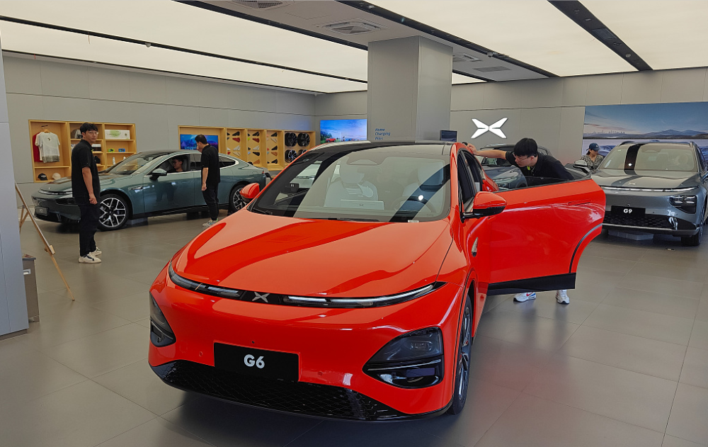
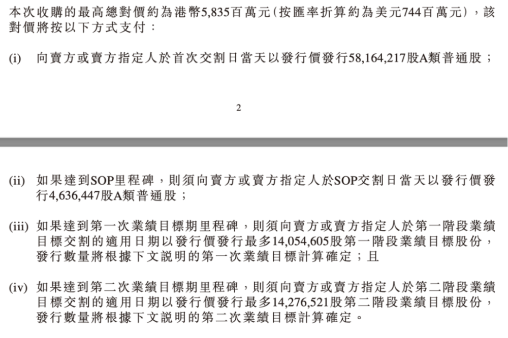

# 何小鹏54亿豪赌滴滴，进军“15万元”低端市场冲销量｜深网

_来源：视觉中国_

作者丨程潇熠

编辑丨康晓

出品丨深网·腾讯新闻小满工作室

8月28日，小鹏汽车和滴滴同时发布公告，小鹏汽车以最高58.35亿港元（约合人民币54.23亿元）收购滴滴智能电动汽车项目相关资产和研发能力。

本次收购不涉及现金部分，收购对价以增发股份的形式完成，最高增发9113.179万股，约占扩大后股本的5%。

小鹏汽车将进入多品牌阶段。基于收购的滴滴造车项目相关资产，小鹏汽车将推出全新品牌，新品牌首款车型代号“MONA”，为A级智能电动汽车（即紧凑型车，轴距一般在2.5到2.7米），预计2024年由小鹏汽车量产并推向市场。

**“MONA车型是小鹏第二品牌甚至第三品牌的开始。”** 小鹏汽车CEO何小鹏在媒体沟通会上称，该品牌还是会以向大众零售（to
C）为主，兼顾网约车销售（to B）。

**“MONA车型，少数的SKU针对共享出行，最主要的SKU是打造高等级的无人驾驶。”**

根据小鹏汽车公告，新车型价位将在“15万级”价格区间。何小鹏称，“MONA”
会全面使用小鹏的电子电气和XNGP，并在小鹏现有工厂进行生产，MONA出行版会在滴滴平台上运营，“在数据合规的前提下，我们会用到一些必要的数据来支持我们的运营。”

“这是滴滴第一次全面打开生态体系进行合作，例如市场资源、充电网络、包括金融保险、Robotaxi 的运营方面，都是对我们非常有价值的。”何小鹏说。

该消息一出，小鹏汽车港股股价大涨，截至发稿最大涨幅超16%。

对于这则突如其来的消息，业界众说纷纭。有汽车行业资深从业者认为“这意味着滴滴造车的终结”，也有人推测，小鹏汽车或成滴滴代工厂（即为滴滴代工生产汽车）。

**小鹏对“MONA”给予走量厚望，预计年销量可达10万辆**

何小鹏称，“MONA”是一款完成度非常高的产品，滴滴前期已经投入大几十亿人民币来开发。言下之意，“MONA”离量产已是临门一脚。

“MONA预计年销量可达到10万辆，如果连续两年都能达到销售目标，会有额外的股权对价，最高的股权比例可以提升到5%。”何小鹏称。

**“有了一个靠谱的解决方案提供商，又能快速起量，把15万的车型投入市场。”** 一位新势力人士向《深网》感慨，谁都不愿意掉队，小鹏汽车此举“挺聪明的”。

何小鹏曾经“看不上”15万级别车型。他曾在2021年称，15万是智能汽车基础分水岭。“真正要把智能做好，我认为在未来的两到三年，可能主力价格在19.9万到29.9万之间也就是20万到30万之间。”

而在上周的小鹏汽车二季度财报电话会议上，何小鹏推翻了自己曾经的观点，“有趣的是，两年前我曾经提过一个观点，因为成本原因，没有车企能够在15万级别推出有竞争力的全自动驾驶汽车。但随着我们死磕技术创新和全流程降本，当前我的观点改变了。”

何小鹏提出这一观点的依据是，他已经明确看到了清晰可实现的路径和时间表。“这让我们很有信心，在最主流的15万级别也有能力推出全自动驾驶汽车，这会极大地推动智能化全面普及。”

如今看来，何小鹏所说的正是“MONA”项目。他将对于“MONA”的走量期望也写进了收购协议。

据小鹏汽车官方发布，小鹏汽车将发行占交易完成后总股本3.25%的A类普通股，收购滴滴旗下智能电动汽车项目相关资产和研发能力。滴滴将成为小鹏汽车的战略股东，首批股份的锁定期为24个月。

《深网》梳理港交所公告后发现，上述股份交易仅为此次收购交易中的第一次支付，小鹏汽车与滴滴的此次收购被分为4次进行支付：首次交割日、达到SOP里程碑（开始量产）、达到第一次业绩目标里程碑、达到第二次业绩目标里程碑。

小鹏汽车没有在公告内披露具体的“业绩目标”时间范围及目标销量，仅称第一阶段及第二阶段的业绩目标股份具体数量根据业绩目标内符合资格的新车交付量而确定。

**因此，小鹏汽车支付多少股份，要看目标期内卖了多少辆新车，上限为18万辆新车。根据何小鹏所言，目标下限应为10万辆，与滴滴约定的业绩目标期或以“年”为单位。**

这并不是一个容易达成的目标。2022年全年，小鹏汽车、理想汽车、蔚来汽车分别交付了12.08万、13.32万、12.25万辆新车。这三家从0到年销量破10万都花费了数年时间积累。

小鹏汽车在短短两个月中连续官宣两大合作，先是将与大众品牌合作研发纯电动车型，后是收购滴滴造车项目入局“15万级别”汽车战场。合纵连横后，能够为小鹏汽车带来新气象，仍有待观察。

**滴滴造车，意在落地自动驾驶**

滴滴造车，最早要追溯至2021年。当时网传滴滴成立代号为“达芬奇”的造车业务，团队规模达1700人，预计2023年中发布造车计划，并争取一年后进行交付。

“达芬奇是不会再造整车，也不会再卖整车了。除了工程和产品会留一些人之外，品牌、营销、售后等部门都会清掉。”据虎嗅援引知情人士消息，滴滴放弃造车不是因为造车资质，“程维对造车这件事非常不笃定，传递给底下的人信心不足，觉得投入产出比不高，最后只能把业务卖掉。”

从滴滴近几年的造车态度来看，滴滴造车的主要目的仍是落地自动驾驶。《深网》获悉，滴滴在最难的时候仍在对外招聘自动驾驶相关人才。

早在2019年，滴滴自动驾驶CEO张博曾称，自动驾驶实现技术落地需要集齐四张牌：共享出行网络、无人驾驶技术、汽车厂商和Tier 1的支持以及足够的资本支持。

而滴滴此前在与乘用车企业的合作中屡屡碰壁。

2018年，滴滴与理想汽车前身车和家宣布成立桔电出行，计划共同推出一款纯电MPV。但因理念不合，量产进度中止。桔电出行已在2022年申请破产。

2019 年 11 月，滴滴与比亚迪合资成立了美好出行（杭州）汽车科技有限公司，比亚迪持股 65%，为控股方。2020年双方合作推出定制网约车
D1，2021年首季度销量破5000。如今部分地区路段仍能看到D1车型，但双方后续再未提及此合作。

2020 年 6 月，滴滴子公司滴滴自动驾驶宣布与北汽合作，双方将共同研发高级别自动驾驶定制车型，专门用于
RoboTaxi（自动驾驶出租车）运营。其共同推出的北汽新能源EU5出租市场销量占2022年总销量近90%。

今年5月，滴滴自动驾驶又与广汽埃安新能源签订合作，共同发布无人驾驶新能源量产车项目“AIDI计划”。双方将成立合资公司，共同定义和量产共享出行L4无人驾驶新能源汽车，该量产车将于2025年接入滴滴共享出行网络。

**或许在滴滴董事长兼CEO程维看来，滴滴下场造车一直是推进自动驾驶落地的下下策，毕竟滴滴的战略是做运营商而非制造商。**

程维曾在2017年《财经》的采访中说，滴滴的战略是：一是国际化，构建全球最大的一站式的出行平台；二是推动共享新能源汽车和配套的服务体系。未来人们不用再拥有汽车，滴滴将作为整个城市的汽车运营商。三是智慧交通和无人驾驶。

这场交易目前来看无疑是双赢。滴滴摆脱重资产的造车项目，专心推进自动驾驶落地；小鹏汽车拿到15万级智能汽车“成品”，快速进入15万价格区间汽车市场，参与竞争。看到这则交易信息后压力最大的，或许是酝酿多年、还未正式推出的蔚来平价子品牌。

