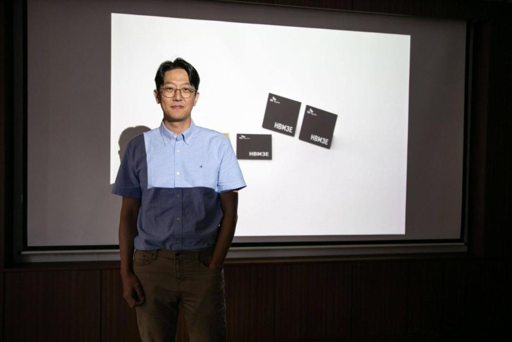
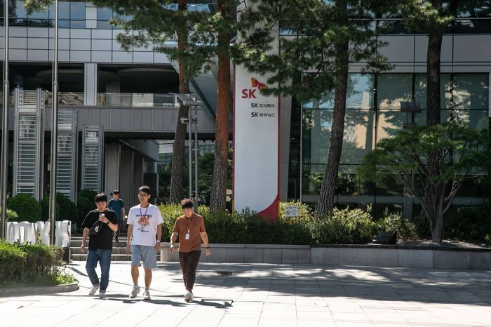
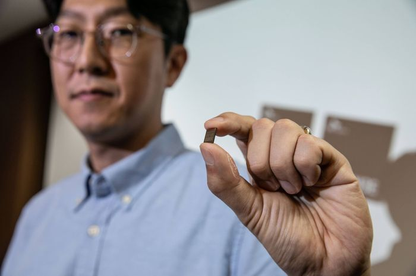

# 借英伟达东风，韩国这家芯片公司赢下生成式AI领域关键之战

**划重点：**

  * _1_ 长期以来，韩国半导体供应商SK海力士始终是内存芯片行业兴衰起伏的主要参与者，但并不被视为行业先驱。
  * _2_ SK海力士十年前押注被视为“未知领域”的高带宽内存(HBM)，如今其成为英伟达顶级人工智能处理器芯片上HBM的主要供应商。
  * _3_ 2013年，SK海力士与AMD合作率先向市场推出了高带宽内存，其最新的第四代产品将12个传统的DRAM芯片堆叠起来。
  * _4_ SK海力士预计其2023年HBM收入将增长50%以上，但其并不能保证自己始终保持领先地位，三星计划大举投资，到2024年将HBM产量提高一倍。

作为全球顶尖的半导体供应商，韩国SK海力士很早就押注于开发强大的内存芯片。如今，该公司已经成为生成式人工智能硬件领域的大赢家。海力士开发的高带宽内存芯片被视为人工智能系统的关键组成部分，用于支持ChatGPT等智能程序。

_图：负责SK海力士高级内存产品设计的朴明宰表示，高带宽内存是人工智能系统的关键组成部分，但在十年前被认为是“未知领域”_

推动当前人工智能热潮的硬件与英伟达关系最为密切。不过，与英伟达智能H100处理器一起封装的是专门的内存芯片，它可以实现人工智能应用背后近乎即时的计算，速度之快令人惊叹。

而SK海力士就是英伟达顶级人工智能处理器芯片上最新高带宽内存(HBM)组件的主要供应商。长期以来，这家总部位于韩国利川市的公司始终是内存芯片行业兴衰起伏的主要参与者，但从历史上看，它并不被视为行业先驱。

十年前，SK海力士比竞争对手更积极地押注于高带宽内存。在HBM中，被称为DRAM的存储芯片一个接一个地堆叠在一起，就像摩天大楼的楼层一样。该公司高级内存产品设计负责人朴明宰(Park
Myeong-jae)表示，该领域当时曾被认为是“未知领域”。

如今，随着依赖高带宽内存的人工智能应用的兴起，SK海力士已经成为硬件领域的早期赢家之一，尽管竞争正在加剧，其与韩国竞争对手三星电子的差距也正在缩小。

SK海力士表示，新一代HBM芯片每秒可以处理相当于230部全高清电影的数据。

朴明宰说，内存芯片不再仅仅是计算机的辅助设备。他在接受采访时表示：“从本质上讲，包括HBM在内的内存技术的发展，正在为人工智能系统的未来发展铺平道路。”

尽管由于智能手机和电脑销量下滑，促使整个内存芯片市场出现了严重低迷，但SK海力士的股价自年初以来上涨了近60%，几乎是三星电子涨幅的三倍，也高于美光科技和英特尔约30%的涨幅。英伟达的股价在2023年上涨了两倍多。

_图：随着依赖高带宽内存的人工智能应用的兴起，SK海力士已成为硬件领域的早期赢家之一_

尽管SK海力士经历了艰难的一年，但该公司股价还在上涨。该公司的收入仍主要依赖传统的内存芯片业务。在第二季度，SK海力士报告净亏损约为22亿美元，表明其财务状况尚未从其在高带宽内存方面的进步中获得多少好处。相比之下，英伟达在5月至7月的季度利润超过60亿美元。

像ChatGPT这样的生成式人工智能工具吞噬着海量的数据，这些数据必须从内存芯片中检索出来，然后发送到处理单元进行计算。凭借其摩天大楼式的堆叠，HBM可以与英伟达、AMD和英特尔等公司设计的处理器更紧密地协同工作，从而提高性能。

2013年，SK海力士与AMD一起率先向市场推出了高带宽内存。其最新的第四代产品将12个传统的DRAM芯片堆叠在一起，而上一代产品只有8个，并具有业界最高水平的数据传输效率和散热能力。

这项壮举需要发明新的堆叠和融合芯片的方法。在12层堆叠的产品中，SK海力士用液体材料填充层与层之间的空隙，取代了在每层之间涂上薄膜的传统方法。在最新的堆叠过程中，该公司使用高温确保芯片层均匀地贴合在一起，并以70吨的压力压缩它们以填补空隙。

韩国高级科学技术研究所机械工程教授金钟浩(Kim jung
-ho)说，大约十年前，英伟达和AMD曾寻求合作伙伴，以打造一种新型内存芯片，能够以更快的速度将更大容量的数据同时传输到它们的图形处理单元。金钟浩所在的大学研究实验室自2010年以来始终在与SK海力士合作研究高带宽内存。

_图：SK海力士是英伟达顶级AI处理器芯片最新高带宽内存芯片的主要供应商_

SK海力士积极回应了这些要求。金钟浩补充说：“这既反映了该公司对新技术的投入，也反映了其在人工智能时代对一款备受关注的产品押下巨额赌注所需要的运气。”

花旗银行驻首尔半导体分析师彼得·李（Peter
Lee）表示，最初，由于需求低迷和技术困难，内存行业对HBM的投资有限，但SK海力士似乎早期就更看好HBM的前景。

SK海力士高管朴明宰表示，该公司的HBM工作组最初并未将人工智能视为这种新型内存芯片的主要用途，促使他们前进的动力是克服所谓的“内存墙”，即科技行业认为计算性能受到内存芯片速度的限制。

“我们相信，用于高性能计算的高带宽内存最终会促使相关应用的出现，”朴明宰继续说。“而且，HBM确实为后来的加密货币和人工智能热潮奠定了基础”。

SK海力士今年4月份表示，预计其2023年HBM收入将增长50%以上。花旗分析师也认为，人工智能需求在全球DRAM收入中所占比例预计将从今年的16%增长到2025年的41%。

SK海力士并不能保证其始终保持领先地位。三星副总裁兼内存营销主管Harry
Yoon在接受采访时说，三星正准备在今年晚些时候推出下一代产品，并正在努力扩大与客户的合作关系。三星是全球最大的内存芯片制造商，该公司计划大举投资，到2024年将HBM产量提高一倍。

据市场研究公司TrendForce的数据，预计三星今年的市场份额将赶上SK海力士，两者的市场份额将分别达到46%至49%。TrendForce称，美光预计将占据约5%的市场份额。但美光表示，有信心赶上两家韩国竞争对手。

英伟达最近亮相了一款用于加速计算和人工智能的新处理器，并计划于2024年第二季度上市，它配备了“世界上最快的内存”。不过，通告中没有提到供应商的名字。

业内专家表示，最能满足英伟达要求的公司就是SK海力士，该公司本月早些时候表示，已开始向客户提供下一代HBM样品。

SK海力士没有透露在高带宽内存方面投入了多少资金，也没有公布这类芯片的销售数据，但该公司表示，包括HBM在内的这一类芯片目前占DRAM总销量的20%以上，而去年这一比例还只是个位数。

朴明宰说，SK海力士在开发速度、质量和批量生产准备方面仍然具有优势。“基于这些优势，公司打算继续引领市场，”他说。（文/金鹿）

