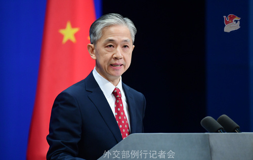

# 外交部：鉴于当前中日关系状况，经双方商定推迟公明党代表团访华

8月28日，外交部发言人汪文斌主持例行记者会。

路透社记者提问，中方是否要求日本公明党党首延后其定于今天开始的访华计划？中方有何考虑？

_汪文斌 资料图 图源：外交部网站_

汪文斌表示，经向主管部门了解，鉴于当前中日关系状况，经双方商定，决定推迟日本公明党代表团访华。公明党长期坚持中日友好，中方高度重视同公明党开展交流对话，愿共同为中日关系改善发展作出积极努力。

来源：北京日报客户端 | 记者 刘柳

编辑：周经纬

流程编辑：郭丹

