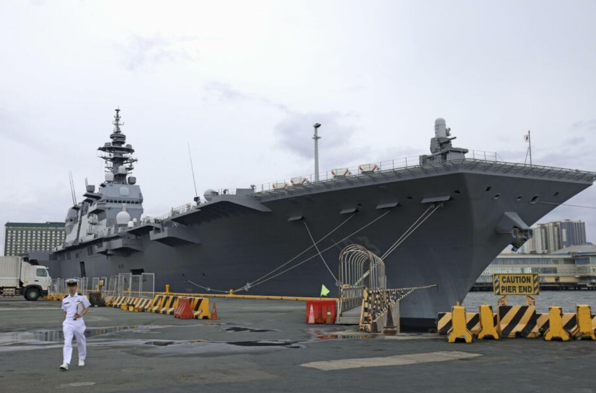

# 日媒：日本准航母“出云”号首次停靠菲律宾首都，自卫队官员言论“对准中国”

【环球网报道】综合日本广播协会、共同社28日报道，日本自卫队27日向媒体公开了准航母“出云”号历史首次停靠在菲律宾首都马尼拉的画面。报道称，“出云”号此前参加美日澳菲在南海举行的联合军演，该军演被认为是针对中国。

_日本自卫队27日向媒体公开准航母“出云”号停靠在菲律宾首都马尼拉的画面，图自日媒_

据NHK报道，27日，美日澳菲四国海上部队指挥官在“出云”号舰上举行典礼。日本自卫舰队司令官齐藤聪在发言时将矛头对准中国，宣称“了解到中国正在进行专横的活动，在日本附近也能看到这样的活动”。报道提到，中国与菲律宾近期围绕仁爱礁发生了一系列纠纷。

据共同社报道，除“出云”号，美国两栖攻击舰“美利坚”号、澳大利亚两栖攻击舰“堪培拉”号也参加了日前在南海举行的军演并在马尼拉停靠。

关于美日澳在南海举行的此次军演，军事专家宋忠平曾对《环球时报》说，美日澳插手南海问题实际上也不是为了保卫菲律宾的安全。“菲律宾是否参加军演、有没有军舰不重要，因为它只是美日澳介入南海局势的由头。”

宋忠平分析说，三个国家中，澳大利亚是被裹挟到南海地区的国家，其利益范围并不在这里，是美国企图把南海变成遏制中国的地缘政治“桥头堡”。美国和日本希望更多国家卷入到南海问题中。他对《环球时报》记者说：“这些国家唯恐南海不乱，唯恐中国和东盟国家不起争端，用心极其险恶。”

