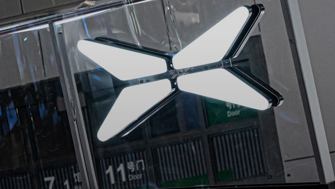

# 滴滴“弃车”、小鹏58亿接盘，全面解析来了

**划重点：**

  * _1_ 除了滴滴将获得小鹏总股本3.25%的A类普通股之外，小鹏汽车与滴滴约定了一个销售额——如若“MONA”分两次达成销售指标，滴滴持有小鹏的股份将相应上浮，最高至大约5%。
  * _2_ 在多条路线权衡与取舍后，滴滴最终选择了不造车路线；而对小鹏来说，15万元以下车型不仅填补车型空白，也是提振销量之举。
  * _3_ 滴滴的路线调整说明，Uber、滴滴、Lyft这类平台以网约车特定用车牵动整个产业链造车的代工模式，是走不通的，“这是以前臆想出来的”。

腾讯新闻《远光灯》 作者 张小珺

在经过几年的调整和徘徊之后，滴滴出行最终选定了入局新能源大变局的方式——学习华为的不造车模式。

8月28日，小鹏汽车(09868.HK)和滴滴出行共同宣布了双方的战略合作。在资本层面，据小鹏公告称，小鹏汽车将发行占交易完成后总股本3.25%的A类普通股，收购滴滴旗下智能电动汽车项目相关资产和研发能力；滴滴将成为小鹏汽车的战略股东，首批股份的锁定期为24个月。本次收购的最高总对价约为58.35亿港元。

在业务合作层面，小鹏汽车将生产一款A级智能电动汽车，项目代号为“MONA”，该车型预计于2024年开始量产。
**值得注意的是，这款车型是由小鹏汽车制造和生产，也由小鹏所有，并非与滴滴共同研发与所有。**
而滴滴方面要做的是，面向小鹏汽车开放生态，为“MONA”提供包括智能座舱、智驾及共享出行市场等业务支持，帮助小鹏汽车在“15万级”价格区间打造爆款车型。

**据接近交易的知情人士称，双方皆有合作诉求，最终的条款于近期谈定。在小鹏汽车方面，董事长何小鹏、IR（投资者关系）团队和业务相关负责人；在滴滴方面，董事长兼CEO程维、IR团队和业务相关负责人等，都参与了谈判和对合作细节的商议。**

**“也是你情我愿。”另据该知情人士透露，除了滴滴将获得小鹏总股本的3.25%A类普通股之外，小鹏汽车与滴滴约定了一个销售额——如若“MONA”分两次达成销售指标，滴滴持有小鹏的股份将相应上浮，最高至大约5%。**

据小鹏汽车公告显示，如果达到第一次业绩目标期里程碑，小鹏须向卖方或一名卖方指定人发行第一阶段业绩目标股份。第一阶段业绩目标股份的具体数量将根据第一次业绩目标期内合资格新车交付量而确定，前提是为计算第一阶段业绩目标股份之目的，合资格新车交付量的最高数量应为18万辆，且本公司拟发行的第一阶段业绩目标股份最多为14,054,605股A类普通股。

同样地，如果达到第二次业绩目标期里程碑，本公司将向卖方或一名卖方指定人发行第二阶段业绩目标股份。第二阶段业绩目标股份的具体数量将根据第二次业绩目标期内合资格新车交付量而确定，前提是为计算第二阶段业绩目标股份之目的，合资格新车交付量的最高数量应为18万辆，且本公司拟发行的第二阶段业绩目标股份最多为14,276,521股A类普通股。

以上说明，如果交付业绩达成，两次合计拟发行股份28,331,126股A类普通股，占总股本1.64%，加上之前的3.25%，接近于5%。

以网约车平台撬动造车走不通后，滴滴开始向华为学习

这次交易与合作，对双方有不同的战略意义。首先对滴滴来说，这意味着它在经过几次关于是否造车的路线选择与调整后，最终选择了向华为学习不造车模式。

**“的确也想过造车——想过自己造、自己销售、自己建厂。”**
一位不愿具名的滴滴人士说，但他们考虑到现在新能源造车产业竞争激烈异常，很卷，而滴滴近几年仍然希望降本增效。“可以想象，投入肯定持续亏损。”因此在现实的考量下，滴滴没有下定决心要造车。

他们曾经尝试过以下几条路线。 **路线之一** 是2018年与理想汽车成立合资公司（北京桔电出行科技），但这家合资企业以宣告破产告终。

一位前滴滴中高层人士称：“早先说合作都没想好要怎么做，理想后来去做了比较贵的SUV，自然也就不了了之了。”

**路线之二**
是2020年滴滴和比亚迪合作，这时滴滴已经有了更成熟的想法。滴滴负责出设计方案，比亚迪负责生产，双方共同设计纯电动出租车型号D1——这相当于比亚迪给滴滴代工网约车车型。

上述前滴滴人士分析认为，滴滴和比亚迪合作最大问题是，在比亚迪看来，“滴滴到底是潜在的车厂对手，还是只是委托我们代工和生产的金主？”——对于中低级车型来说，网约车司机购买意愿强，而滴滴后续可以绕开比亚迪找其他人代工生产这类车型，潜在的竞争为合作带来不确定性——因此，双方一直比较错位。

一位前网约车平台高层、汽车产业资深从业者认为，
**滴滴的路线调整说明，Uber、滴滴、Lyft这类平台以网约车特定用车牵动整个产业链造车的代工模式，根本走不通，“这是以前臆想出来的”。**

他分析称，D1售价是15万，而现在市面上同类跑网约车的车型已降至7万-11万元，虽然D1服务更好，但对司机来说价格没有竞争力。而定制车的问题在于，就连比亚迪都要为定制车单独开辟产线，与之同时又上不了量，成本就降不下来。最终该合作对于双方都不经济。“对网约车平台来说，与其找人代工，不如找人合作。”

他进一步说道，网约车平台原本的想法是，“我有很大2B订单，让司机用我们的车。所以由我立项，整合主机厂的资源来造车”。但核心前提，除了乘客和司机驾乘体验要好，还有一个更重要的因素：成本够低、价格便宜。网约车司机的核心诉求是快速回本、赚到钱。“这是硬道理。”

但是，在全球这么卷的汽车市场，价格受供应链、制造成本等综合因素影响。“以前做这个模式是觉得主机厂利润高，给我们造车可以造个便宜的。但现在市场是反的。所有主机厂做网约车这类产品不计成本，为了出量把成本打得那么低，市场竞争太激烈了。”上述人士说，网约车平台即便有再大的量，也撑不起一个车型；反而是定制化导致成本上升，超越了租赁公司和驾驶员承受的成本。因此，所谓“用网约订单的量来保证定制一款车”，难以成立。

**而滴滴的路线三正是这次与小鹏的合作，滴滴改变了以往做法——他们不再找人代工，而是输出模块化的能力和生态，以资产换股份，以网络换销量。**
他们认为像华为一样输出模块化的能力、且不造车的路线，更适合现阶段的滴滴。

这也意味着，经过反复的路线切换后，滴滴不造车，也不重度参与造车了。

小鹏汽车填补车型空白，是提振销量之举

而对于合作的另一方小鹏汽车来说，合作的战略意义在以下几方面：

第一，小鹏在15万级别的A级车市场是空白的，“MONA”可以填补车型空白；第二，借助滴滴的网约车生态网络，小鹏可拓展销售渠道，用以提振销量。

在新势力三家中，理想和蔚来的销量一直高于小鹏。以刚刚过去的7月举例，理想月销3.4万台车，蔚来月销2万台，而小鹏虽然有反弹之势，但也就刚刚过万，月销1.1万台。对于现阶段的小鹏来说，销量无疑具有吸引力。

同时，何小鹏在沟通会上称，MONA车型是小鹏第二品牌甚至第三品牌的开始，该品牌会2C为主，兼顾2B。MONA车型的品牌少数的SKU针对共享出行，最主要的SKU是打造高等级的无人驾驶。他希望借此推动科技普惠，科技平权。

上述汽车产业资深从业者补充称，简单来说，这次是“滴滴卖资产，对滴滴是好事，减负甩包袱，所有和造车相关的业务都会减少；小鹏想做‘智能化的比亚迪’，这么做也相当于是去拿滴滴订单”。

上述滴滴人士说道，
**小鹏收购滴滴该部分资产后，滴滴负责造车的“达芬奇”团队还会保留一部分人员，继续开展后续工作——就像类华为模式，向其他车企提供智能化的服务和产品。**
也就是说，滴滴还会寻求与其他车企合作，为其提供包括智能座舱、智驾、地图及共享出行市场等能力。

前述接近交易的人士称， **这次滴滴与小鹏的合约中没有约定唯一限制的条款。**

总之，针对此次联手，小鹏与滴滴双方都各有各的考虑、各有各的算盘。

