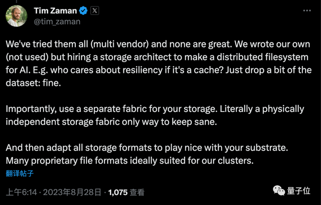

# 马斯克直播自动驾驶“去扎克伯格家”，45分钟仅一次人工干预

梦晨 丰色 发自 凹非寺

量子位 | 公众号 QbitAI

马斯克还真开着特斯拉“去小扎家”了，全程直播无剪辑！

不过说“开车”已经不准确，因为这回是 **新版FSD** 全程给马斯克“代驾”，45分钟里他本人只上手干预了一次。

也就是钢铁侠亲自上阵，搞了一场 **自动驾驶路测** 。

坐标加州Palo Alto，从特斯拉新工程总部出发，中途曾用谷歌地图搜索扎克伯格家地址并导航。

马斯克搭乘一辆老款Model S，硬件还是基于HW3的版本，但软件已经是未正式发布的新版FSD V12。

尽管画质不到480p，但这场平台上的直播，已吸引超1000万人在线围观。

之所以备受瞩目，倒不全是大家伙吃瓜“马扎笼斗”的热情太高，主要在于FSD V12被称为 **特斯拉自动驾驶最重要的一次升级** ：

实现了完全 **端到端** （End-to-end）方案，输入一端是图像，输出一端是对汽车的控制指令，中间完全由神经网络处理。

马斯克自己的说法要更咋呼一点：

光子进，行为出，和人类一样。

试驾过程中，马斯克多次表示 **现在的系统没有一行规则和条件判断代码，不需要高清互联网地图** 。

比如，在经过路边一位骑行者时，马斯克就强调“没有任何代码声明要给骑自行车的人让行，没有等待x秒之类的东西，只有(神经)网络。”

**This is all net, baby, nothing but net.**

知名科技博主Robert Scoble表示： **世界从今晚开始改变** 。

十年后，人们将把这一时刻定义为机器人的首次公开演示，机器人仅通过看视频就学会在现实世界中移动。

这是软件构建方式的范式转换。

马斯克也回复他：准确的。

同样令人惊讶的是，所需的推理计算功率只需要100W。

01 45分钟路程仅一次干预

为了凸显真实性，马斯克从地图上随机选择了目的地。

行驶没一会儿，汽车来到了一条两边全部立满红色柱子的 **施工区域** ，对于这一“反常”路况，车辆顺畅通过：

在本次路程的第一个红灯之处，Model S完美停住。

等待左转灯绿起之后，它便通过 **无保护左转** （UPL）非常流畅地驶入左边的另一条马路。

这是自动驾驶领域中一个比较难的场景，要考虑到地面引导标、左侧行人、前方车辆等情况，马斯克表示：

看直播可能看不太清楚，但车辆行驶得很平稳。

大约5分钟时，车辆又碰上一片 **减速带** ，Model S顺利完成自动减速。与此同时，一辆自行车在右侧飞速前进，但丝毫不会对它造成影响。

也禁住了 **环岛** 的考验。只见在这样的环形交叉路口，Model S先等前方的两辆白色汽车通过之后，便立刻转弯进入：

大约10分钟之后，车辆载着马斯克到达了今天的第一个目的地，接着再前往下一个随机地点。

期间汽车路过斯坦福大学，人群变得多起来，Model S毫无压力，并礼让了行人：

由于直播逐渐进入晚高峰时段，马斯克也吐槽车开的有一点慢。

但一切都按照预期发生，直到19分左右，马斯克进行了第一次干预，也是全程的唯一一次。

当时， **想要直行** 的车辆在路口已经等了很久红灯，而在对面信号灯刚刚转为左转状态时，Model S竟突然跟着启动。

不过马斯克和旁坐的工程师反应迅速，连忙干预制止。

险情结束，老马也直言：

这就是FSD v12还未真正公开发布的原因。

后面剩余的25分钟路程都顺利结束，直播还展示了FSD的靠边停车功能等等。

而在整个直播过程中，马斯克反复 **强调得最多的一点** 就是：

无论是最开始遇到的红色立柱、减速带，还是后面遇到的骑行路人、环岛路口，FSD系统都不是靠任何一行控制代码来完成决策的。

相反，FSD只是看了非常多的视频，然后完成了训练，得到了一个神经网络。

（特斯拉Autopilot的决策从2020年开始由编程逻辑转为视频训练的神经网络，在FSD v12之前，v11版本控制堆栈中有超过30万行C++代码。）

像19分钟的那次闯红灯行为，马斯克就告诉观众，解决方案本质就是再多喂更多交通信号灯的视频，尤其是左转灯的，然后就会起作用。

当然，胡乱投入大量视频是不够的，来自优秀人类驾驶员的高质量数据才是训练特斯拉Autopilot实现FSD的关键。

大量平庸的数据并不能改善驾驶，数据管理实际上相当困难。我们有相当多的软件去控制系统究竟选择什么数据、训练什么数据。

除了不靠任何代码完成决策，马斯克还强调：

FSD V12不用时刻联网就能完成一切。

当然，如果有干预行为发生，系统会将它记录下来并发回特斯拉进行分析。

由于决策全部在本地进行，特斯拉FSD用8个摄像头以每秒36帧的速度进行拍摄，但系统的计算速度其实可以更快，达到每秒50帧，只可惜相机的速度已经到头了。

不联网进行决策也意味着地图也不用随时更新，用马斯克的话来说：

系统只需要坐标，就会自行找到位置。

另外值得注意的是，本次测试FSD V12的Model S安装的还是HW3。

在HW3上解决L5级自动驾驶之前，特斯拉可能不会在HW4车辆之上启用FSD。这意味着HW4的FSD访问权限可能推迟到2025年。

02 一万张英伟达H100周一上线

作为知名的时间管理大师，马斯克试驾途中还抽空语音连线了一个网络讨论会。

在这里他回答的问题和透露的重点内容有：

为什么改用端到端方案，优势在哪？

马斯克认为“人类就是这样运作的”，人类用眼睛和生物神经网络开车，自动驾驶用摄像机和数字神经网络开车是正确的通用解决方案。

虽然神经网络缺乏可解释性，相应的司机也经常说不清楚如何做的决策，只是凭经验。

乘客在做人类司机的出租车时，也无法准确知道司机在想什么。而特斯拉屏幕上显示的画面，就是自动驾驶系统在 “想什么”的一个近似。

高端GPU将继续短缺，世界进入强算力依赖阶段。

马斯克透露AI训练主要还是用的英伟达硬件，特斯拉Dojo超算作为辅助，今年花了约20亿美元在训练上面（大部分是硬件资产）。

我认为未来全人类80%-90%的算力都会用在神经网络上。

AI训练需要把算力集中在一个地方，避免数据传输带宽的瓶颈，也会带来很大的电力负担。

马斯克在这里还开了一个玩笑：Transformer架构的神经网络需要越来越多的硬件Transformer。

比GPU更缺的是高速连接设备。

面对“拥有5000张H100是什么感觉？”的提问，马斯克表示：说少了。

包含1万张英伟达H100的新算力集群，正在24/7加急准备中，周一（也就是今天）上线。

而且不像很多公司声称“拥有”算力其实是租的云计算服务，特斯拉就是真的买了1万张GPU自己搭系统。

在这样的大规模集群中，设备之间的网络连接非常关键，英伟达InfiniBand交换机可能会比GPU本身更缺。

……

直播结束后，特斯拉AI基础设施主管Tim Zaman进一步透露，即将上线的算力集群拥有200PB的热缓存，比训练大模型的系统多几个数量级。

也是一个让很多从业者觉得不可思议的地方，比如GitHub前CEO。

Tim Zaman表示尝试了很多云计算供应商，但没有一个足够好，聘请了存储系统架构师来开发AI专用的分布式文件系统。

最后，回到此次直播测试。

不少网友不吝惜自己的赞美之词，并希望能够早日试驾一把。

还有网友调侃：

看起来FSD已经准备好迎接挑战了，那么，不来试一把亚洲的终极boss之战吗？

be like this （手动狗头）：

值得一提的是，这把直播除了秀特斯拉新版FSD，也是直播功能的一场压力测试。

至于最终也没打上的“马扎大战”，似乎已经不那么重要了。

马斯克给自己打的圆场是“小扎在这片地区有8000多房产，要是真找到他了我就去挑战”。

参考链接：

[1]https://twitter.com/elonmusk/status/1695247110030119054

[2]https://twitter.com/treb5475/status/1695289700620341311

[3]https://twitter.com/tim_zaman/status/1695488119729238147?s=20

[4]https://www.teslaoracle.com/2023/07/01/teslas-full-self-driving-
version-12-will-not-be-beta-says-elon-musk/

