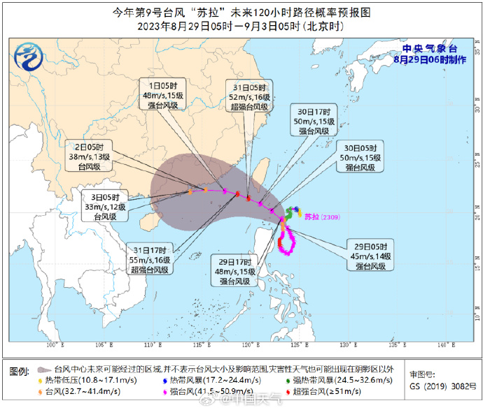
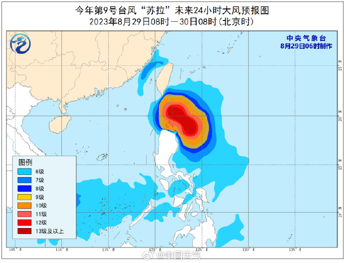
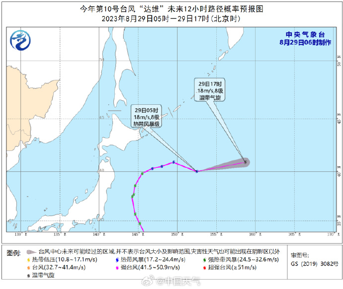
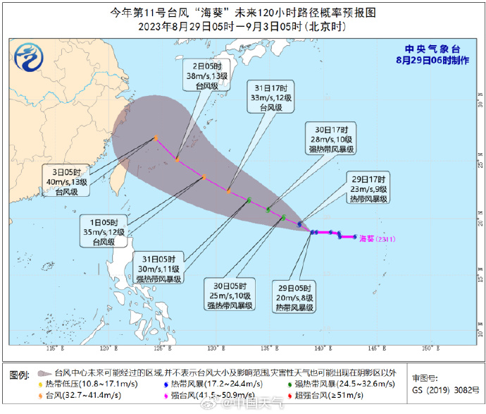

# 三大台风最新动态：两股增强并趋近我国，一股即将变性为温带气旋

“苏拉”逐渐向广东中东部一带沿海靠近：

今年第9号台风“苏拉”（SAOLA）（强台风级）的中心今天（29日）早晨5点钟位于菲律宾马尼拉东北方向约520公里的海面上，就是北纬18.5度、东经123.7度，中心附近最大风力有14级（45米/秒），中心最低气压为950百帕，七级风圈半径220-250公里，十级风圈半径80-90公里，十二级风圈半径50公里。

预计，“苏拉”将以每小时10公里左右的速度向北偏西方向移动，强度缓慢增强，31日早晨移入南海东北部海面，逐渐向广东中东部一带沿海靠近。

大风预报：8月29日08时至30日08时，巴士海峡、台湾以东洋面偏南海域将有6-8级、阵风9-10级的大风，其中巴士海峡偏东海域风力可达9-10级、阵风11-12级，请过往船只注意航行安全。

“达维”向东偏北方向快速移动，即将变性为温带气旋：

今年第10号台风“达维”（DAMREY）（热带风暴级）的中心今天（29日）早晨5点钟位于日本东京东偏北方向大约1220公里的西北太平洋洋面上，就是北纬40.0度、东经152.5度，中心附近最大风力有8级（18米/秒），中心最低气压为995百帕，七级风圈半径120-200公里。

预计，“达维”将以每小时45公里的速度向东偏北方向快速移动，即将变性为温带气旋。

“海葵”向西偏北方向移动，强度缓慢增强：

今年第11号台风“海葵”（HAIKUI）（热带风暴级）的中心今天（29日）早晨5点钟位于美国关岛西北方向约870公里的西北太平洋洋面上，就是北纬18.8度、东经138.9度，中心附近最大风力有8级（20米/秒），中心最低气压为995百帕，七级风圈半径110-160公里。

预计，“海葵”将以每小时10-15公里的速度向西偏北方向移动，强度缓慢增强。

来源 中国天气

（来源：中国天气）

