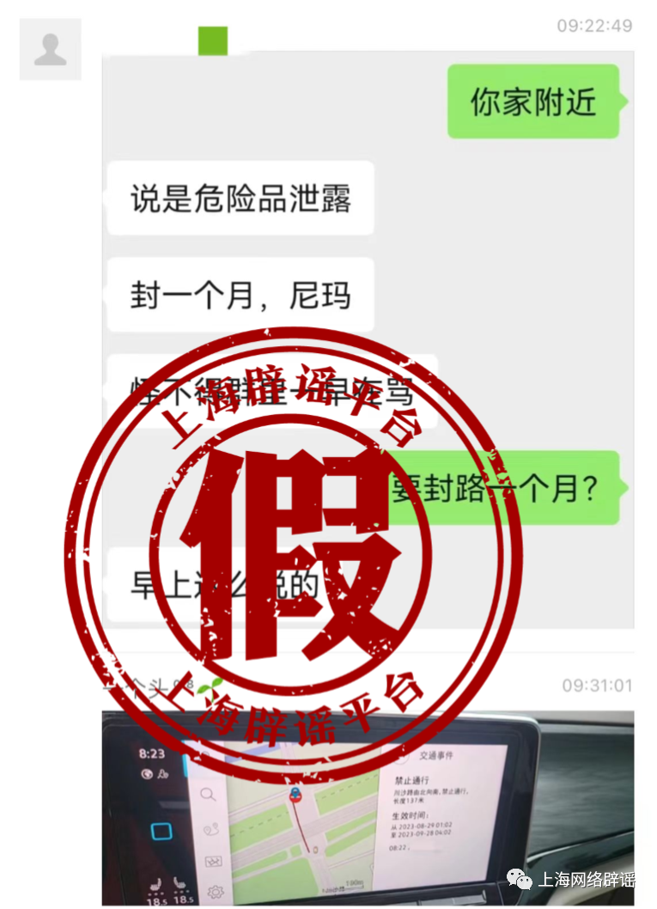
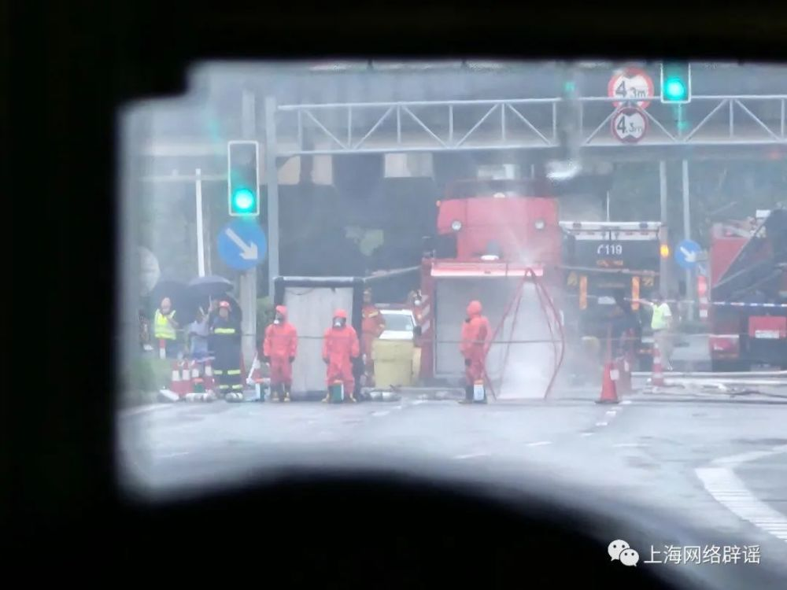

# 上海一地有毒气泄漏要封路一个月？权威部门辟谣

8月29日，微信圈群流传聊天记录称，上海浦东新区川沙附近有毒气泄漏情况，导致路面拥堵。也有粉丝向上海辟谣平台留言问，听说相关路段要封路一个月，是不是真的。

上海辟谣平台从浦东新区应急管理部门了解到，
**网传事故发生在8月28日22时56分许，一辆装有桶装液态甲基三氯硅烷的货车行驶至S1川沙路南约50米处，其中1桶发生泄漏。经应急管理局、公安分局、消防救援支队等单位联动处置，将泄漏的1个铁桶作危废处理，其间无人员伤亡。8月29日10时25分许，道路交通逐步恢复正常，不存在要封路一个月的情况。此外，经区生态部门检测，事故未造成附近环境及水质污染。**

上海辟谣平台注意到，网传封路一个月的说法，来自某地图导航的显示屏信息，不排除信息更新不及时、实时显示错误。对于此类意外突发事故，建议公众咨询道路交通管理部门，以获得准确信息。

_△网友拍摄到的处置现场_

来源 上海网络辟谣

编辑 曾佳佳

流程编辑 马晓双

