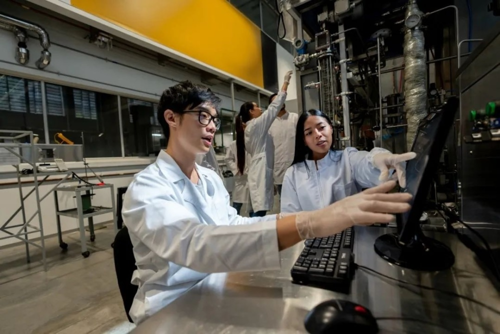
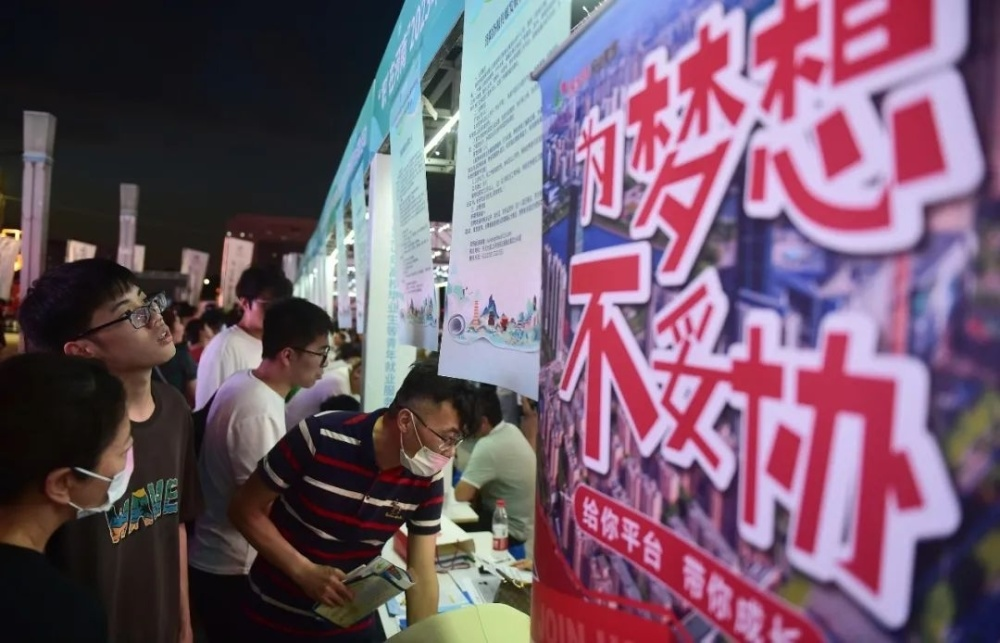
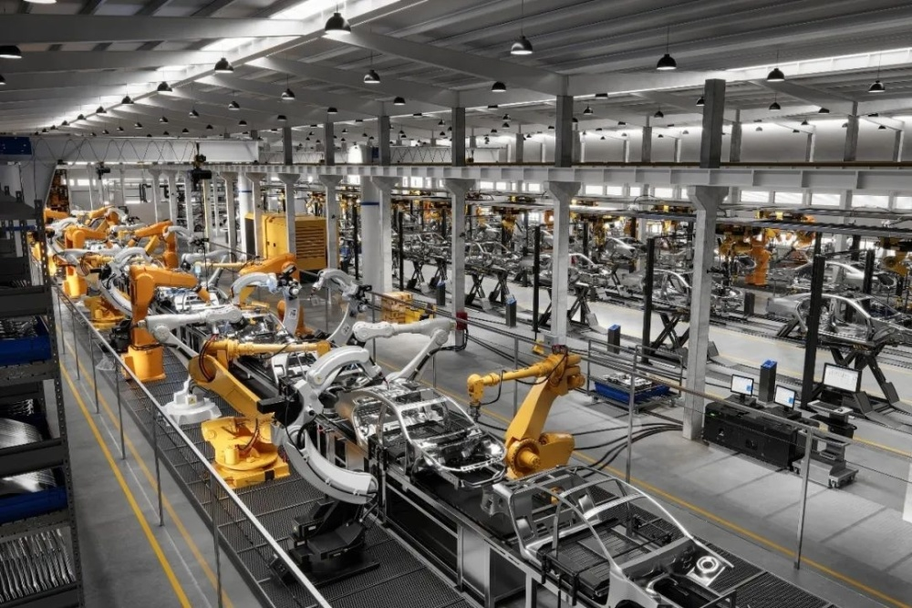

# 制造业成了应届生的“就业稻草”

在低气压的就业现实里，制造业维持着它的流动。尽管它不是突然多出来的行业，但对年轻人来说，确实就像多出来的选择。大学毕业后该不该“进厂”？能否在制造业浪潮里站稳脚跟？这是他们要面对的问题。

**文｜** 邬宇琛

**编辑｜** 楚明

**图｜** 视觉中国

**齿轮发生转动**

到处都是车。

电动车、平衡车，各种奇怪车头的平衡车，还有车模型，被堆放在办公楼的各个角落。今年7月，21岁的李彩尔第一次踏进了这家电车制造公司的写字楼。她摇晃着脑袋四处张望这里的景象。“如果在其他公司，见到最多的（办公物件）可能是电脑，但在这里，是车。”

办公室坐落在一个园区，员工们开着自家公司生产的电车在里面“乱蹿”。李彩尔对眼前的一切感到新奇，觉得整个园区就像是个“汽车游乐园”。

“制造业原来是这样的吗？”这是这个00后入职第一天的疑问。

2个月前，计算机专业毕业的李彩尔迎来了她的第一份工作，在这家制造类企业担任项目经理。在此之前，她从未给自己铺设任何道路通向这里，只是被一股大浪推到这个陌生的地方。

文科生也进了制造业。王灿学的是德语专业，大三还去德国交换了一个学期。回国后，她考研失败，选择就业，在几家offer里选择了上海一家新能源制造企业，成为海外部门的项目经理。

企业总部在上海黄浦区，一个气派的写字楼里一整层都被公司包下。王灿就此开始和从来没接触过的电池打交道。入职第一天开始，她把这段工作经历写成周记在社交平台上更新，标题是“文科生在制造业的摸爬滚打之旅”。

在就业环境发生变动的近几年，应届生的就业天平似乎正在倾向新的重心。《牛客2023春季校园招聘白皮书》显示，2023届春招学生中，首选智能制造行业的本科生占比18%，硕士生达到26.1%。麦可思研究院发布的《2022就业蓝皮书》也提到，近五年，更多毕业生涌向地级市及以下地区，而在地级城市及以下地区就业的2021届本科生在制造业就业的比例排名第二，占到18.7%。

江西萍乡，一个五线城市，陕西某一本高校毕业的江妍婷拿了毕业证后就千里迢迢赶往这里，入职一家制造类国企。下了高铁，单位的班车已经在站外等待新鲜血液涌入。上了大巴，江妍婷和其他十几个应届生被送往市郊的工厂。她打听了一下，好几个新员工都是毕业于一本院校。

她透过车窗往外看，路两旁的高楼少得可怜。“这不是南方吗？”她心想。就在几个月前，江妍婷还在为就业抓心挠肺。几个月后，她就这样被送进了制造业。她那时就已觉得命运的齿轮开始转动。

齿轮是随变化的就业市场转动的。智联招聘数据显示，2022年智能制造领域招聘职位数同比增长53.8%，2020-2022年招聘职位数同比增幅均在50%以上。

2023年春季校招，比亚迪招纳了惊人的3.18万人，硕士和博士生占比61.3%。在2023届的应届生口中，比亚迪成为“点击即送”的代名词。“找不到工作就投比亚迪兜底。”李彩尔说。

在低气压的就业现实里，制造业维持着它的流动。尽管它不是突然多出来的行业，但对年轻人来说，确实就像多出来的选择。大学毕业后该不该“进厂”？能否在制造业浪潮里站稳脚跟？这是他们要面对的问题。

_2023年7月，河南洛阳举办制造业民营企业专场夜市招聘活动_

**抓住稻草先上岸吗？**

李彩尔至今还能记起那个笑容。

去年秋招，她已经杀进一家梦寐以求的互联网公司第四轮面试。主管让她描述一下过往经历，她开始把自己大学生涯中的实习经历、社团经历全盘托出，“组织了10场大型会议，和参会的老师同学们进行沟通，参加了一些比赛项目......”

她越说越没底气。直到说完后，主管露出了不经意的笑容，像是在表达“都不值得一提”，她才突然意识到：我原来真的没什么闪光点，不足以在这样规模的竞争里胜出。

在真正面对就业市场之前，李彩尔并没有想到计算机专业出来找工作会如此困难。她曾经以为，进入互联网公司、毕业就月入过万是计算机学生的标配。大三那年，她得到了无锡一家软件公司的项目管理实习机会。一天200元的薪资，在实习单位中已经算高，再加上租房补助500元、电脑补助100元，就连中午在公司饭堂吃饭也只要3元，“神仙工作砸到我头上了”。

在软件公司实习6个月，李彩尔觉得自己在心态和工作能力上都已经做好就业的准备。她兴致勃勃地准备秋招，“想要迫不及待地把自己扔进互联网公司”。但整个秋招下来，李彩尔却迎来0offer。滑铁卢之后，朋友建议她一起试试国考。她花了一个月的时间备考，没有在这场只选拔几人的考试中胜出。

对李彩尔来说，那是一个残酷的秋天。未来在哪？她还看不清楚。

直到去年11月，她第一次收到了一份offer，来自江苏南通一家重型机械制造企业。企业坐落在一个镇区的一家工业园区，五险一金的缴纳比例顶格，还开了8000多元的薪水。但镇区远离市区，需要40分钟车程。她到贴吧上“卧底”，找了几个厂里的员工打听办公环境。照片发来，李彩尔心都“凉了”：破旧的车间，工人们穿着工服埋头干活。她很纠结，一边是当时唯一的offer，另一边是不符合她期待的工作环境。“从未接触过工厂，难不成真的要成为蓝领了？”

2022年，我国制造业占全球制造业比重近30%，维持着世界第一制造大国的地位。但对年轻人来说，制造业似乎多年来没有成为很多人的就业首选。

3年前，人社部发布“2020年第四季度全国招聘大于求职“最缺工”的100个职业排行”，明确点出制造业岗位的旺盛需求，在彼时新进排行的25个职业中，有15个与制造业相关，占比60%，而短缺程度加大的34个职业中，有16个职业与制造业直接相关，占比47.1%。

外界也在将制造业塑造成简单的符号，比如，蓝领、车间、流水线、厂仔和厂妹，让希望找份好工作的大学生望而生疑。

推动他们作出选择的是潮起潮落的规律。就在6年前，求职需求最大的三个行业是互联网、房地产建筑和教育培训。如今这些行业不再像过去那样大量释放岗位，也褪去了许多吸引力。如今，制造业势头正起，再次成为新的人才迁徙区。应届生们像敏锐的候鸟一样不断涌入热腾腾的、能够被接纳的地方。

陕西一本高校毕业的江妍婷，也随着潮水上涨的方向涌入制造业。她大学读的是行政管理——一个因为就业率低下而面临裁撤风险的专业。进大学不久后，她对先读研后考公的路径设定已经非常清晰。她努力保研，但因为比赛、社团活动等综合评测分数低，最终还是回到考研的道路上。去年冬天，她发烧参加了考试，最终与理想院校失之交臂。她选择考公，同样失败。

她只能硬着头皮扎进今年的春招海洋里，不管什么行业，只要有看上去能做的岗位就投。一家成人教育培训公司发来offer，主要做电话销售。她拒绝了，不想无休止地打电话，也不想背负业绩压力。就在她找不到出路的时候，一家在江西萍乡的新能源制造国企发来了offer，岗位是文员。

那时，她分析这家制造类企业有自己的产品线，也意味有坚实的生产能力，至少在这几年可以维持稳定的发展。同时，国企、新能源，这些字眼也让一个行政管理专业的学生感到满意，“签三年合同可以保护自己”。她决定接过这份offer，因为她的选择已经不多。今年7月，她从陕西来到江西，转车到了萍乡。“终于有工作了。”她想。

制造业像是一根恰好出现的救命稻草，挽救了这些困在就业市场的年轻人。

王灿能抓住的也是来自两家制造企业投来的橄榄枝，一家是日企制造商，另一家是新能源民企制造商。她从前对制造业毫无了解，也从没设想过小语种专业毕业后会踏入其中。两家企业开出的工资都让这名文科生垂涎，前者起薪九千，后者则过万。价高者为王，她还是选择了后者。

双一流高校毕业的工科硕士张琳，在去年秋天投了100多份简历，最后得到了3家offer，恰巧都来自制造业——其中就包括比亚迪。她最后选择去深圳一家手机制造厂商，一毕业就拿到了30万元薪资年包。

**纠偏**

“怀疑。”是李彩尔入职电车制造公司的第一感受。

她还记得自己在入职培训时听培训讲师介绍，“我们公司是一家具有互联网精神的制造企业”。在软件公司实习过的李彩尔有些不屑，她站起来发问：“你们是怎么理解互联网精神的呢？互联网精神是怎么在制造业体现的呢？”

这位讲师不紧不慢地解释，因为这家公司和一家互联网公司曾保持密切的合作关系，在运营模式上都受到互联网公司的影响。李彩尔并不买账，“制造业公司就应该大大方方承认自己是制造业的，不要假装特立独行，玩一下概念”。

显然，年轻人虽然涌入制造业，但仍然需要被这个行业说服。入职后不久，她就被带到车间参观。那是她第一次“进厂”，站在干净的地面上，可以从头望到尾。一辆车在生产线头部还是散乱的零件，到了尾部就变成了一辆完整的电动车。“震撼。”她站在产线旁这么想。计算机专业的她觉得这种冲击可能来源于产品的“实感”。对她来说，代码是靠逻辑和想象建构的，会对过程感到困惑，但眼睛似乎不会欺骗人，在生产线上，一辆车的诞生过程，每一步都直观可见。

车间之旅颠覆了她的想象，“原来工厂不脏不乱，而且还井然有序”。她工作区域在园区的一栋写字楼，生产车间只隔1公里。她骑着自家公司生产的小电车，可以快速抵达。

同是项目经理的王灿也有这样的体验。作为一名文科生，她穿着无尘服第一次到达车间参观的时候，为整个工厂的规模震惊。工厂接近一个足球场那么大，有几层楼，每一层楼都有好几个生产线。在生产线的头部，是符合传统制造业印象的一个巨型搅拌罐，后端则是自动化程度相当高的装配环节。整个工厂的环境同样干净整洁。

工厂给年轻人带来了新印象，而写字楼里的工作让人感受着一种熟悉的氛围。在“有互联网精神”的电车制造企业，下午茶是必备的。每天下午，这家公司都会放出牛奶、面包、水果等供员工免费领取。除此之外，公司每年也会有2次团建。

王灿入职时第一眼瞥见的除了无限供应的咖啡，还有同事们桌上摆放的超大显示屏。在互联网大厂削减福利开支的这两年，制造业的待遇则在迎头赶上。在手机制造厂商，张琳在深圳的办公总部上班，由于是测试岗位，她至今仍未下过车间。工作没满一年，她在公司过着和普通白领相似的生活。

入职后不久，李彩尔再次问了领导那个问题：“互联网精神到底是什么？”领导告诉她，互联网精神是一种对产品的极致化追求，智能产品才是企业的关键。公司鼓励员工在产品上玩出花样，其中一辆电车就是靠员工拆了后重装玩出来的。

“这个东西非常酷。”李彩尔就这样逐渐认可了自家的公司。

 _工厂生产线上的汽车_

**磨合，或被消磨**

同样是新能源制造企业，江妍婷的公司坐落在五线城市的郊区，从这里去市区要花费40分钟。打开外卖软件，甚至看不到能配送过来的商家。

江妍婷起初没有那么不安。入职前半个月是培训期，她就像走过场一样安稳度过。第一次真正感受到“制造业”，是自己在饭堂吃饭的时候，普工们浩浩荡荡地从远方涌入饭堂大门，坐在江妍婷的附近。她用余光打量着这些工人们。普工们身上沾着化工产线上留下的痕迹和污渍，但他们却若无其事地吃着饭。在工人中间，这位一本毕业的学生调整了自己的坐姿，埋下头继续吃饭。

在半个月培训期结束后，江妍婷被转到车间里轮岗。她始终没有见到过办公室。幻想中的新能源的高科技、现代化工厂也没有出现，她发现车间还是以人力劳动为主。进入车间要接触化学用品，江妍婷把口罩按得很紧，生怕呼吸进什么不好的物质。工人们早就对此习以为常，甚至觉得口罩闷，索性摘了口罩作业。

身为文员的她和工人们穿着一样颜色的蓝色工服上班、轮班。她想，“我是女孩子啊，我也想穿好看的衣服上班”。为了保证生产线源源不断地轮转下去，轮班甚至不止3个班次，而是不定时的轮班。有时候她被要求凌晨3点起来工作，直到第二天下午1点钟。她生物钟调不过来，夜里失眠，一天只能睡3个小时。

在车间里，她和工人们一起绕着产线走，带她的师傅看她是大学生，没有特别指望她帮忙。她的工作大部分时间是拿着扫把打扫卫生要求很高的车间。她不知疲倦地移动步伐，一天下来，微信步数可以达到20000步。有时候，她也会心想，“我大学毕业为什么会来干这份工作？”

制造业兼容了传统和新兴的工作形态。对于新涌进来的年轻人而言，想要稳住这份工作，就必须重塑对工作的认知。入职后不久，公司的同事就告诉王灿，“要做好重新读一个大学的准备”。

文科生王灿遇到的第一个困难是开会。作为一名项目经理，她必须要了解项目和产品的具体内容，从而参与项目的把关甚至决策。在新能源制造公司，当然就是需要知道一块电池如何生产，如何发电。在会议上，外国客户会滔滔不绝地讲述产品相关的内容，全是用英文，这对王灿来说更加困难。她通常都会把语音转录的文字保存，会议之后去查询一个个单词的词义。直到今年年初，王灿才真正逐渐上手了这份工作。

同是项目经理的李彩尔也要从头学起。过去她对机械完全无感，是一个“讨厌动手的人”，但现在她下了车间一定要找工程师问问，“这个零件是做什么的？”“这个原理是什么？”她还试着组装一辆车。

即便身处同样的行业，工作环境也各不相同。对江妍婷而言，制造业的面目似乎更加粗粝。公司包住宿，六个人住在一间廉租房里。但廉租房远离车间，骑电动车上班大概10分钟。路上没灯，江妍婷听说这里出了好几起车祸，她有点担心。一个周末，江妍婷好不容易想出趟门休息，走到厂区外打听，一个大爷告诉她，这附近没有公交车。她落寞地站在大路上，很想回到北方。

**潮落潮起**

“对我来说，它确实是救命稻草，但也是压死骆驼的最后一根稻草。”江妍婷说。

江妍婷正在考虑是否离职。在没见到办公室之前，她拿着4000多元的试用期工资，做着每天工作11小时的工作，享受不到快乐，也没觉得学到东西。但如果离职怎么办呢？她又要陷入不确定的迷茫里了。她想好了，下个月必须做决定。“这份工作就像别人啃掉的骨头一样，食之无味弃之可惜。”如果离开，她就回家全职备考，继续考研考公。

有人走，有人留。应届生李彩尔至今工作2个月，觉得自己还远没有接触到行业的全部面貌。就在不久前，她被调到一个新岗位。过去，她负责一个项目的前端，比如生产、设计，现在她要负责项目的后端，比如仓储和交付。公司是弹性工作制，规则上要求早上9点上班，但实际上可以灵活调整。她不确定自己会不会面临新的困难，开始感到压力倍增。

尽管如此，两个月的工作经历也足以让她对制造业改观。她感受到了这份工作要比自己想象的有魅力。她还发现，制造业似乎包容所有的人，普工可以是大专起步，研发也可以是35岁以上，越老越吃香，而职能部门的人可以来自各个层次的学校。

一个三本的同事比李彩尔大一岁，有一天，她突然问李彩尔，“你211毕业来这不会觉得吃亏吗？”

李彩尔当时有点回避这个问题，绕着弯子就把问题躲过去了。但后来她发现，这个同事很有能量，“像是一把锋利的刀子”。毕业那年，她把所有的大厂、小厂都投了一遍，根本不给自己设限，最后和李彩尔坐在一起。两个人遇到技术研发上的问题都不懂时，这名负责采购的同事就会主动去请教研发的同事。

在制造业，这样的人数不胜数，他们给李彩尔带来从来没感受过的能量。一个研发的同事整天待在操作间，直到晚上8点多才离开。李彩尔发现他对组装车“非常偏执”，能把一辆车装到百分之七八十对她来说已经足够了，但他一定会让车呈现出百分之百的完美状态。“不同的零件可以组装出不同的车，可能通过不同的组装方式研究出一个新品。”这名研发同事至今已经“攒”了两辆车了。

应届生进入制造业意味着什么？2022年中国高技术制造业投资比上年增长22.2%，增速与上年持平。它是一个落脚点，也是产业更迭的一部分。没有人会小视制造业推动未来的作用，但如何融入新的潮流也是新晋就业者要面对的问题。

“如果好好学东西，还是能在行业里接触很多跨时代的技术。它是实实在在的新天地。如果应届生带着偏见进来，觉得被坑了，那就不好了。”初入制造业的李彩尔说。“归根结底，它和别的行业的工作没什么不同。”

对于已经工作一年的王灿来说，工作已经步入正轨。她每天的工作是开会、沟通，每个月至少还会陪客户下一次车间。有时候接到客户一个电话，就要加班到晚上八九点。她往返于江苏和上海，在车间和写字楼间穿梭。她感知到公司业务正在迅速扩大。她打听到，今年校招，公司已经招了400个人，明年可能要招800个。

外部环境跌宕起伏，她有些侥幸自己站在了可能没那么摇晃的船只上。

（应受访者要求，李彩尔、江妍婷、王灿、张琳皆为化名）

