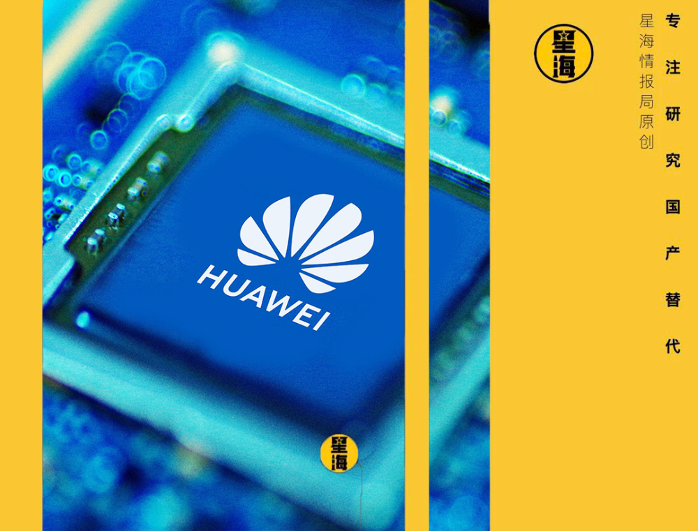
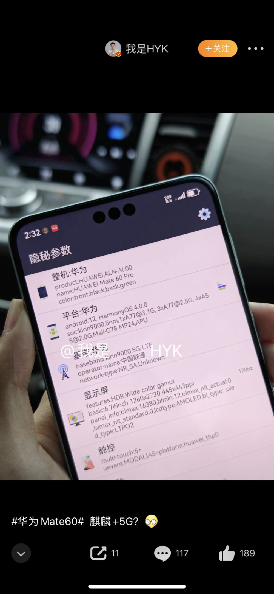
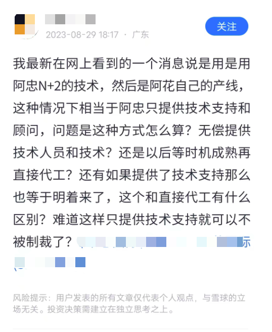
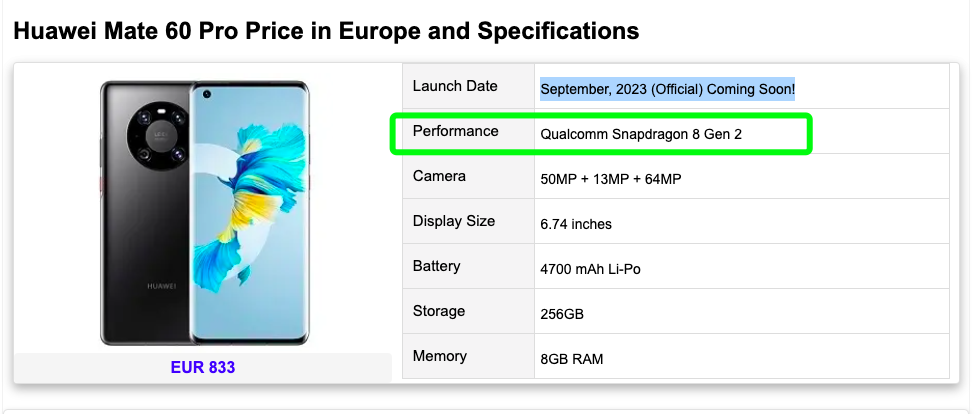

# 华为Mate60系列的芯片，哪来的？

今天最最炸裂的消息来自于华为，中午吃完饭后水一下微信群，结果发现几乎所有群里都在说华为推出Mate60系列的事情——工作群、行业群、聊天群……

**而这里面最值得关注的问题就是：华为Mate60的芯片，到底是什么来路。**

下面，我就罗列一下我目前检索到的各种信息，大致梳理一下华为Mate60芯片的一些可能性。

**第一种可能性：**

**华为Mate60系列所使用的芯片是2020年9月禁令之前所囤积的产品。**
假设囤积数量足够且已知Mate40销量较少、Mate50使用高通芯片，因此，或许有足够的芯片供给Mate60.

关于这种可能性推断的信息来源有两个：

一个是微博数码博主@我是HYK的照片：照片显示Mate60使用的是Kirin 9000（麒麟9000）芯片，制程为5nm。

当年囤积的那批麒麟9000，就是5nm的制程。

另一个则是telecoms网站上一位名叫Scott Bicheno的作者。该作者在2020年10月22日的一篇文章中写道：

译文：另一个巨大的变量是——在禁令生效前，华为最终从台积电或者别的厂商那里获得了多少麒麟9000芯片（这个“s”一说是复数，但如今业内更倾向于是超频版）。有一些报告估计华为已经囤积了上千万枚麒麟9000芯片，这是非常厉害的努力。中国媒体认为：Mate40作为一种“收藏品”，华为的这些存货应当是足够满足本土市场需要的。考虑到华为后期无法正常使用安卓系统，我们估计绝大多数销售都是针对中国本土市场的。

因此，如果我们只做简单的加减法数学题的话：如果当年华为囤积的麒麟9000芯片超过1000万枚，考虑到Mate40系列的销量较低，那么应当是有足够芯片供给Mate60的。

但现实不是简单的数学题，截止目前时刻（2023年8月29日晚6时），仍然无法验证这种可能性是否成立。

**第二种可能性：**

这种可能性或许有些过于惊悚了——来源于下午在微信群中的一个pdf文件，该文件可能是遭到泄露的内部文件，但也有可能是好事网友的伪造作品。

**这份pdf文件中非常明确地表示：Mate60使用了Kirin 9000 Super 5G Soc，且来自于中芯国际7nm全自研工艺。**

再比如，在华为官方的英文版论坛上，2022年6月23日发布了一个名为“New Kirin 9000S to power Huawei Mate
50”（新麒麟9000S芯片以驱动华为Mate50）的帖子。

甚至雪球app上有人说这是华为自己产线造出来的，背后是台积电派了技术指导小组。

只能说这个事情真的是众说纷纭，简直可以拍电影了。

注意，这里我要认真说明：基于目前掌握的消息，我个人对此持谨慎观望态度。

理由有两个：第一，这个pdf文件的一些做工不是很细致，完全没有官方出品的pdf文件的那种质感——尤其是芯片那一页，对图片的处理水平甚至不如我这个业余的ppt制作爱好者。第二，此前从未在任何公开且可靠的渠道获悉中芯国际可以大规模、廉价制造7nm制程芯片，中芯国际官网仅显示了关于14nm的一些消息，未有信息表示中芯国际可以大规模量产7nm产品。第三，建设一条芯片产线成本极高，华为如果自建能造7nm的高端芯片产线，年报里必然有所体现——但至今无人发现。

**从理性上来说，基于种种可靠渠道的信息，我认为这种可能性几乎不存在。**

**从情感上来说，憋屈了这么些年，我真的很希望我自己的分析是错的，这个世界就是有奇迹存在的。**

**第三种可能性：**

和第二种近似，不过比第二种要看上去更靠谱一些。

**华为Mate60系列可能使用的是一种使用了3D堆叠技术的芯片，让两块不那么先进的芯片组合在一起，实现“1+1大于2”、比较先进的效果。**

理由有两个：

其一是，2022年初，华为年报发布会，当时华为轮值董事长郭平曾表示：华为可以用面积换来性能，采用堆叠工艺，哪怕不那么先进的芯片也可以有竞争力。

其二是，华为的确在芯片堆叠上颇有成绩——20天前，2023年8月9日，华为申请了一项名为“芯片堆叠结构及其形成方法”的专利。

这种可能性的确非常有诱惑力：因为它完美契合了我们的诸多要求：技术上问题不大，自主可控、绕开了台积电和ASML的高端设备也可以实现。

唯一的问题是：如果真的是堆叠，那么华为是否已经完全掌握了解决相关的能耗、发热问题的技术？

**第四种可能性：**

华为Mate60还是用的高通芯片

这个信息来源是国外的一些网站，不过我个人觉得这些非常不靠谱——因为这些网站对于Mate60性能的估计实在离谱——甚至还有觉得Mate60系列最大存储空间只有512GB的……

综合来看，我个人认为Mate60系列一定是在芯片上有一个比较重大的变动，但这个变动是否就是7nm芯片国产化或者堆叠技术，或者还是原来囤积的东西，这就需要等到9月12日的发布会上才能真正见分晓了。

**当然，我从来都非常相信中芯国际、华为以及中国所有半导体行业从业者的智慧和能力**
，如果真的出现了奇迹性的突破，实际上也并不令人惊讶——当年我们的先辈一穷二白的时候都没有放弃过希望，何况如今已经羽翼渐渐丰满的我们呢？

我很希望这次装在Mate60里的是一块我们自己生产的芯片，因为不论这是来自于全新的、未被公开的制造技术，还是来自于某种奇妙的工程学手段，Mate60+国产芯片这个组合本身就已经足够令我们振奋了！

**因为这意味着：轻舟已过万重山，我们的的确确有能力突破封锁再创辉煌。**

**星海情报局-精选代表作**

Operator1128（转载）

