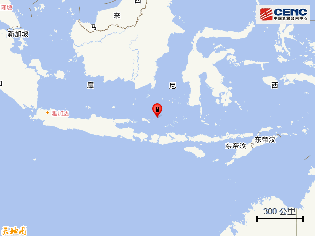
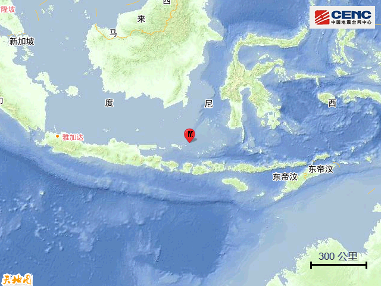
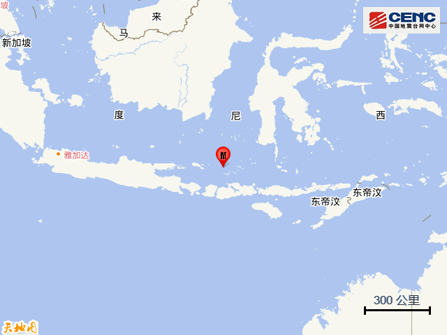
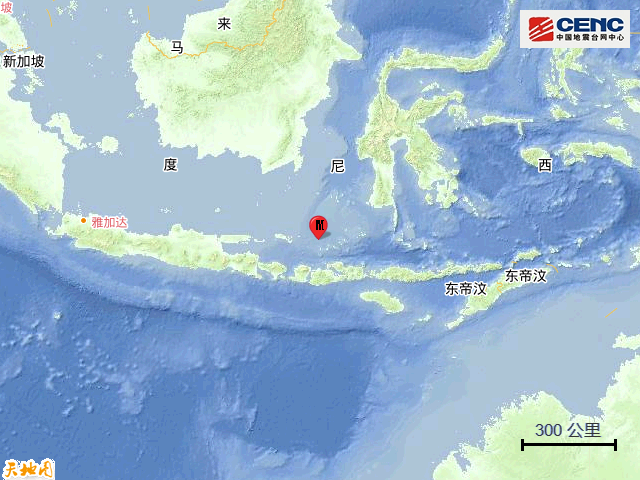

# 印尼连发3次地震，最高7.4级！

据央视新闻客户端援引印尼气象、气候和地球物理局消息，当地时间8月29日2时55分，印度尼西亚南加里曼丹省塔纳本布县东南方向180公里处海域发生
**7.4级地震** ，震源深度10公里。印尼气象、气候和地球物理局称， **预计不会发生海啸** 。

另据当地媒体消息，印尼巴厘岛、龙目岛等多地有震感。相关部门提醒民众有发生余震的可能。

据中国地震台网正式测定，北京时间8月29日3时55分（当地时间8月29日3时55分）在印尼巴厘海发生 **7.1级地震**
，震源深度520公里，震中位于南纬6.80度，东经116.60度。

**基础背景**

**周边城市** ：震中300公里范围内有6座大中城市，最近为马塔兰（Mataram），距震中约206公里。

**震中地形** ：震中5公里范围内平均海拔约-417米。

据中国地震台网正式测定，北京时间8月29日4时8分（当地时间8月29日4时8分）在印尼巴厘海发生 **5.9级地震**
，震源深度470公里，震中位于南纬7.15度，东经117.20度。

**基础背景**

**周边城市** ：震中200公里范围内有2座大中城市，最近为普拉亚（Praya），距震中约197公里。

**震中地形** ：震中5公里范围内平均海拔约-536米。

**来源：中国新闻社综合自央视新闻客户端、中国地震台网**

