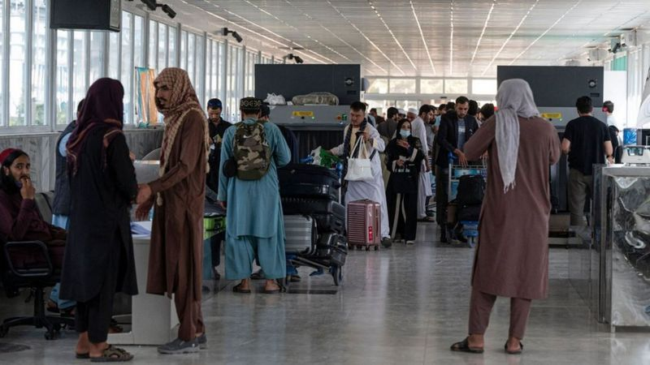

# 外媒：塔利班阻止女性出国留学，至少60名奖学金获得者无法离境

（观察者网讯）阿富汗塔利班自掌权后已发布多项限制女性权利的命令。今年1月，阿富汗女性被禁止参加高校入学考试，部分学生不得已申请海外奖学金出国留学。

不过，这一选择也面临着被塔利班阻止的风险。据英国广播公司（BBC）8月28日报道，有获得奖学金的阿富汗女学生透露，她在机场被塔利班官员阻止离境。目前，已有约60名阿富汗女性不被允许离境，其中包括获得签证、有男性“监护人”陪同的女性。

_数十名阿富汗女孩在机场被塔利班阻止出国读书，图自BBC_

“塔利班禁止女生读大学后，我唯一的希望就是申请奖学金出国留学。”20岁阿富汗学生纳特凯（Natkai，化名）告诉BBC，她在国内上大学的机会渺茫，但仍坚持学习，申请奖学金入读阿联酋迪拜大学。

BBC称，纳特凯提到的奖学金为阿联酋亿万富翁哈布托尔（Sheikh Khalaf Ahmad Al
Habtoor）2022年12月启动的阿富汗女性奖学金。据了解，共有100名阿富汗女性获得了这些奖学金，其中一些居住在国外的阿富汗学生已经前往迪拜。

纳特凯表示，8月23日，她出发前往机场，但很快她的希望就破灭了。“当塔利班官员看到我们的机票和学生签证时，他们说不允许女孩持学生签证离开阿富汗。”

BBC得知，至少有60名女孩在机场被拒绝离境，其中包括有男性“监护人”（mahram，即丈夫、父兄等有血缘关系的男性）陪同的女孩。现场照片显示，这些戴着头巾的女孩们站在行李旁边，表情震惊而沮丧。

艾哈迈德（Shams
Ahmad，化名）是陪同妹妹到机场，但被塔利班阻止离境的其中一员。他告诉BBC：“入学国内高校的途径被关闭后，奖学金让我的妹妹有了新希望。她满怀希望地离开家，又哭着回来了。她所有的权利都被剥夺了。”

_阿富汗女性抗议塔利班限制女性教育和工作，图自BBC_

阿联酋迪拜大学和阿富汗女性奖学金创办人哈布托尔已证实这些女学生离境受到阻挠。

8月23日，哈布托尔在推特发布视频，对塔利班的所作所为表示失望。他说：“我已经无法用语言表达自己的失望，经团队成员过几个月来的不懈努力，我们确保了入学、住宿、交通、医疗保险以及一系列旨在确保女学生最大程度舒适和安全的综合服务，但我们的愿望被粉碎了。阿富汗当局毫无理由地阻止女孩们离开，不公正地限制了她们的自由。”

“这是一个悲剧，是对人道、教育、平等和正义原则的打击。我请求所有相关方迅速介入，帮助拯救和帮助这些苦苦挣扎的学生。”哈布托尔随后@了联合国、联合国教科文组织和联合国人权组织的推特官方账号。

_阿富汗女性奖学金创办人、阿联酋亿万富翁哈布托尔谴责塔利班，推文截图_

阿富汗塔利班近年来已发布多项限制女性权利的命令：去年12月，塔利班发布禁令，要求所有当地和国外的非政府组织（NGO）禁止其女性雇员上班；今年1月，塔利班下令包括所有私立大学和教育机构在内的各高校不准女性参加入学考试；4月，所有阿富汗女性不被允许为联合国机构工作；7月，塔利班关闭了全国范围内的女子美容院……

联合国开发计划署4月18日发布的《2023年阿富汗社会经济展望》报告显示，对妇女学习和工作能力的严厉限制，加剧了阿富汗灾难性的社会经济局势，给民众带来毁灭性后果。

开发署驻阿富汗代表布祖鲁科娃（Surayo
Buzurukova）指出，塔利班作出严重限制妇女学习和工作能力的决定是该国陷入经济困境的一个重要原因。“如果没有妇女，就不可能实现经济增长和减贫。这是我们在与事实当局沟通时尝试传达的信息。”

BBC表示，塔利班最新一轮限制女性权利的行动，已引发人权组织和国际社会的不安。但截至目前，塔利班没有就此事发表任何声明或做出任何澄清。

被阻止出国读书的纳特凯正陷入沮丧之中。

纳特凯说，她对塔利班无话可说，因为“他们不接受或尊重妇女”。同时，她呼吁世界不要放弃阿富汗女性和女性的教育。“在这个国家，身为女性就是一种罪，我在这里错过了（求学的）机会。我很伤心，我不知道该怎么办，也不知道接下来会发生什么。”

**本文系观察者网独家稿件，未经授权，不得转载。**

