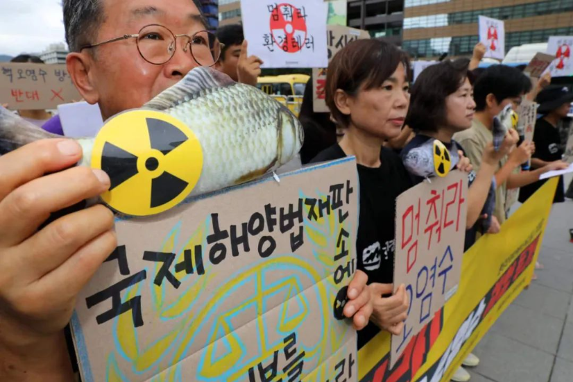
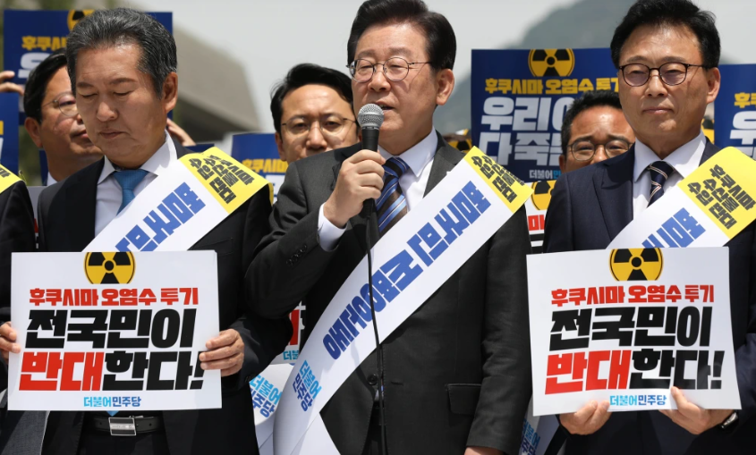

# 媒体：韩国经济成日本核污染水的祭品，为巩固新搭建的美日韩同盟关系

_▲当地时间2023年8月28日，韩国仁川，韩国总统尹锡悦出席执政党国民力量党的研讨会，晚宴桌上摆放着生鱼片和章鱼料理。图/IC photo_

8月28日是日本核污染水排海第五天。据韩国《东亚日报》报道，当天，韩国釜山最著名的海鲜市场札嘎其市场生意萧条，二楼餐厅在午餐时间空无一人。有商家感叹，生意“比日本地震引发核事故时还差”。

不过，当天中午，韩国总统尹锡悦与国务总理韩德洙在总统府举行了一场“海鲜例会”，一同食用了包括海鲜在内的菜肴。

据韩国总统办公室发言人介绍，总统府员工食堂将连续一周持续供应海鲜菜品，此举旨在强调日本福岛核污染水排海后韩国国内水产品的安全性，鼓励水产消费。

**韩国民众并不买账**

虽然韩国总统府举行的“海鲜例会”意在表明韩国水产品是安全的，但换个角度看，说明韩国水产品贸易已经受到严重冲击，迫使尹锡悦政府不得不用“海鲜例会”这样的方式加以安抚。

其实尹锡悦政府对于日本核污染水排海带来的危险不是没有心理准备。

今年7月份，韩国政府就决定用3500亿韩元（约19.4亿人民币）补贴因日本排放福岛核污染水而遭受损失的水产业商户。同时，把水产品储备预算提高了两倍，以储备水产品应对未来市场可能出现的动荡。韩国政府还计划投放640亿韩元（约3.5亿人民币）的水产品优惠券，促进水产消费。

不过，韩国民众看起来并不买账。日本启动核污染水排海后，韩国民众除了抢盐，还开始大量囤积便于储存的水产品干货。

据韩国全国渔民会总联盟预计，在日本核污染水排海之后，韩国水产品的消费会减少约50%。

在这样的形势下，韩国总统府祭出连吃一周海鲜的象征性姿态，就未免有些轻飘飘而且不接地气了。

 _▲2023年8月24日，市民手举标语在韩国首尔市中心集会，抗议日本核污染水排海。图/新华社_

**韩国四大在野党均反对**

对于尹锡悦政府的“海鲜例会”，韩国最大在野党共同民主党批评其是在作秀。

8月26日，共同民主党党首李在明就以空前强烈的措辞抨击日本核污染水排海之举“是对人类的挑衅，是向太平洋沿岸国家宣战。”他还提醒说，尹锡悦应该牢记自己不是日本的跑腿和代理人，而是韩国国民的代理人。

除了共同民主党，韩国另外三大在野党正义党、基本收入党、进步党也均加入了反对日本核污染水排海的行列中。在8月26日有5万人参加的集会上，四大在野党与90多个韩国市民社会团体都参加了。

韩国正义党党鞭裴晋教在集会上表示：“现在我们的海洋将经历无法挽回的黑暗30年，甚至一个世纪，分为核污染水排入前和排入后。”他还指出，韩国政府已成为
“核污染水恐怖袭击的帮凶”。

韩国在野党派代表了多数韩国民众的呼声—民调显示，80%的韩国民众反对日本核污染水排海计划。

 _▲资料图：韩国最大在野党共同民主党党首李在明（中）在首尔光化门广场，呼吁市民参与反对福岛核污染水排海签名活动。图/新华社_

**韩国经济成“祭品”**

今年以来，韩国的经济形势本就不佳。韩国产业通商资源部的数据显示，截至7月份，韩国出口额已连续10个月下滑，从2022年3月至2023年5月，韩国对外贸易逆差持续15个月。

其中，韩国的核心产业信息通信产业的出口额连续13个月下滑。受出口萎缩影响，到7月份，韩国制造业采购经理人指数也已连续13个月处于萎缩状态。韩国经济规模如今也掉到了世界前十以外。

而在日本核污染水排海一事上，韩国政府一意为日本开道辩护，很可能进一步让韩国经济成为日本核污染水的“祭品”。

其实，今年上半年韩国水产品出口也在萎缩当中，出口额同比减少了
10.3%。其中对欧盟和英国出口减少了16.4%；对美国减少了8.2%。相对而言，对大中华区出口减少算少的，只减少了2%。

但随着韩国渔民捕鱼积极性下降，加之尹锡悦政府的相关立场，今年下半年水产品出口势必还会大降。

为日本核污染水排海开道带来的问题如此之大，为何尹锡悦政府还执意为之？韩国政府内部人士承认，主要是为了巩固新搭建的美日韩同盟关系。

在这种考量下，为日本核污染水开道都不算什么事。据韩联社报道，尹锡悦政府正考虑把韩国早期抗日先烈洪范图将军的胸像从陆军士官学校校园和国防部大楼移走。而在2021年，洪范图的遗骸从哈萨克斯坦移回韩国首尔显忠院时，还得到了最高礼遇。

近日，日本东京新宿高丽博物馆首次展出了近100年未曾公开的屠杀朝鲜人画卷。1923年关东大地震时，日本屠杀了约6000名朝鲜人。在日本核污染水排海引发韩国民众强烈反弹之时，这幅画卷的展出实在是一次有益的提醒。

撰稿/徐立凡（专栏作家）

编辑/迟道华

校对/陈荻雁

