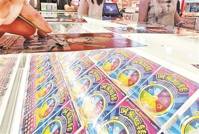
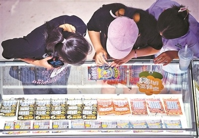
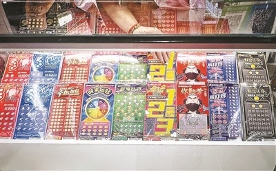

# 年轻人刮起“刮刮乐”风：买家多数会赔掉一半，兼职摆摊卖可“返点”

_“刮刮乐”买完就能在柜台上刮奖_

_年轻人围在彩票柜台前刮奖_

_“刮刮乐”一类的彩票品种繁多_

近来，年轻人中开始刮起一股“刮刮乐”风。他们隔三差五买几张“喜相逢”“点石成金”或是“好运十倍”玩一玩，还有年轻的同事一起集资“分红”买整本“大7”。总体来说，虽然“中少赔多”，但正像这类即开型彩票“刮刮乐”的名字一样：刮的就是一个乐呵。

根据财政部网站8月份公布的消息，截至今年上半年，全国彩票销售额中增幅最大的便是即开型彩票，同比增长99.4%，几乎翻了一倍。

相较于双色球、大乐透等传统数字型彩票，“刮刮乐”开始成为年轻人试手气、买快感，甚至是新社交的“主阵地”。

同时专家也提示，年轻人买彩票，可以当作一种娱乐，但不要当作发财的途径。

**购买者说：“刮刮乐”玩家多数会赔掉成本一半，情侣七夕玩起“刮刮乐”**

七夕节的傍晚，常营龙湖天街地下二层的体育彩票柜台前围满了年轻的男男女女。那天聚在这里扎堆刮彩票的年轻人中，还多了不少情侣。小情侣两人各买一张“刮刮乐”，似乎成了一种新的情人节仪式。

一对情侣经过彩票柜台，见柜台前围拢了很多人，犹豫片刻后，他们也挤了进去。可能是出于好奇，女生买了一张20元的“刮刮乐”。没想到就刮了一次，两人便来了精神。虽然第一张并没中奖，但女生果断地又买了一张20元的，这次她让男友刮，终于刮出了20元奖金，“不用兑钱了，您再给来一张吧。”小情侣开心地说。

刮到奖金后，用奖金买彩票继续刮，这在卖彩票的现场很常见。据店员介绍，年轻人玩“刮刮乐”，都不太在乎中奖的那几十元，就是想通过“刮刮乐”获得一种短暂的快感。

**上班族：集资买“大7”**

最近，上班族小翼也爱上了“刮刮乐”。每月发完工资，他便和同一办公室的三个年轻同事合伙买彩票。不久前，4个人一起凑了600元，买了一本共计30张名为“大7”的体彩“刮刮乐”。

按照玩法，“大7”只要刮到数字7，就可以获得数字7下方标注的奖金。如果在一张彩票上刮出多个7，就能获得所有7下方的累计金额。

一开始，小翼和同事只刮中了几十元，但大家的情绪却高涨起来，“哇哦！7！哇噻！又一个7……”随着7出现得越来越频繁，几人的声调也越来越高。最终，4个人总共刮出了1100元奖金。

“赚了！”因为4个人是等比投入，于是平分了奖金。“这一次算是把之前几次投进去的钱都找补回来了。”小翼说自己此前不常玩彩票，但最近他在社交媒体上总能看见朋友发刮彩票的内容，就觉得挺有意思，自己也想尝试一下。

“每次和朋友逛街，路过彩票店，就会刮个两三张，主打一个消遣娱乐。”今年24岁的星遥，从大学开始就在北京，如今做着外贸工作，平常因为工作压力大，她习惯用刮彩票的方式来排解。

每次刮彩票，星遥都会感到莫名的解压和快感，她也想不起来自己是从哪一次开始，从刮涂层的过程中找到了满足和快乐，“其实我对从里面刮到多少钱并不在意，因为期望越大，反而失望越大，现在不管是去KTV唱歌，还是看一场话剧，都要好几百元，喝杯奶茶、咖啡都要二三十元，‘刮刮乐’也算是便宜的一种娱乐方式了。”

**骑手：怕“上头”购买定上限**

在“刮刮乐”玩家圈里流行着一个词——“赔半”。意思是说，“刮刮乐”中大奖的概率虽然不高，但中小奖还是比较容易的，多买几张就有可能中奖。只不过，中奖金额很难覆盖成本，最终算下来，大多会赔掉成本的一半。

尽管大家都知道买彩票是“中少赔多”，但即开型彩票还是激起不少人试试运气的冲动。

8月中旬的一天下午，外卖小哥小常趁着没有订单的空当，到通州九棵树附近的一家彩票店买了一张大乐透彩票，随手还要了一张20元面值的“刮刮乐”，在彩票店里就用瓶起子刮了起来。

待大乐透的彩票打出来，小常手中的“刮刮乐”也已刮完。“没有。”他低声嘀咕了一句，转手又用手机扫了40元，拿了两张“刮刮乐”，在一旁刮起来，“还是没有，看来今天运气不行，改天再试试。”

这时，彩票店女店员把大乐透彩票单递到小常手里，“上个月我们店中奖的人挺多的。这东西有时一阵一阵的，过段时间可能又好了。”

店员说：“有时我们也会规劝顾客理智点。有的客人刮‘上头’，真会几百元几千元的买。”

小常身边的骑手同行也有不少买“刮刮乐”的，中奖后大家也都会晒出来。“一般看见的人都会跃跃欲试，想自己也买一张试试。”小常说。

尽管今天连刮了多张都没中奖，但小常认为自己还算理性。小常说，虽然有时会有点小“上头”，不过他给自己定的买彩票金额上限是100元，哪怕都不中也会及时停手。

**大学生：不定期购买添惊喜**

上海财经大学的学生小方也会不定期去学校旁边的罗森便利店买点彩票。小方开始买彩票也是因为看到了社交媒体上的视频。当时令他印象深刻的是一个居住在长沙的博主特意去上海旅游买彩票，试图换地转运。

今年4月，小方经过便利店，突然想起了那条视频的内容，于是他走进店里，买了两张10元的“宝石之王”，刮奖后还真中了10元。在这之后，每次和朋友出去玩，小方都会买张彩票试试手气。

4个月里，他先后买了10张彩票，亏损了180元。买彩票对小方来说就像小时候买康师傅饮料玩“揭开瓶盖”：“再来一瓶”是惊喜，“谢谢惠顾”是常态。他觉得买彩票就是偶尔给自己的生活添点期盼和惊喜。

**销售者说：销售可“返点”年轻人开始摆摊卖彩票**

距离北京现代音乐学院不远处就有一家彩票店，据这家彩票店的店员介绍，销量好的时候，每天来买“刮刮乐”的学生客流都不间断。不过虽然买的人多，但店里的销售额并不高，学生们大多买个二三十元，凑凑热闹就收手了。

该店员介绍，“刮刮乐”这种即开型彩票已存在多年，目前有至少二三十种品类，销量一直都还不错，今年春夏算是迎来了一个高峰期，尤其是暑假之前这段时间销售尤为好，小面值的甚至一度出现了断货现象。

以学生为主的年轻人，开始成为“刮刮乐”彩票购买的生力军，这一情况不仅是在北京，在全国各地都有所体现。

于是，有些店家、年轻人看准了商机，拿着彩票到年轻人群流动量大的地方摆摊卖彩票，还有的人在社交媒体上转发自己摆摊卖彩票的情况，以吸引更多的年轻人买彩票。

在吉林摆摊卖“刮刮乐”的嘉慧通常固定从彩票店老板那里拿货，会得到7%的返点。如果能找到好的位置摆摊，一天卖出1000多元的彩票，大概能赚七八十元；如果卖得不好，一天只能赚十几元。

嘉慧说，现在小面值的“刮刮乐”卖得最好。不过，因为面值小，虽然卖得多，但赚得却不多。

摆摊卖“刮刮乐”的除了兼职的年轻人，还有体彩店老板及其家人。

浙江的一位摊主表示，自己的父母就是开彩票店的，彩票中心给店里返点8%，所以，他没事就摆摊帮父母代卖“刮刮乐”。卖得最好的时段一般是周末的晚上，如果能找到人流量大一些的地方，两个小时就能赚百十来元。

据这位摊主介绍，浙江的小面值“刮刮乐”已经出现断货的情况，有的还需要限购，“5元、10元面值的很久都没货了。目前卖得最好的是20元面值的‘中国红’和‘点石成金’。”

**购彩回潮：怀旧风刮起，街头抽奖上世纪曾风靡一时**

每次进彩票店，小翼都会想起小时候父辈们买彩票的情景。他记得，自己上小学时的上世纪90年代初，福利彩票一度非常火爆。当时，北京电视台会在晚饭后的时段直播摇奖。那个时候，小翼的父亲对彩票就挺着迷，会把每期的数字都抄在挂历上，然后研究规律，总结出一些数字后再去彩票店下注。小翼说，家里的长辈有人至今还有买彩票的习惯，只不过一直也没谁中过大奖。

资料显示，中国福利彩票始于1987年。当年7月，天津市造币厂印制出我国第一张福利彩票——中国社会福利有奖募捐券。1995年，“中国社会福利有奖募捐券”更名为“中国福利彩票”，中国彩票正式与国际接轨。中国福利彩票发展出了众多种类，包括双色球、3D、七乐彩、快乐8、“刮刮乐”等。

中国体育彩票则始于1994年，由原国家体委向国务院申请在全国范围内统一发行、统一印制、统一管理。经批准，1994-1995年度共发行10亿元体育彩票，筹集的资金主要用于补充大型赛事的举办经费。体育彩票种类同样繁多，包括超级大乐透、排列3、排列5、七星彩、足球胜负彩……

在那之后的20多年，中国福利彩票和体育彩票的发展，一直备受彩民关注。现在，年轻人迷上“刮刮乐”也算是一种怀旧风。星遥说，她每次刮彩票时，都像回到了童年，“用5角零花钱抽中小卖部老板设置的5元‘大奖’，那种感觉别提多开心了。”

小翼的同事也回想起小时候，一些大型百货商场门口会设置满额抽奖环节，就和现在的“刮刮乐”很像，奖品从洗发水到大彩电、冰箱……他还记得家里中过的最大的奖是一个微波炉，“当年这种现场兑奖的方式只是营造噱头，为了刺激消费，现在的‘刮刮乐’同样也在‘刺激’年轻的消费人群，毕竟没有人会拒绝未知的惊喜。”

**社交消遣：“赔半”的另一种解释是“陪伴”**

有不少彩票店店员和店主认为，年轻人喜欢“刮刮乐”的主要原因是出奖快，买了现场就能刮，刮完现场出结果，瞬间就能享受到喜悦，至于是赚是赔，反正面值都不大，大家也都不是很在乎。

而年龄大一些的中老年人，依旧喜欢双色球、大乐透这种彩票，有人还会在店里看每期中奖号码的图表，仔细研究，“年轻人没闲工夫，可能觉得那样比较浪费时间吧。”

因此，对于“刮刮乐”的外号“赔半”，还有另外一种解释——“陪伴”。采访中，很多年轻玩家都表示，“刮刮乐”已然成了他们的一种新型消遣和社交方式。

星遥认为，“刮刮乐”能给她带来短暂的快乐就足够了，她从不指望用一二十元中个百万大奖。她从玩“刮刮乐”至今，最多也就刮出过200元奖金，“其实让我开心的是面对未知，动手刮的这个过程，如果刮中能回本就开心一下，不回本也无所谓，一个字‘玩’嘛。”

小翼至今总共买过三次彩票，每次都是跟同事一起凑钱买，他觉得这已经成了他和同事的社交方式之一，“如果是我一个人就不买了，没意思，大家一起刮才好玩。”

对于买彩票，小翼和同事们的心态都很平稳，“大家买彩票并不是想着能中多大奖，因为所有人都清楚彩票中大奖的概率很小。我们不过是想在工作之余，找一种比较方便快捷的社交娱乐方式。中得多了大家一起狂笑，中得少了也是生活中的小惊喜，没中奖顶多就是一声叹息。”

小翼觉得，“刮刮乐”还有一个特点不同于双色球、大乐透等传统彩票，那就是参与感很强，可以在彩票店自己动手刮，刮中就能当场兑奖，“因为亲自动手了，就会让人有一种特殊的感觉。”

文/本报记者张子渊实习生陈金库周紫漪代紫庭

统筹/林艳张彬

摄影/本报记者郝羿张子渊

**提示：“刮刮乐”像开盲盒切勿当成投资途径**

北青报记者了解到，为了防止年轻人购彩沉迷、投入过大，在每一张彩票的票背显著位置，都有一句带着笑脸的“快乐购彩理性投注”提示语。据悉，体彩机构还实施了大额购彩预约和超额销售审批制度，对异常销售行为、大额购彩等销售风险监测，让广大购彩者在安全健康的购彩环境中享受投注带来的乐趣。

此前，上海师范大学商学院教授、彩票研究专家李刚接受媒体采访时表示，年轻人爱买即开型彩票，正如他们迷上盲盒，两者是一个道理，买“刮刮乐”，就是在开盲盒。李刚建议：年轻人买彩票，可以当作一种娱乐，但不要当作发财的途径。

