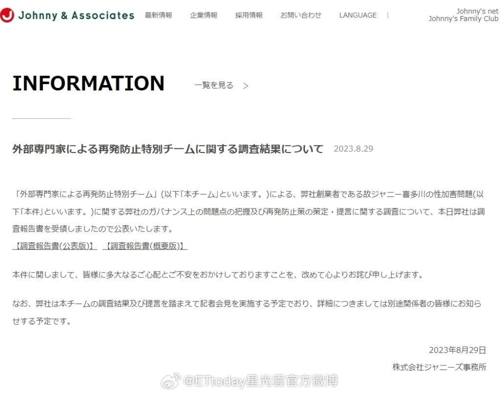
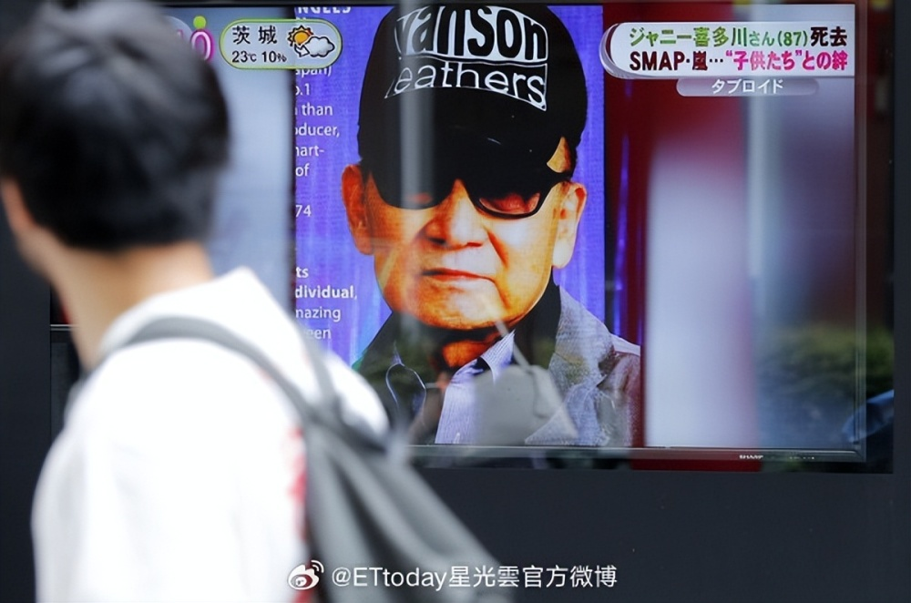
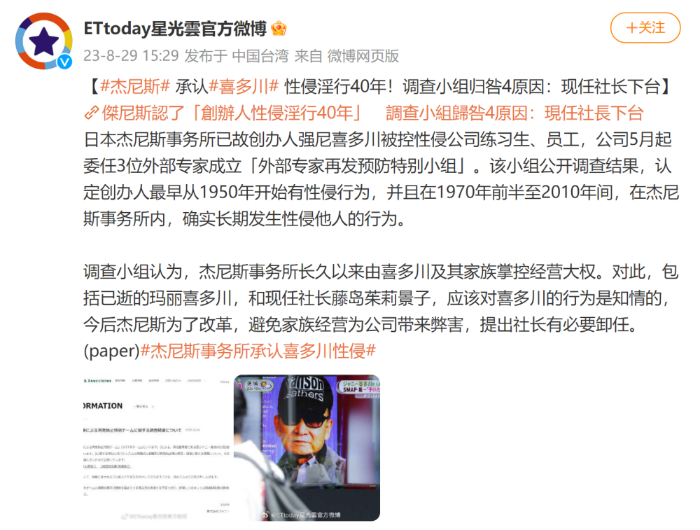

# 日本艺人经纪公司杰尼斯事务所公开：承认创办人喜多川性侵多人达40年

8月29日，据ETtoday星光云官方微博消息：日本杰尼斯事务所已故创办人强尼喜多川被控性侵公司练习生、员工，公司5月起委任3位外部专家成立「外部专家再发预防特别小组」。该小组公开调查结果，认定创办人最早从1950年开始有性侵行为，并且在1970年前半至2010年间，在杰尼斯事务所内，确实长期发生性侵他人的行为。

调查小组认为，杰尼斯事务所长久以来由喜多川及其家族掌控经营大权。对此，包括已逝的玛丽喜多川，和现任社长藤岛茱莉景子，应该对喜多川的行为是知情的，今后杰尼斯为了改革，避免家族经营为公司带来弊害，提出社长有必要卸任。

**【来源：ETtoday星光云】**

