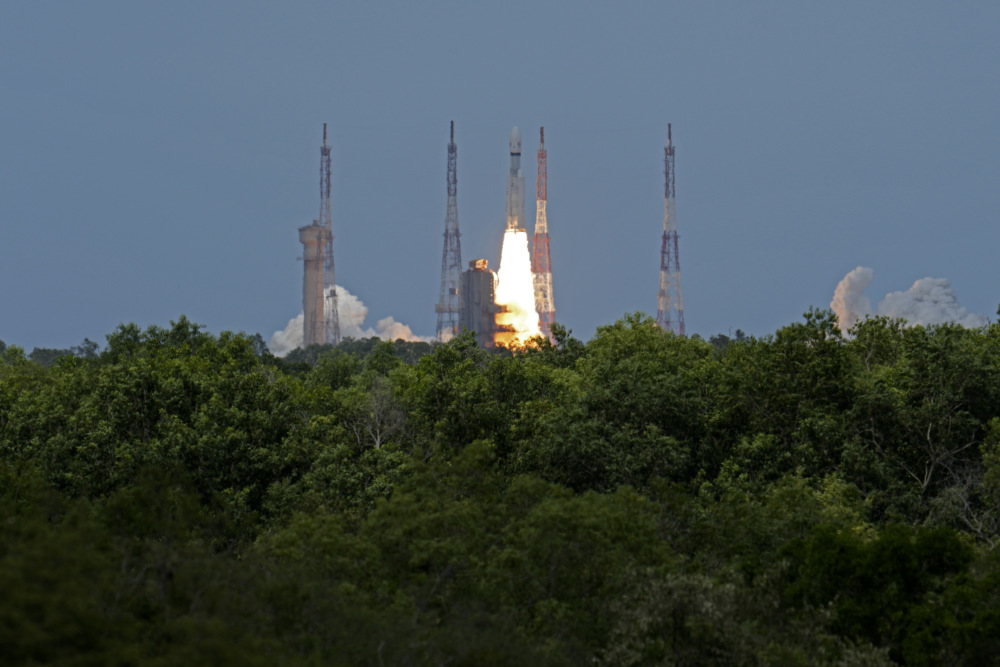

# 月球之后瞄准太阳，印度计划9月2日发射首个太阳探测器

**参考消息网8月29日报道** 据路透社8月28日报道，印度航天机构当日称，印度首个研究太阳的探测器将于9月2日发射。

这一消息是在社交媒体X（原推特）上发布的。几天前，印度成为第一个让航天器在未探索过的月球南极登陆的国家。

“日地L1点太阳”号航天器是印度首个天基太阳探测器，旨在研究太阳风。太阳风也就是“极光”，可能对地球造成干扰。

印度航天机构称，该探测器将使用极地卫星运载火箭（PSLV）从位于斯里赫里戈达的主要航天发射场发射，PSLV将飞行约150万公里。

印度空间研究组织（ISRO）在社交媒体X上的帖子中说：“从发射到L-1（拉格朗日点），‘日地L1点太阳’号航天器的总旅行时间大约需要4个月。”

印度政府在2019年为这项任务批准了相当于4600万美元的资金。

ISRO尚未提供有关成本的最新官方数据。

