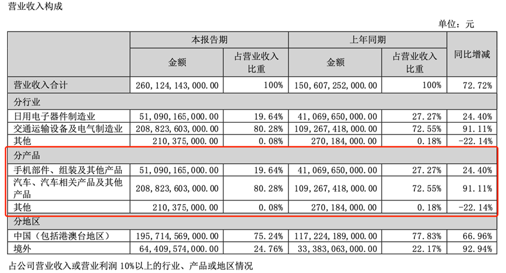

# 比亚迪销量蝉联全球第一，但毛利率为何能超越特斯拉？｜ 深网

作者 ｜ 程潇熠

编辑 ｜ 康晓

8月28日晚，比亚迪发布截至2023年6月30日的2023年半年报。核心要点如下：

· **归母净利润同比增长速度相比一季度有所下降。**
今年二季度营业收入1399.5亿元，同比增长67%；归母净利润68.24亿元，同比增长144.9%。作为对比，今年一季度比亚迪营业收入同比增长79.83%，归母净利润同比增长410.89%。

· **单车利润约8500元。** 二季度比亚迪单车收入约16万元，同比减少5%，单车净利约8500元，同比增加25%。

· **单季毛利率首超特斯拉。** 二季度比亚迪毛利率为18.72%，作为对比，同期特斯拉毛利率为18.2%。

· **研发费用高于归母净利润。** 二季度比亚迪销售费用同比增长126%至61.9亿元，研发费用同比增长148%至75.97亿元。

· **在中国新能源汽车领域市占率扩大至33.5%。**
根据中汽协数据，2023年上半年比亚迪新能源汽车市占率进一步扩大至33.5%，较2022年增长6.5%，蝉联全球销量第一。

· **下半年新品牌持续发布、加速出海。** 海豹DM-
i有望下半年上市；7月，腾势N7上市；8月，腾势N8上市、方程豹品牌发布。海外市场，多次获得泰国、以色列、新西兰、新加坡纯电动车月销冠军，将在巴西设立大型生产基地综合体。

今年二季度，国内汽车价格战正酣，多数车企在其中选择压薄利润用降价保销量，特斯拉毛利率创新低。

**汽车是规模产业，在价格战背景下，比亚迪仍能保持利润与毛利率的增长，主要归功于汽车交付规模增长、上游原材料成本下降及本身成本控制的功劳。**

“比亚迪最有实力打价格战。”一位汽车行业资深从业者告诉《深网》，特斯拉打价格战是狭义的，仅存在在整车厂之间，而比亚迪则是影响整个汽车产业链。

垂直整合成本控制是比亚迪能卖便宜的原因，也是其销量规模登顶的底层原因。

**垂直整合成本控制**

比亚迪掌门人王传福与特斯拉CEO埃隆·马斯克都是垂直整合战略的拥护者。垂直整合（纵向一体化）即零部件自给自足的生产方式，在汽车行业的集大成代表是上世纪20年代福特汽车的胭脂河工厂。

从原材料到整车下线的所有环节均在工厂内完成，省去了上游供应沟通、运输的时间和成本，福特汽车靠胭脂河工厂将一辆车的成本及装配速度压到极限，平均每49秒钟就能下线一辆Model
A。

然而在战争和金融危机的影响下，国外车企再难支撑这种重资产运营方式，为了缩短研发周期并降低资产负债率，车企不断将零部件外包生产，自制率从福特胭脂厂时代的100%降至40%以下。

**王传福始终坚持垂直整合，2010年比亚迪旗下配套零部件厂扩充至数百家，关键原因在于外购零部件实在太贵。**

比亚迪汽车电子事业部总工程师罗如忠在清华大学公开课上称，他们早年曾向博世采购刹车系统，对方报价2000元/套，比亚迪觉得太贵，决定自己搞，成功之后，比亚迪拿着自家产品再去找博世，博世的报价居然降到了800元/套。

这一方法时至今日仍然奏效。据《晚点LatePost》报道，比亚迪在设计DMi 方案时，将水冷电机替换成了油冷电机，整套系统的成本降到 1
万元左右。这让汉的续航和当时的特斯拉 Model 3 一致，但便宜 2 万元。

**汽车业务营收占比达80%，手机业务增长乏力**

比亚迪在财报中将业务划分为两个板块：汽车及电池业务、手机部件及组装业务。中报显示，比亚迪上半年营收2601.24亿元，同比增长72.72%，归母净利润109.54亿元，同比增长204.68%。其中汽车业务同比增长超90%，占比超总收入的80%。

汽车营收的高增长离不开其销量规模。今年上半年，比亚迪汽车销量达125.6万辆，同比增长94%，3月至7月，比亚迪保持着每月卖出超20万辆新车的水平，销量远高于其他车企。要知道，去年全年，蔚来、小鹏、理想三家的年销量都未到15万辆。

比亚迪在稳坐全球新能源销量第一位置的同时，也在不断拉开与特斯拉的差距，扩大优势。比亚迪上半年销量比特斯拉多约30万辆，而去年同期两者间差距不足8万辆。

比亚迪将动力电池相关收入与汽车收入合并。比亚迪是全球装机量仅次于宁德时代的电池厂商，今年上半年装机量同比增长达102%，市占率为15.7%（宁德时代为36.8%）。

**出海将是比亚迪未来的一个重要增长点。据海关数据，今年上半年中国汽车出口达到234万辆，同比增长约77%，超越日本成为全球第一大汽车出口国。新能源汽车出口
79.5 万辆，占出口总量的34%。**

这意味着国内汽车出口仍然以燃油车为主，未来新能源汽车出口有较大增长空间。比亚迪上半年整车出口销量8.1万辆，全国排名第九。上半年境外收入同比增长高达92.94%。

比亚迪手机业务受全球智能手机出货量持续下滑影响，增长疲弱。据IDC统计，2023年上半年全球智能手机出货量为 5.34 亿部，较上一年度同比下降了
11.3%，连续八个季度下滑。

但从公开信息来看，比亚迪并未就此将手机业务边缘化。

8月28日，比亚迪宣布其控股子公司比亚迪电子以约人民币 158 亿元(等值 22
亿美元)现金收购捷普新加坡旗下成都、无锡的产品生产制造业务，包括现有客户的零部件生产制造业务。

捷普新加坡是纽交所上市公司捷普的全资子公司。在MMI披露的全球最大电子制造服务商50强名单中，捷普排名全球第四。与此同时，捷普公司也在苹果供应商名单之中，为苹果供应产品的工厂位于中国广东、河北、江苏、四川以及印度马哈拉施特拉邦。

此外，比亚迪开始在机器人领域进行投资。8月24日，企查查显示，由华为“天才少年”
彭志辉（稚晖君）创立的智元机器人，新增比亚迪等公司为股东，比亚迪持股比例为3.76%。这是比亚迪在人形机器人领域的首个公开投资项目。

