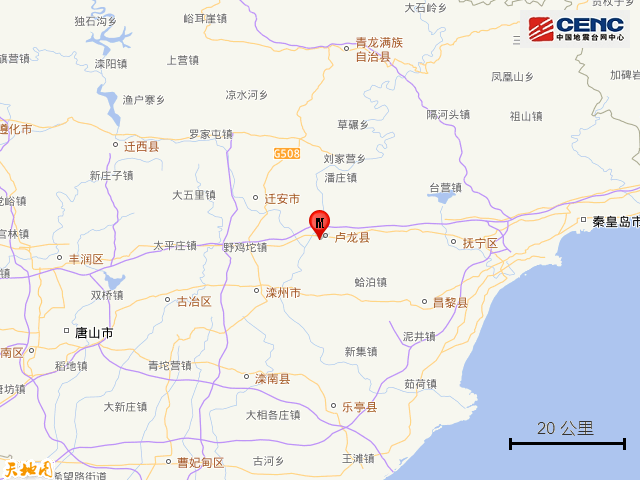
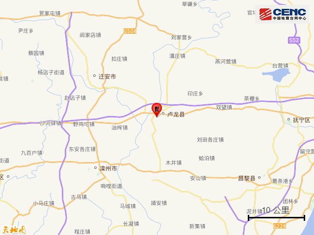
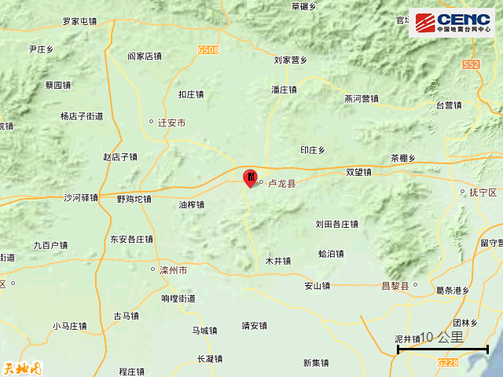
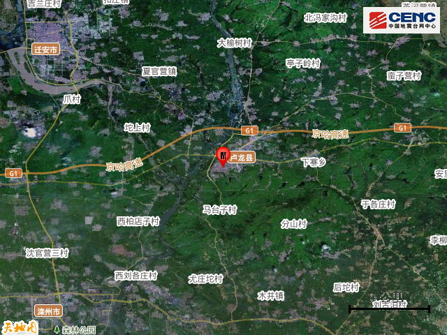
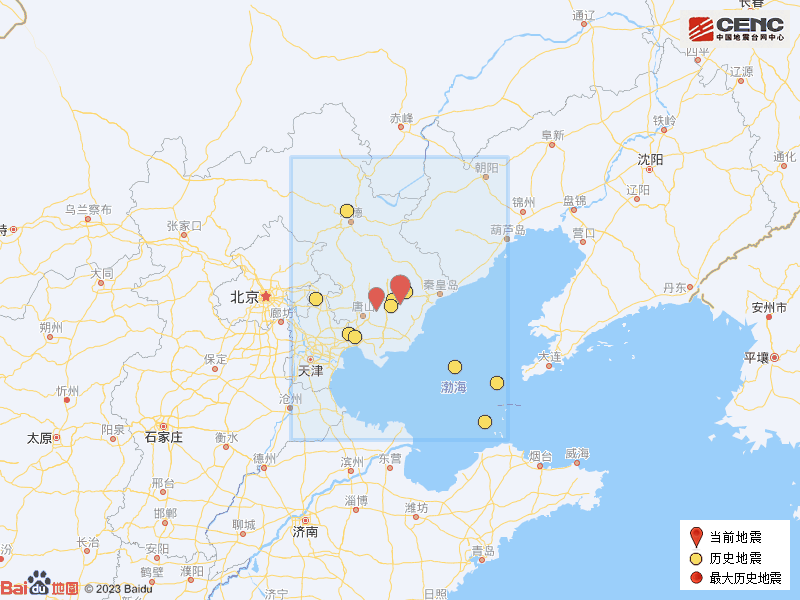

# 河北秦皇岛市卢龙县发生2.3级地震

据中国地震台网正式测定，8月29日15时31分在河北秦皇岛市卢龙县发生2.3级地震，震源深度15公里，震中位于北纬39.88度，东经118.87度。

震中5公里范围内平均海拔约55米。

根据中国地震台网速报目录，震中周边200公里内近5年来发生3级以上地震共12次，最大地震是2020年7月12日在河北唐山市古冶区发生的5.1级地震（距离本次震中38公里），历史地震分布如图。

