# 胡歌删除负面动态，晒自拍努力挽回形象，前后反差大惹担忧

8月29日凌晨，演员胡歌猝不及防更新一条动态，语气和口吻尽显消极情绪，声称自己会尽量保持冷静，还坦言自己对不起好多人，希望自己能对得起这短暂的一生。

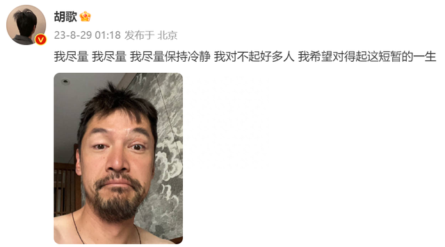

此外还配上了一张最新自拍，照片中的胡歌胡子拉碴，看上去憔悴不堪，“大小眼”也是异常明显，一看就是缺乏休息的表现，与以往荧幕上清爽儒雅的模样简直是判若两人。

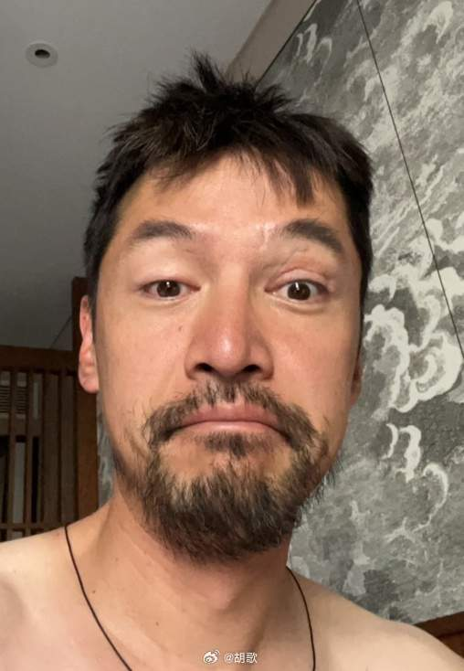

一向乐天派的胡歌突然情绪如此波动，自然让不少粉丝感到忧心忡忡，很快有粉丝猜疑，17年的今天，胡歌遭遇了那场触目惊人的严重车祸，那场事故最终导致胡歌的好友兼助理张冕不幸离世，而胡歌本人也是伤势危重，眼部一度缝了一百多针，当时面临着毁容破相的风险。

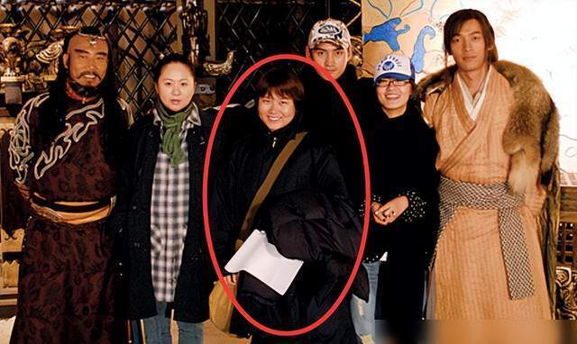

如果不是张冕临时和胡歌换了座位，那离开的恐怕就是胡歌了，这么多年胡歌一直活在自责中，所以在这个特殊节点，胡歌发布这条动态很大概率是在追思张冕。

随着舆论愈演愈烈，胡歌删除了这条动态又发布了自拍照，他的配文只有一个笑脸的表情，似乎想告诉外界他的状态没问题，不用为他担忧。

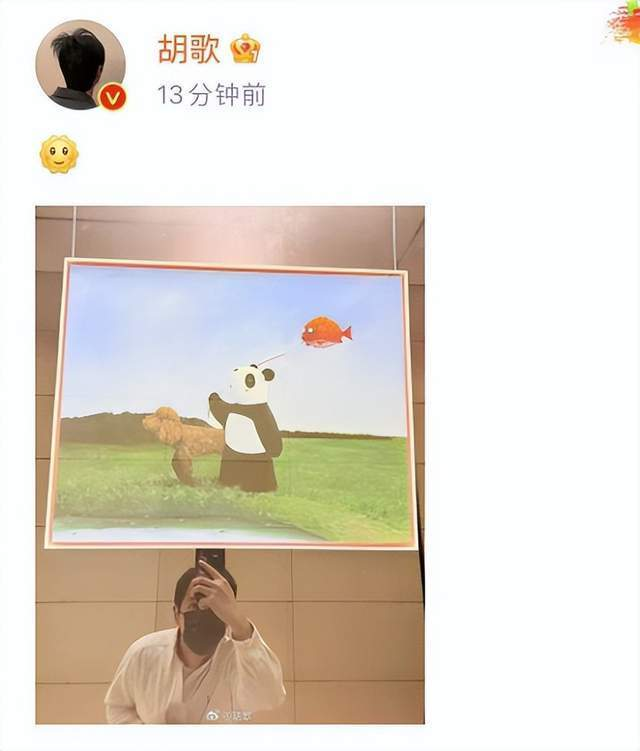

他还晒出与熊猫的合影，看上去很温馨，不知道胡歌是不是酒醒了，重新晒自拍努力挽回形象。

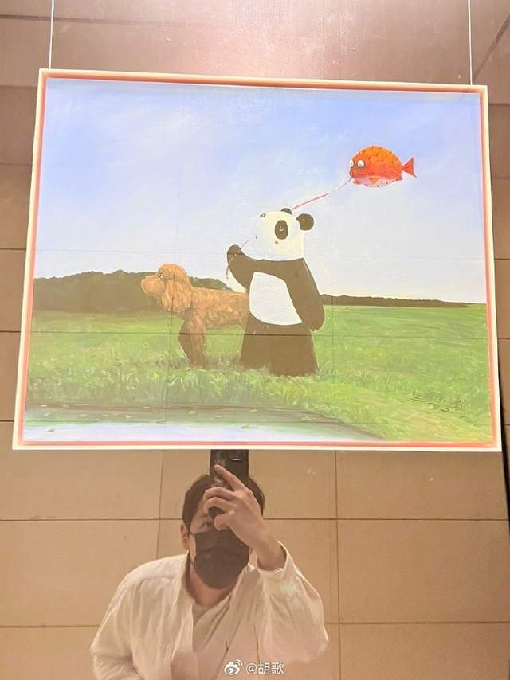

他还佩戴着口罩，把衣服穿得整整齐齐，和深夜的状态简直判若两人，感觉胡歌现在的情绪波动很大，究竟发生了什么，还是如外界猜测得那样，胡歌是为了新剧炒作？

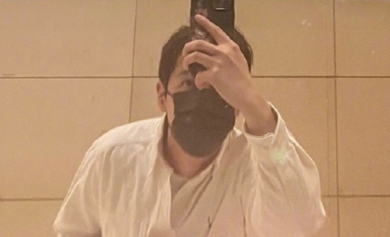

有不少网友从胡歌的表现中猜疑当下的他可能受抑郁情绪困扰，毕竟前几天的他曾经在微博进行试水发言，表露出自己有退圈的想法。

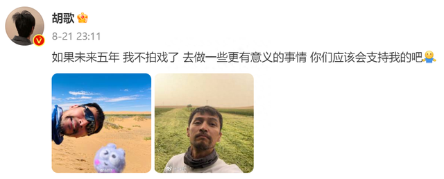

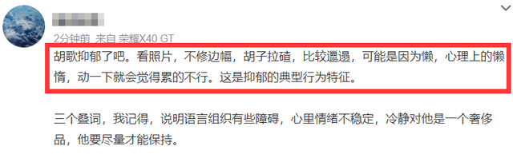

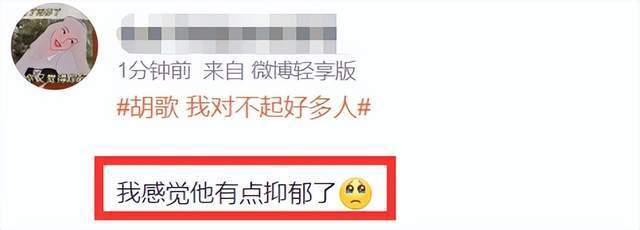

然而就在大家猜测中，胡歌回应说他的底色和大家看到的样子很不一样，经常自我矛盾然后纠结，内心也会有很多挣扎，确实给人的感觉是这样，他总是会陷入自我矛盾中，让粉丝也跟着担心。

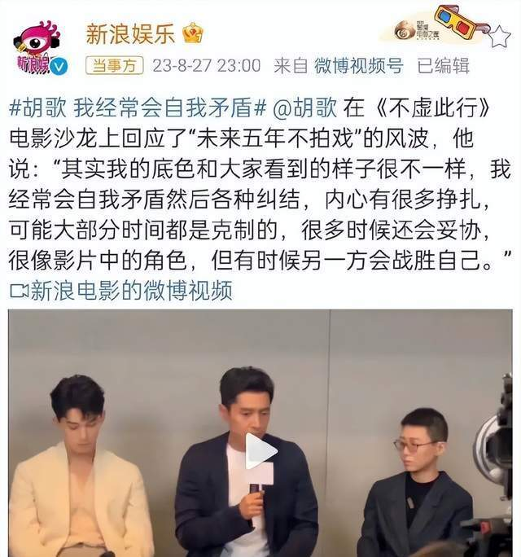

不过，有退圈想法的胡歌并没有停下工作，他还发布了广告宣传片，还为了新剧露面宣传，所以确实不理解当下的胡歌究竟想要做什么，连续两次发莫名其妙的发言背后有什么隐情呢？

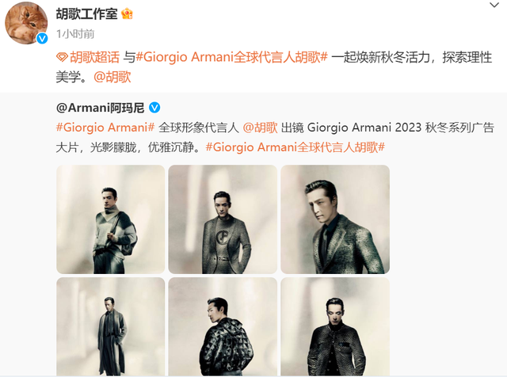

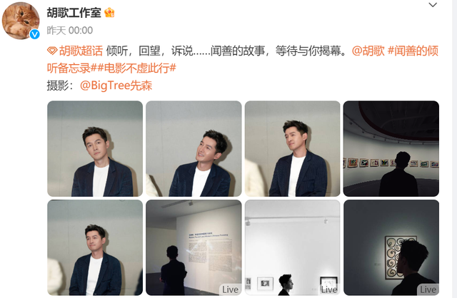

另外，因为很多粉丝对其“恨铁不成钢”已开始脱粉，还回踩将胡歌的黑历史给挂了出来。

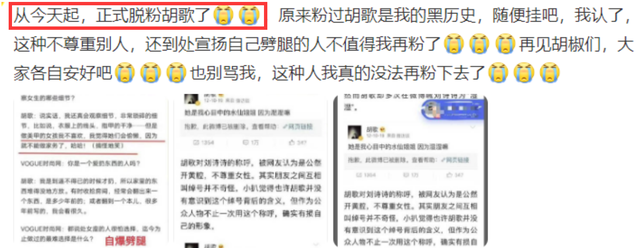

胡歌曾在采访中自爆自己大学期间曾有过劈腿经历，一度在两段感情中摇摆不前，直到后来的他遇到了被公开承认的女友薛佳凝。

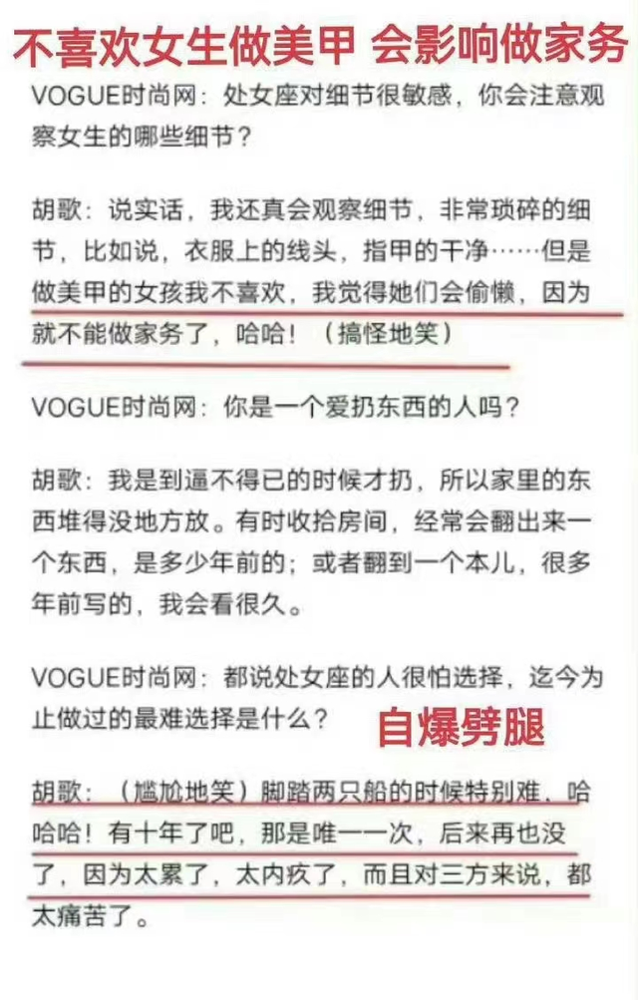

另外，在采访中胡歌曾坦言自己不喜欢女生做美甲，因为这样的女生会影响做家务，可见其大男子主义已经是深入骨髓。

成名之后的胡歌先后经历了两段被人熟知的恋情，两任女友皆为圈内人士，即薛佳凝和江疏影，在与薛佳凝的那段感情中，期间胡歌曾与杨幂传出恋情绯闻，两人当年在网络上互动亲密，私下关系着实令人遐想。

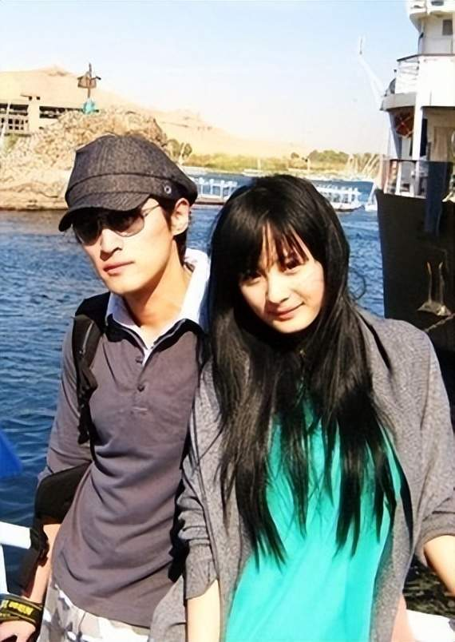

而在与江疏影的恋情中，两人被拍到后，胡歌火速承认恋情并官宣分手，江疏影一直保持沉默，直到后来上节目采访，提起这段感情她都很伤心，可见当时她被伤得很深，也因胡歌承认恋情江疏影一直被粉丝针对，就很委屈。

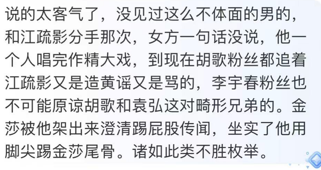

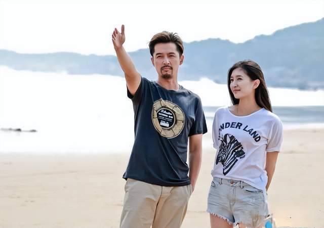

胡歌也曾说过男人花心很正常，人生的悲哀之处就在于作为一个男人来说，好像你所做的所有努力都是为了这个女人而奔波，如果把这一个女人变成很多女人的话，你的动力就会增加数十倍百倍。

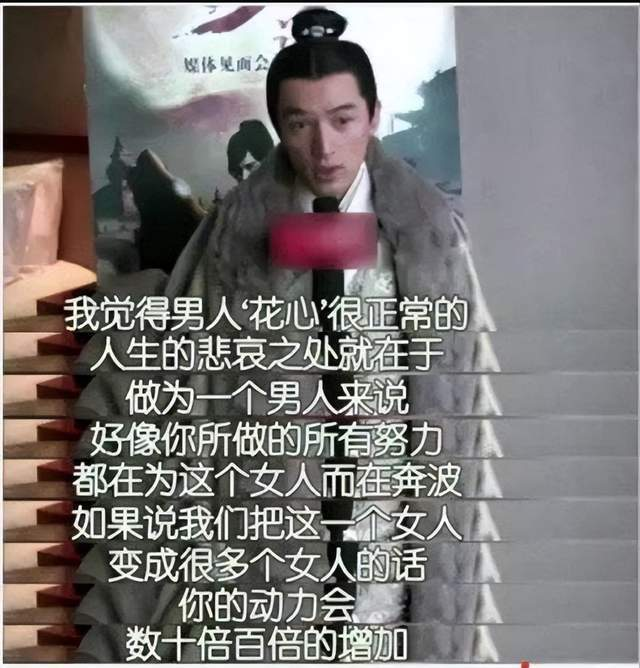

此外，胡歌曾经还力挺家暴男蒋劲夫，虽然为好友发声是讲义气的表现，但在捍卫友情的前提下起码应当保持正确的三观。

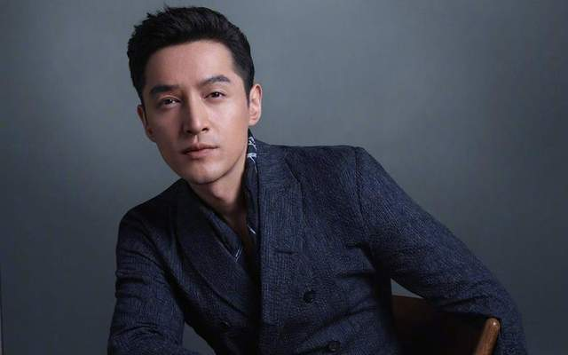

当然正所谓“人无完人”，在一些粉丝看来，明星也是普通人，不可能方方面面都完美无缺，但是身为公众人物，明星的言行举止都会起到示范作用，所以也希望胡歌以后发言时多考虑下自己的公众身份，不要让粉丝担心，保持一个理性的状态。

