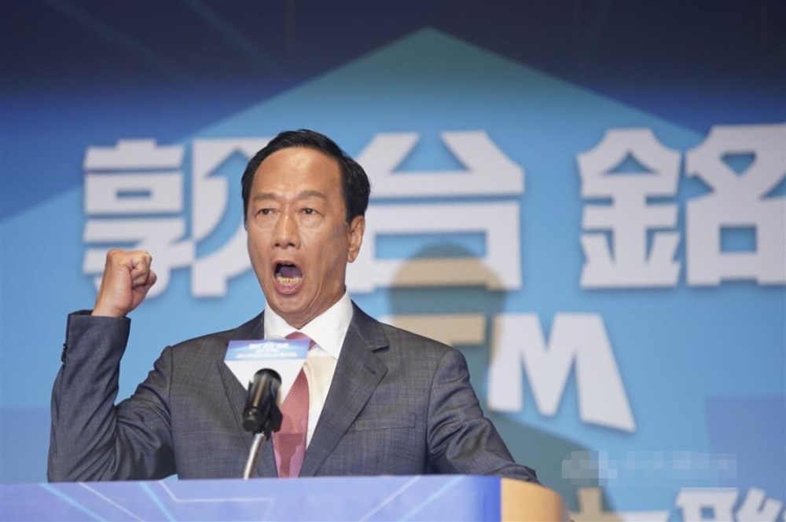

# 郭台铭“独立参选”须近29万份“连署书”，史上仅5组人成功过门槛

鸿海创办人郭台铭28日宣布参选台湾地区领导人，岛内相关选务规定，郭台铭非经政党推荐，要正式取得候选资格，需在11月2日之前搜集约29万份“联署书”。

台湾地区从1996年通过投票选举方式产生领导人以来，只有5组通过“联署”参选正副台湾地区领导人的前例，但迄今未有“独立参选”当选纪录。

根据台“中选会”公告“联署”参选正副台湾地区领导人的相关时程，郭台铭需要在9月13日到17日间，登记为被“联署人”，并缴纳100万元新台币的保证金；并于登记后45天内，也就是9月19日至11月2日间完成“联署”。

台“中选会”在收到“联署”书件后会再次进行审核，并于11月14日前公布“联署”结果。若有效“联署书”数量达最近一次民意代表选举总选举人数（可投票人数）的1.5%，即通过“联署”门槛。2020年民意代表选举共19311105选举人数，合格“联署书”至少需达289667份才可登记。完成“联署”后，将发给“完成联署证明书”，并退还保证金100万元新台币，可正式登记为台湾地区领导人候选人；如果“联署”未达门槛，即代表“联署”参选失败，而且“联署”未达规定门槛人数二分之一，则保证金不予发还。

据资料显示，1996年台湾地区领导人选举时，除前台湾地区领导人李登辉代表国民党参选，前台湾地区领导人办公室“资政”彭明敏代表民进党参选，泛蓝阵营另有两组人马“独立参选”，分别是“林洋港、郝柏村”与“陈履安、王清峰”，最后李登辉拿下54%选票，林洋港、陈履安各拿下14.9%、9.98%选票。

2000年总计有6组人选登记参选台湾地区领导人，当时宋楚瑜退出国民党与张昭雄搭档，但宋楚瑜的参选造成泛蓝阵营分裂，虽以4664972票创下“独立参选”最高票数的记录，但最终还是输给了民进党候选人陈水扁及吕秀莲的4977697票，以31万票之差落选。同年泛绿阵营以“联署”参选的许信良，仅获得0.63%选票。

2012年前台湾地区领导人马英九寻求连任，宋楚瑜再度以“联署”方式加入战局，获2.76%得票率。

2016、2020年两次“大选”，都没有达到“联署”门槛的候选人。

（综合中国台湾网等报道）

