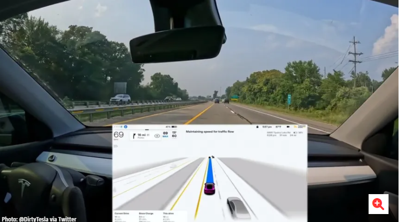
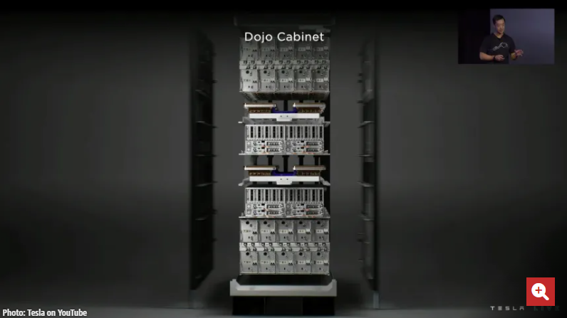
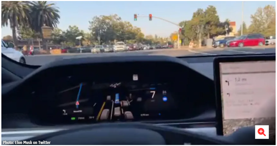
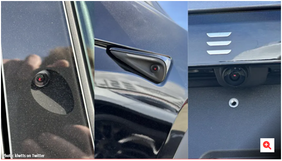

# 马斯克直播自动驾驶“去扎克伯格家”，45分钟仅一次人工干预

**划重点：**

  * _1_ 马斯克上周末通过X平台直播Autopilot FSD V12试驾，超1000万观众围观。
  * _2_ 在长达45分钟的试驾过程中，马斯克只进行了一次驾驶干预。
  * _3_ FSD V12是端到端人工智能，测试中安装在Hardware 3计算平台中。
  * _4_ FSD V12不需要互联网连接，测试中展现出卓越的泊车能力。

腾讯科技讯
8月29日消息，全球汽车制造商和科技公司正在进行一场不再沉默的竞赛，要让司机变得无关紧要。他们想取代的不仅仅是临时司机，还有职业司机。尽管自动驾驶技术已取得了很大进展，但很明显还有很多工作要做。我们当中的一些人可能喜欢它，其他人可能不会，但可以肯定的是，自动驾驶汽车是未来。

自诩为“特斯拉Technoking”的伊隆·马斯克（Elon Musk）上个月宣布，Autopilot FSD
V12不会是“测试”版本。上周末，这位全球首富开启了一场“特殊”的直播----
特斯拉“自动驾驶系统”试驾直播，随后还将视频发布到已经更名为“X”的社交媒体平台上。

在这场长达45分钟的直播中，马斯克开着自己的特斯拉Model S在加州帕洛阿尔托市(Palo Alto)
兜风，而这里正是Meta首席执行官马克·扎克伯格的豪宅所在地。马斯克的这次试驾也测试了X的大流量直播功能，超过1000万观众在X平台上观看了马斯克的试驾直播。在整个45分钟的驾驶过程中，马斯克只在FSD
V12视频演示进行到大约19分54秒时进行了一次驾驶干预。这发生在一个繁忙的十字路口，马斯克所驾驶的特斯拉试图闯红灯，他立即控制了车辆。

多年以来，特斯拉Autpilot一直无法展示完全自动驾驶功能，被饱受诟病。马斯克迫切地希望给批评者一个答案，他决定用特斯拉Autopilot FSD
V12的实时演示来给出答案。

此次试驾出乎意料地顺利，部分原因是FSD V12的表现已非常接近人类驾驶员。正如马斯克在试驾中强调得那样，FSD
V12运行平稳，对道路上的各种情况，如施工区域和减速带等，都能顺利做出反应。

马斯克只在一个繁忙的十字路口干预过一次，因为FSD V12即将闯红灯。马斯克表示，Autopilot的设计原理与人类视觉的工作原理相同--
眼睛和我们的大脑。特斯拉Autopilot使用摄像头和神经网络人工智能来做出驾驶决策（统称为特斯拉视觉Tesla Vision）。

根马斯克的说法，如果FSD
V12在特定场景下没有做出好的决策，特斯拉会向神经网络提供更多的驾驶数据（基本上是视频）。此外，来自优秀司机的优质数据，才是训练特斯拉Autopilot进行完全自动驾驶的关键。

马斯克还表示，虽然FSD
V12中没有代码行可以运行，但提供给神经网络的数据选择需要监管。然而，这种监管软件是在代码行和人工智能相结合的基础上运行的。这些视频数据的基本来源是特斯拉全球数百万辆电动车的整个车队。

特斯拉在2020年开始将Autopilot的决策从编程逻辑转移到神经网络。经过三年的开发，我们可以从马斯克的FSD
V12视频中看到结果，整个决策和场景处理已转移到特斯拉神经网络和人工智能。这里需要注意的一点是，马斯克用来测试FSD V12的特斯拉Model
S安装了Hardware 3计算平台。最新的是Hardware 4，它拥有更快的计算机和更多的摄像头。

马斯克还透露了这次测试中的一个重要信息，已在全球部署FSD V12测试人员。“我们在世界各地都有FSD
12测试车手，有来自新西兰、泰国、挪威、日本的测试人员”，他透露，这当然是除了目前在北美的试车手（特斯拉员工）之外。以下是FSD
V12展示出的最酷的五个方面：

一、有助于特斯拉参与无人驾驶竞赛

毫无疑问，特斯拉是自动驾驶领域的领先企业之一。尽管马斯克多年来做出了很多疯狂的承诺，并在许多场合明确高估了他们的自动驾驶系统的能力，但进步是不可否认的。

不过，就目前而言，FSD V12仍然只是驾驶自动化标准的2级高级驾驶辅助系统（ADAS）。其他公司如Cruise、Waymo、Zoox甚至梅赛德斯-
奔驰都超过了特斯拉，要么在严格的远程监督下部署了自动驾驶出租车，要么已经获得了其自动驾驶系统的认证，被认为至少是Level
3高级驾驶辅助系统。这意味着驱动程序必须只在套件请求时才进行干预，任何4级或更高的级别都会转化为车辆自动驾驶。

自2月份以来，特斯拉一直在向一些客户提供其下一代计算平台Hardware 4，但FSD测试版尚未在该系统上运行。因此，马斯克使用的Model
S配备了被称为HW3的前代技术。尽管事情变得极其糟糕而且风险很高，他还是决定向所有人展示FSD V12的能力。

二、FSD V12是“端到端”人工智能

虽然这听起来可能很奇怪，因为如今一切似乎都与人工智能相关，但让完全自动驾驶成为端到端的人工智能意味着该系统根据真实世界的数据（主要是视频）进行训练，并根据之前遇到的场景做出判断。它可以理解之前发生的事情，复制类似的动作，然后立即适应它所处的特定环境。

这证明Cruise所谓的“人类是糟糕的驾驶员”的观点是错误的，因为特斯拉的计算机正在根据人类数据进行训练。如果向人类学习，它很可能会像人类一样行事，只是不像有人违反法律、酒后驾驶或太累时偶尔违规。

不过让人工智能负责驾驶，在某些场景下可能存有弱点。假设自动驾驶汽车必须处理这样一种情况：必须停在一个不受控制的铁路道口，等待一列驶来的火车。如果FSD
V12不能正确及时地判断发生了什么，理论上可能会使乘客遭受严重的事故。

这个缺点在FSD
V12的现场演示中突显出来，在19分50秒的标记处，当时车辆试图在左转车道的交通灯变色时闯红灯。马斯克还强调，需要更多的训练数据来让系统学习如何在特定场景下或天气不好时正确驾驶电动车。

不过神经网络（一种被设计为像人脑一样“思考”的人工系统）可以不断扩展其功能。学习永不停止。这也是特斯拉员工帮助公司了解日本、泰国和新西兰交通状况的原因。在这些国家，人们驾驶右驾驶位的汽车在道路的左侧行驶。

三、FSD V12不需要互联网连接或地图

包括Cruise在内的一些无人驾驶出租车公司，使用互联网连接来跟踪它们的车辆。另一方面，无人驾驶公司Waymo有时只有在摆脱被黑客攻击的恐惧后，才会启用互联网连接。相比之下，FSD
V12根本不使用互联网连接。

这并不是一个很好的主意。如果特斯拉真的想将自己的电动车改造成无人驾驶出租车，就必须使用到互联网连接。否则，特斯拉将无法让自动驾驶汽车实时发现可能出现的交通变化、必要的路线更新和其他人共享的危险路况。

举例来说，大众计划打造car-to-
X通信系统，能够使车辆相互“警告”遇到的潜在危险情况。在某种程度上，这就是Waze正在做的事情。其他司机报告了路况坑洼或意外的交通堵塞，Waze应用会自动更新，让其他应用用户知道如果在同一条路线上可能会遇到的紧急路况。

特斯拉的FSD
V12也不需要实时更新导航地图。马斯克表示，该系统只需要坐标，就会自己找到位置。他还表示，当停止自动驾驶系统时，该事件会被记录下来，并发送回特斯拉进行分析。之后，该软件获得更多的视频训练数据，学习如何正确地接近该场景。所以，它仍然需要时不时地连接互联网。

四、增强的泊车能力和简洁的无人驾驶出租车功能

马斯克直播的视频显示，Model
S优雅地自动完成了平行泊车任务。马斯克坐在方向盘后面，自己拍摄了整个泊车的过程。他说，当电动车到达“随机”地点后，能够知道它必须靠边停车。马斯克指出，这是神经网络从视频中学习到的可预测行为。

但是正如视频展示的那样，马斯克乘坐的电动车泊车的时间要比原计划的时间早一些。与马斯克一起乘车的特斯拉自动驾驶软件总监阿肖克·埃卢斯瓦米（Ashok
Elluswamy）对此解释说，电动车无法准确地将乘客带到他们想要去的地方，但会试图找到一个相对合理的停车点。

输入系统的视频显示，找到一个合理的停车位可能很复杂。在某些情况下，甚至是不可能的。所以，它做出了最好的选择--停车，而不是绕着街区寻找合适的停车位。

马斯克指出，一旦该软件准备好提供给所有付费客户和合格的员工，运行FSD
V12的自动驾驶出租车将能够四处寻找需要乘车的乘客，识别他们，并在不忽视安全的情况下尽可能的在离他们最近的位置停下来。

五、海量的数据和强大的计算机

特斯拉的FSD V12是一个端到端的人工智能。对于那些愿意更深入地了解它或在了解它之前体验它的人而言，FSD V12带给他们的体验更像是魔法。不过FSD
V12也提出了一个问题：计算力可以走多远。在基于摄像头的软件能够像人类司机一样工作之前，需要多少视频进行学习？

因为交通规则和司机行为的不同，FSD
V12目前在美国加州之外进行测试会遇到不小的挑战。在瑞士，司机会遵守所有的交通规则，因为罚款数额巨大。但在东欧等交通摄像头不常见的地方，司机可能会经常违反交通规则。

此外，如果FSD V12向人类学习，它会像人类一样应对复杂的交通状况吗？特斯拉的解决方案是将许多视频输入系统，让FSD
V12不断学习，并从中找出最佳行动方案。七年前，微软试图推出自己的ChatGPT。当时，微软推出的Tay是一款向人类学习的聊天机器人。可悲的是，它被利用得很快，不得不关闭，因为它学到了太多可怕的东西，最终拥有了极端主义的信仰。

对特斯拉而言，这是一次巨大的胜利。在FSD
V12准备好大范围发布后，完全自动驾驶将不再依赖于程序员不断改进小问题。它将向那些愿意与特斯拉分享视频片段的人学习，并不断改进，它自己会变得更像人类。希望FSD
V12不会包含人类的缺点，如感觉疲劳、无聊或注意力不集中等等。

总体而言，FSD V12看上去没有太大的戏剧性。终有一天，它会成为自动驾驶的解决方案之一。FSD
V12的潜力是巨大的，但通往成功的旅程往往是令人筋疲力尽的。（无忌）

