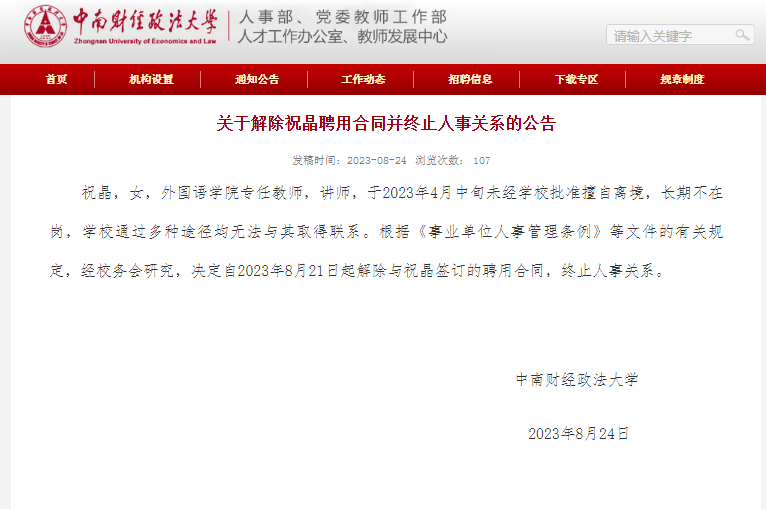

# 中南财经政法大学：女教师未经批准擅自离境失去联系，解除聘用合同

关于解除祝晶聘用合同并终止人事关系的公告

祝晶，女，外国语学院专任教师，讲师，于2023年4月中旬未经学校批准擅自离境，长期不在岗，学校通过多种途径均无法与其取得联系。根据《事业单位人事管理条例》等文件的有关规定，经校务会研究，决定自2023年8月21日起解除与祝晶签订的聘用合同，终止人事关系。

中南财经政法大学

2023年8月24日

来源：中南财经政法大学官网

