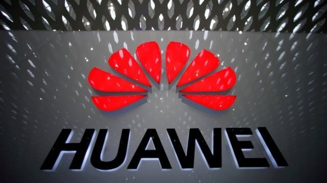
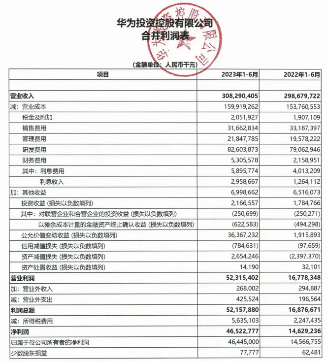

# 华为上半年净利润465亿元 同比增长218%

腾讯科技讯 8月30日晚间，华为正式披露2023年半年报，上半年华为实现营收3082.90亿元，上年同期为2986.80亿元，同比增长3.2%；

净利润为465.23亿元，上年同期为146.29亿元，同比增长218%。

华为持续投入研发，2023年上半年，华为研发费用为826.04亿元，同比增长4.4%，上年同期为790.63亿元。

