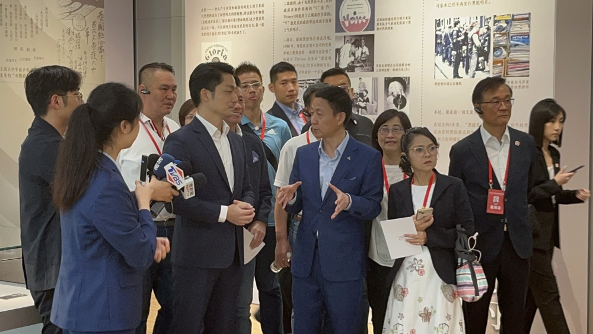
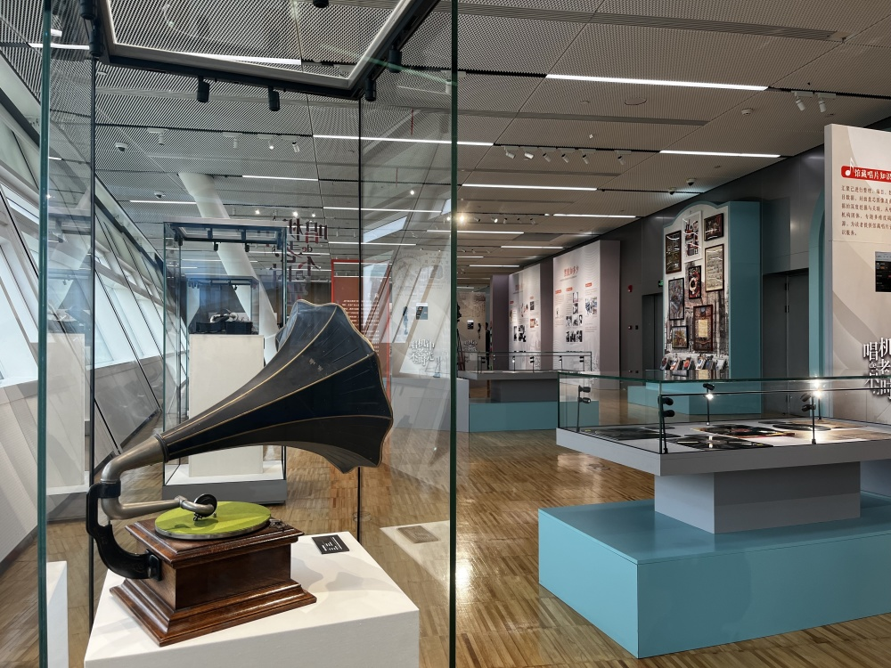

# 台北代表团参访上图东馆，蒋万安：这里也太享受了吧

_台北代表团参观展览。 本文图片 澎湃新闻记者 蒋乐来 图_

8月30日上午，“2023上海台北城市论坛”正式举行。论坛后，台北市市长蒋万安下午率台北代表团一行来到上图东馆进行参访。

在7楼的馆藏精品馆，代表团参观了精品展，其中展有现存最早的首部《台湾府志》。据悉，这部府志涵盖山川、物产、风俗等多个方面，保存了不少清初台湾社会的基本情况，具有很高的史料价值。

_《唱机中的不老时光》展览现场。_

代表团接着来到5楼的音乐馆展陈区，参观《唱机中的不老时光》展览。

在展区内，上海图书馆馆长陈超为代表团成员作介绍。在一台早期的百代“大喇叭”留声机前，代表团一行驻足停留。陈超在介绍时一句“现在还能放”，让大家纷纷表示惊讶。

展陈区一侧，还设置了一排面向窗外的沙发座椅，每个座椅前的小桌上架着一块平板，并配有头戴式耳机。在这里，馆内读者可以坐下观赏窗外景色，同时戴上耳机聆听馆藏的数字黑胶唱片。

_蒋万安体验数字老唱片_

参访现场，蒋万安也来到一处座椅坐下，戴上耳机进行体验。“这里也太享受了吧”，戴着耳机的蒋万安不禁感叹道。在馆员的指引下，他试听了一段戏曲唱段《林四娘》，一度闭目沉浸。

馆员介绍说，这其中都是馆藏的老唱片进行数字化处理并加以保存。陈超表示，老唱片数字化一方面需要技术进行修复，另一方面也需要有一定的艺术鉴赏力，不能把所有的噪音都去掉。

 _蒋万安体验数字老唱片_

对此，正在试听的蒋万安也分享了自己的感受：“它确实有保留老唱片的那种声音，很有味道。”

老唱片经过数字化以后，民众来到图书馆，除了看书阅览，还可以欣赏音乐。蒋万安表示，这些其实都值得台北在未来进行参考，希望在整个提供给市民的服务上面能够做到更优化。

