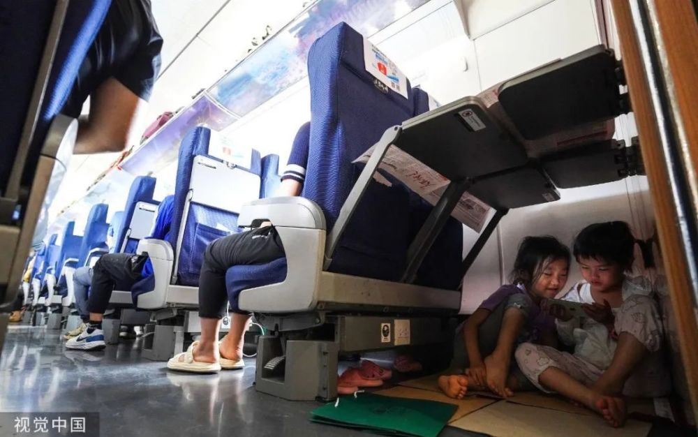
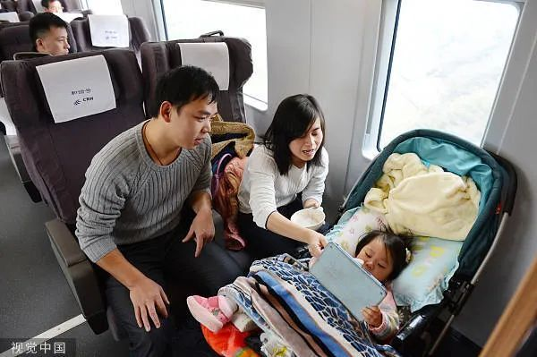

# 夜读丨当我的高铁座位旁边坐了一个小孩

**文|** 蔡家欣

**编辑|** 王珊瑚

说不清是从什么时候开始，28岁的许晓平开始恐惧出行，确切地说，她恐惧的是噪音。在她的回忆中，坐高铁动车九成的概率会遇上哭闹的小孩。上车一看到小孩，她就劝自己，“万一这小孩之后吵闹，尽量别发脾气。”

对许晓平来说，容忍噪音，特别是小孩的尖叫声，不是一件容易的事。她抑郁症康复不久，遇到持续的尖叫声时，头皮一阵阵发麻，浑身血液往上涌，焦虑累积，情绪一触即发。

今年六月，重庆开往成都的高铁上，许晓平还是没忍住，和两个男孩的父亲起了冲突。

那一天，许晓平几乎都在赶路，晚上六点半才坐上回程高铁。一个半小时的车程，她本寄希望能休息一会儿。可安静的车厢里，两个男孩一直在过道里跑跳、尖叫。许晓平戴上降噪耳机，但仍然阻挡不了尖叫声的穿透力。许晓平说，她曾两次语气温和地提醒，“小朋友不要那么大声。”其中一位男孩的父亲听到后提了一嘴，“你们小声点”。没过几分钟，两个男孩挑衅似地跑到许晓平跟前喊叫，继而跑开，还回头观察她的反应。

男孩的父亲没有任何反应，许晓平被触怒了，直接对着那位父亲“开炮”，“不要让我和你在公共场合吵起来”。对方没有歉意，“小孩就这样，作为成年人应该容忍。”前排的男性，另一位男孩的父亲，回头打量她，许晓平正在气头上，“看什么看”。对方站起身，“就看你怎样？”许晓平怵了，“对方是男性，发生肢体冲突，胜算很小。”

冲突以许晓平的沉默告结。那两位父亲不依不饶：“嫌吵就去一等座。”

事实上，升级座位也不能躲避尖叫。商务座是26岁的珠珠保护自己的方式。不久前她遇到一家四口，父亲一直在打电话，两个小孩嘶喊。珠珠制止后，被那个妈妈反向输出，“小孩就这样，没办法像大人一路不讲话。”

虽然看到那位妈妈的不易，但珠珠不解，“我需要安静，他们的困扰不应该由我来买单。”至于小孩的天性，珠珠并不想探究，“父母那一辈觉得小孩要活泼可爱，接受度更高，我们这一代人甚至都不喜欢小孩，（遇上）没有礼貌的熊孩子，我为什么还要去喜欢？”

社交媒体上，有很多像许晓平和珠珠这样的人，受高铁噪音困扰。他们可能是一位周五下班后，经历两个小时堵车又赶高铁回家的人，也可能是一位刚经历面试失败的待业青年，又或者是饱受睡眠困扰的人。当利益被侵犯，他们发出疑问，“我为什么要忍受？”

现实中的维权往往不了了之。不满、愤怒的情绪堆积，在网络上衍生出“整顿文学”。这些帖子大多以“xx后整顿高铁熊孩子”为标题，讲述自己在高铁上以凶狠的语气警告吵闹的小孩，结局往往“大快人心”，有人甚至得出结论，“还是得以暴制暴，靠发疯整治世界”。

22岁的小王曾尝试复制社交媒体上的“发疯”招数。威海回上海的列车上，隔壁5岁左右的男孩连续踹凳子，哭闹喊叫，出声制止的小王却被男孩的母亲攻击，“就你觉得吵”，“你这种人不配有小孩”。

忍了一个多小时的小王模仿攻略上的内容大喊：“我有精神病，你再不管孩子，我要杀人了！”

孩子的妈妈瞬间被激怒，跳起来指着小王，“你动我家孩子试试”，接着又四处喊，“有人要杀我的小孩”。幸好列车员站在小王这边，劝告那个妈妈：“请管好自己的小孩，你为什么要让他在这里乱跑？”

即便如此，剩下的路程很煎熬，小王戴着墨镜流泪，而且全程提防，生怕对方揪她头发。

这段经历被小王分享到网上，有人诅咒她“生不出孩子”，“最好别出门”，也有人说她“吵架不熟练”、“发疯不彻底”。向来推崇“利益要靠自己争取”的小王意识到，所谓的“发疯”、“整顿”都是在扩大冲突，“网络上教人做事不需要负任何法律责任”。

_●2023年7月29日，从银川开往郑州东的高铁上，列车长利用座位最后一排的空间，给孩子搭了个“私人小屋”。_

关于高铁噪音的争吵，往往最终归咎于家长的失职上。莲子曾经就是那些年轻人口中的“熊家长”。

她是一个两岁男孩的母亲。那一次，儿子一上车就开始发出笑声。莲子夫妻忙着拿零食哄，前座一位四十多岁的中年男人回过头说，“管好自己的孩子”。丈夫没忍住，“十八个月的小孩，已经在管了”。避免冲突升级，莲子只能道歉，她心里很委屈，“我们已经在引导了，孩子也没做什么过分的事。”

自从有了孩子，出行就低别人一等。第一次感受到歧视是半年前。一家三口回老家，火车行驶起来噪音大，孩子闹觉，几乎全程在哭，莲子和丈夫只能轮流抱着孩子去车厢连接处哄睡，但还是遭到来往乘客的白眼。

没结婚前，莲子每回坐车都会戴上眼罩、颈枕和耳机，一觉睡到终点。有了小孩，出门前要准备零食纸巾尿不湿，想好安抚的招数，提前做好连续抱哄的准备，“只要一哭闹，立刻抱走”。

莲子很无奈，她并非不管，而是管不住。在她看来，0到3岁的孩子，对情绪的控制能力几乎为零，有天生高需求的孩子，也有很乖的小孩，“这个和家长能力无关”。

从父母的视角来看，成人的世界正在对孩童露出苛刻的一面，并且形成连锁反应。有一回在地铁上，5岁儿子的手刚碰到旁边一位女性的露营箱，就遭到呵斥，“别碰我的东西”，这位妈妈很委屈，“我还没来得及开口道歉。”

这位妈妈很不解，五岁的孩子，正是对外界好奇的阶段，认知不像成年人那样完善。但成人的世界似乎都太着急了，没有给她更多的时间去教育。

不仅如此，高铁动车上，孩子似乎就是“原罪”。一位妈妈带着两个孩子坐车，还没坐稳，就被列车员提醒，“管好自己的小孩，不要影响其他乘客”。这位妈妈很委屈，“孩子一直安静地在我怀里。”之后她一路忐忑，1岁多的孩子，车程7个小时，“确实无法保证她全程都是安静的”。

一位也经历过这种“特殊关照”的爸爸称，当对着弱势群体吹毛求疵变成所谓的正义，且误伤也不用付出什么代价的时候，这种正义是很容易在社会流行的。

这种苛责，让父母们变得更加焦虑。小夏是两个孩子的母亲，带孩子出门她都要小心翼翼，“如果孩子没办法全程安静怎么办？”“如果我没法应付怎么办？”有一回，7岁的老大与她隔着一节车厢，她甚至不敢张嘴换座，“就怕别人觉得我道德绑架”。

关于高铁噪音的声讨，时隔不久就会登上新闻热搜。噪音的矛头越来越在指向儿童群体，这让家长们感到委屈，“明明看剧打游戏外放、大声打电话的更多，为什么很少被讨论和抨击？”一位妈妈说。

_●2014年12月10日，带小孩的旅客乘坐G1346次高铁列车。_

近一年来，列车员小宁注意到，关于噪音的投诉变得多起来，儿童和老人是被投诉的主要对象。实际上，在她的观察中，车厢内的环境与疫情前相比并无太大变化。

有一些噪音确实扰人，比如老年团，不仅吵闹程度远超儿童，还不接受列车员的建议。但在小宁看来，大部分关于噪音的投诉都是“小题大作”。比如，“后面有小孩踢凳子，你们也不管”，“有人一直在聊天，你们也不维持秩序”。有一次，一个第二排的女生投诉第八排的两个老人聊天，在小宁看来，老人的交谈属正常音量，但出于考核压力，她不得不去提醒老人，“声音请适当减小”。

事实上，在动车高铁的车厢里，如何定义噪音，并没有统一标准，“由乘客自身的体感来定义”。小宁说。

22岁的列车员陈薇自己制定了一套“标准”：乘客交谈声前后各两排能隐约听到，不在她的管辖范围内；如果站在车厢头尾，能听到叫声或者手机外放，那就是需要她出声制止的噪音。

但众口难调。就在不久前，成都前往郑州的动车上，陈薇多次提醒一个吵闹的小孩，直到小孩家长变脸才打住，结果，同车厢的一位大学生下车后就投诉她不作为。

陈薇透露，班组内曾做过一个投诉者画像，80%的投诉者是90后和00后。在她看来，这个年龄段以独生子女居多，维权意识强，生活环境素质偏高，对不同环境的接纳能力也就弱了。投诉增多的另一个原因是，普快逐渐被淘汰之后，不同需求、收入水平的人被挤压到同一个公共空间，矛盾也随之产生。

按照规定，列车员接到投诉后必须马上处理，事后投诉甚至没有给列车员“改过”的机会。对列车员来说，这意味着什么？可能是几百块钱的罚款，车长要写整改报告，车队干部也要给乘客打电话道歉，“出现一个投诉，那几天会一直想要怎么办，还要连累别人，很愧疚。”

但陈薇没办法避免投诉。她负责商务、一等和二等三个车厢。高铁动车约30分钟靠站一次，每站要验票、调行李架和巡视车厢，来回至少要走12节车厢，她还要额外给商务和一等座客人发放礼品和提醒下车时间。最忙碌的时候，一趟车她要发掉648瓶水，“甚至没有多余精力去做其它的事情”。

为了避免被投诉，陈薇现在只要发现车厢里有哭闹的小孩，就注意观察周围乘客的表情：一旦有人皱眉了，她会赶紧上前去提醒小孩，“这也是为了让他们看到，你在做了。”
但不止一位家长表示，不喜欢列车员的这种“特殊关照”。

关于噪音的争议，陈薇的老同事们也困惑，“以前人多上不去，给人踹上去还要感谢你，现在你多看一眼，都觉得在瞪你。”在陈薇的观察里，如今高铁上的乘客似乎一上车就很疲惫，“要安静的环境做自己的事”。

经历了特快、直达到动车高铁的列车员小宁，也直观地感受到乘客需求的变化：早年把火车当位移工具，现在不仅要速度，还要环境和服务。

在这背后，小宁能隐约捕捉到社会风气的转向，“突然间，大家都开始讨厌老人和儿童，以前不这样。”在她看来，有一些噪音是合理的，比如视频外放或大声交谈的，以老年人居多，那是因为年纪大耳背。还有生病的儿童，一个到上海看病的孩子，身体不适沿途哭闹，当她向其他乘客解释时，一位中年男性反过来投诉她的不作为。

_●列车接纳的第一次远行的孩子。他/她们的紧张和快乐都值得记忆。2014年，京沪高铁。王福春/视觉中国_

噪音的主观性、不同需求的碰撞和新一代人群特性，都使得与噪音有关的冲突升级。列车员也成为被波及的对象，小宁希望，能够推出老年人和母婴车厢，或许可以解决这个无解的难题。

事实上，瑞士和一些北欧国家已经开始沿用静音车厢和家庭车厢，甚至还在家庭车厢给小孩准备滑梯、游戏等娱乐项目。早在2020年，国内高铁试点过静音车厢，对于违反规定的旅客，先劝说，再根据需求调换车厢，但曾有乘客反映，执行力度尚不严格。

也有人反对。一些年轻的乘客表示，“通过隔离措施解决问题，社会的运行成本上升，凭什么要让我们这些没有问题的人，被迫退回一个更小的空间？”有孩子的家长也不同意，“一个孩子都要命了，一个车厢的孩子更崩溃”，或者是顾虑，“不能保证每次都能买到票，在非母婴车厢带孩子会受到更多非议。”

高速行驶的列车里，年轻乘客、孩子父母、以及列车员，在噪音这个话题上，都在用自己的方式，保护各自的利益，但问题还是问题，没有被解决。

这场没有以理解为基础的讨论后，每个人还是在用自己的方式面对问题。许晓平出行会避开暑假，她的好友则自备录音笔，“这种事情是不可避免的，而且我也不会去忍受，可以留存证据。”作为母亲的莲子，将回老家的次数改为一年一次，出行也尽量自驾。

至于列车员陈薇，随时随地都开记录仪，每站增加两趟巡视。即便如此，只要发现车厢里有哭闹的小孩，她的心就提到嗓子眼，“这个声音算大吗？要不要提醒？不提醒行吗？”

（文中人物均为化名）

版权声明：本文所有内容著作权归属极昼工作室，未经书面许可，不得转载、摘编或以其他形式使用，另有声明除外。

