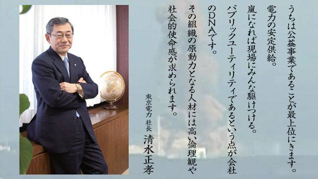
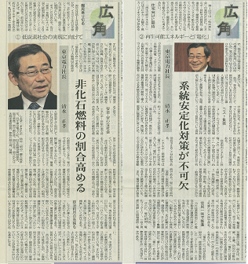
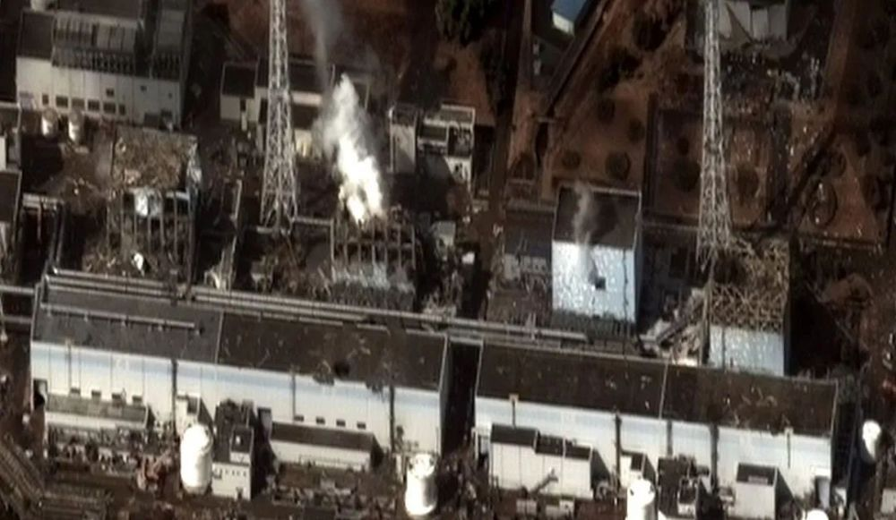
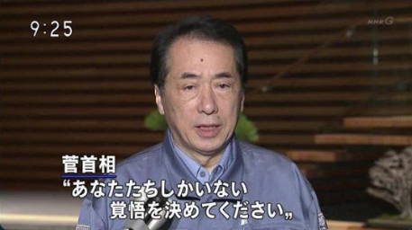
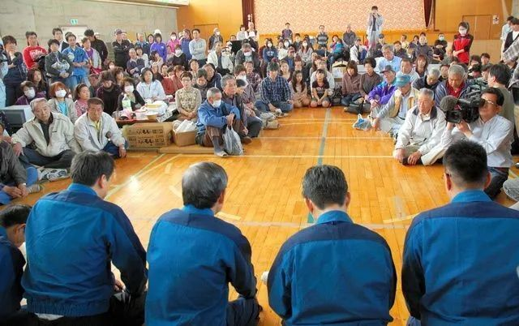
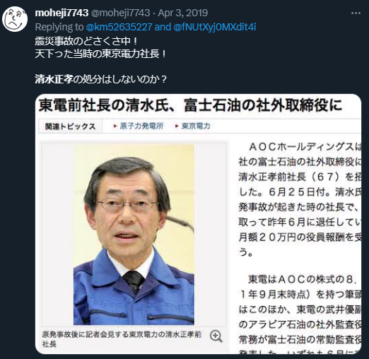

# 日本开排核污染水后，焦点再次回到东电前社长清水正孝身上

**清水不得不在众目睽睽之下跪地谢罪。**

作者：刘潇

日本开排核污染水后，一个名字重新引起关注。

东京电力公司（以下简称东电）从24日开始，向海洋排放福岛第一核电站第一批核污染水。

其实，除了“排污入海”外，还有蒸汽释放、氢气释放、地下掩埋以及注入岩石圈4种方式来处理核污染水。东电之所以选择“排污入海”，是因为这种方式最省钱。

根据朝日新闻社所做的“世论调查”显示，日本国内有超过半数民众表示反对排污入海。超过80%的民众表示“排污入海”会对日本水产业产生极大负面影响。

即便如此，日本政府和东电不顾国内舆论，一意孤行，将大量核污水排入人类共同的海洋资源中去。

焦点，再次回到了东电前社长清水正孝身上。

“简直是在说笑话！”

清水正孝自诩极具“社会使命感”。担任社长时，他曾说道：“我们（东电）以公益事业作为头等大事。如果出现大风大浪，我一定亲自前往现场。”

_·“如果出现大风大浪，我一定亲自前往现场。”_

事故发生前两年的2009年，清水接受了《日刊工业新闻》专访，一再重申核能发电的重要性，同时表示“核电厂的安全对策是不可或缺的”。日本媒体也一度将清水管理下的东电吹嘘为“安全神话”。

_·2009年，《日刊工业新闻》专访了清水。_

然而，打脸来得太快。

2011年3月11日，日本东北部太平洋海域发生强烈地震，远在东京的日本首相官邸都能感到剧烈晃动。一时间，官邸内的高官们纷纷躲入地下的危机管理中心。一个多小时后，高官们听到了另一个坏消息：“福岛第一核电站已丧失全部交流电源，冷却机停止工作”。

_·2011年3月16日，蒸汽滚滚的福岛第一核电站。菅直人说：“别幻想撤退！”_

该核电站是世界最大的福岛核电站第一站，也是东电首座核电厂。冷却机停止工作，意味着核能产生的热量无法得到及时冷却，核爆炸随时可能发生。

然而，清水正孝次日才出现在公司总部，他的解释是“火车停运，被困在日本西部”。这一失职行为，引起时任首相菅直人的不满。

3月14日，清水致电菅直人，称由于核电站设施受损毁，“请求全面撤退”。

据日媒报道，当时菅直人也急了，让清水赶到首相官邸，当面说：“没人来顶替你们。别幻想撤退！简直是在说笑话！东电必须和政府共同建立紧急指挥部！”

_·菅直人说：“别幻想撤退！”_

菅直人提议，立即去东电总部成立紧急指挥部。清水一下子脸色刷白，因为东电总部会议室里正实时播放着福岛核电站的事故画面。要是菅直人看到了事态比汇报的还要严重，自己可担当不起这个责任。

在场的时任官房副长官福山哲郎为清水开脱：“首相，事态紧急，先以撤离民众为重。我看东电没有瞒报的意思。”

菅直人恼了：“我可不是来听借口的。”他掏出自己的手机，打给现场工作人员：“目前缺少的电池长宽多少？”福山哲郎后来说，首相过问如此详细的事情，让在场的所有人都感到不可思议，也意识到首相对东电的信任度已降到了最低点。

面对压力，清水马上“病了”，搬进医院住了两个多星期。如今东电的核污水排入大海，不少日本民众又想起当年清水那场神秘的“急病”，称他入院为“谜之入院”。

有意思的是，外有天灾，
内有“疾病”，住院期间的清水还惦记着还清了东京赤坂区的高档公寓贷款，并指示部下处理了自己名下的房产。有日媒报道说，当时清水觉得日本国内“不够清静”，怕遭到媒体“骚扰”，还飞往迪拜养病。

福岛核事故被定为最高级7级。但东电在分析事故的原因时，还是将主要责任推给外部，称“过分依赖相关学会的判断”“对专家分析的海啸发生率没有做好足够的理解”等。

_·2011年5月4日，清水（背对镜头者左二）向当地居民谢罪。_

2011年，清水“出院”后，不得不面对灾民的愤怒。《朝日新闻》报道称，当他带着东电高层去安置灾民的福岛体育场时，现场民众高喊“快下跪”。清水不得不在众目睽睽之下跪地谢罪。

_·“如果当时撤退了，整个东日本地区就完蛋了。”_

时隔12年，不少日本网民想起清水当年第一时间就想“撤退”的一幕，还是恨得牙痒痒。有网民写道：“如果当时东电撤退了，整个东日本地区就完蛋了。”

“难道对他就不处分了吗”

就在清水为东电的烂摊子焦头烂额之际，朝局变了。

2011年8月26日，因核事故处理不当、日本国会两院对抗严重等原因，民主党的菅直人引咎辞职，野田佳彦接任。后来，自民党的安倍晋三当上了首相。

福岛核事故发生后，菅直人受到朝野巨大压力，当时在野的安倍晋三还曾撰文批评菅直人指挥失当，猛批了他一通。菅直人下台后，气得状告安倍“侵犯名誉权”。

而安倍做了什么呢？

日本《每日新闻》今年8月23日刊登题为《排海是缺乏诚意的不负责任行为》的社论，其中说：2013年，时任日本首相安倍晋三在申奥现场发表演讲时强调，核污染水“处于控制之中”。随着储罐泄漏事件相继被曝，安倍的话语成为不实之词。2015年，安倍内阁和东电承诺将以“相关人士的理解”作为处理核污染水的前提，但是到了2021年，菅义伟内阁不顾民众反对强行通过排海计划。

安倍当首相时，清水进入富士石油公司董事会，任社外取缔役。所谓社外取缔役，是指非本公司的人士担任的董事会成员，其职责是监察公司董事会是否认真履职，有无不法行为，对公司治理的公开透明有一定作用。通常，一个公司设有社外取缔役，其社会评价会更高。然而，清水调任的消息一出，日本舆论却炸了：“冒天下之大不韪的清水正孝，难道对他就不处分了吗”。

_·清水调任的消息让日本舆论炸开了锅。_

当年与清水一起调任的，还有原东电副社长武井优，他被调往AOC财团旗下的阿拉伯石油分公司，进董事会任“挂职督察”。清水的岳父胜俣恒久则被任命为日本原子能发电株式会社“挂职总经理”。

东电高层似乎都被保护起来了。

核污水排海发生后，日本舆论也开始追问，如果没有东日本大地震和那场海啸，福岛核事故是否就不会发生？

 _·日媒报道，事故发生后，清水试图掩盖证据。_

在福岛核事故前，日本核电产业早已存在着严重隐患。2000年，通用公司美籍工程师菅冈启为福岛第一核电工厂的外包工程工作，施工中发现站内一台蒸汽干燥器出现了裂缝，对核电站安全造成重大隐患。

上报给东电后，菅冈启却收到了东电“删除所有相关证据和信息”的指示。出于责任心，菅冈启将证据发给日本原子能安全保安院。然而，该机构并未派调查员前往现场，反而将菅冈启的信息提供给了东电，后者立即解雇菅冈启，并在日后不断威胁他。

当年核事故发生后，菅直人曾召见日本原子能安全保安院负责人。看起来，这注定没什么作用。

核事故发生后，清水也曾指示东电“不能使用炉心熔融等词汇”。“炉心熔融”即堆芯熔毁，可引发具有放射性的物质外泄。这种故意隐瞒的行为在东电也早已有之。

自1977年以来，东电对下属的福岛第一、第二，以及柏崎刈羽核电站的13座反应堆总计199次定期检查中，存在篡改数据和隐瞒安全隐患的行为。

日媒透露，2018年前，储罐中80%都是连“氚”以外的放射性物质都未完全清除的核污染水，但是东电瞒报这一事实，招致民众的不信任。

“原子能村”利益集团

日媒分析，东电之所以能这样做，是因为有个名为“原子能村”的利益集团存在。

“原子能村”由官、商、学三方组成。“官”是以经济产业省资源能源厅和日本原子能安全保安院组成的官僚集团；“商”是以东电为首的电力企业和日立、东芝等核电设备商；“学”指相关专家学者。

这意味着，本应起到相互监督、牵制的三方，却变成了相互交换承包合同、提供高薪工作，以及为核电推进提供资金、政治和立法支持的利益集团。

清水家族身居“原子能村”重要地位。清水的岳父原是东电社长，卸任后担任会长，虽然没有实权，影响依旧很大。清水的父亲也是前东电员工。

或许正因为“原子能村”的存在，直到2021年，清水重新出现在公众面前，仍旧有底气否认自己在福岛核事故中的责任。

有人问，为何早在2008年的东电内部会议上，就有专家提出了应对海啸的方案，但没有得到重视。清水说：“当时的会议上材料太多了，我没看到应对海啸的方案，根本没印象。”

福岛核事故发生以来，日本国内的受害者难以对东电追责，只能以东电股东起诉的方式维权。48名股东状告东电原高层，以“怠慢制定海啸应对措施，给社会造成巨额损失为由”，要求东电赔偿。

日本司法系统自然站在“原子能村”一边，此案多次上诉，多次被驳回，直到2022年，东电股东才打赢了这场官司。当年7月13日，原告之一的木村结走出法院，兴奋地展开写有“株主胜利”（股东胜利）的卷文。

_·“株主胜利”。_

然而，面对核污水排海造成的严重危害，最早的受害者就是日本民众。在这种情况下，真的有什么“胜利者”吗？

今年8月24日，福岛核污染水正式排海，下达现场指令的是东电的现任社长小早川智明。他生于1963年，是公司首位理工科出身的社长，1988年毕业于东京工业大学工学部，同年入职东电，由科员做到一路做到社长。日本网民称他“分析力强，精于算计”。

为何选在8月24日将核污染水排海？日媒分析，这就是为赶在9月1日福岛开渔前，对水质进行一段时间的监测，以借此展示所谓的“安全性”。但捕鱼50多年的福岛渔民小野春雄愤怒地说：“福岛渔民没有任何人可以接受（核污染水排海）。”

总监制： 吕 鸿

监 制： 张建魁

主 编： 许陈静

编 审： 凌 云

