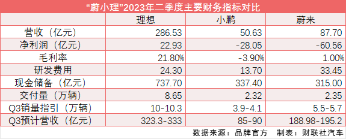

# 蔚小理二季报大横评：理想毛利率再超特斯拉 蔚来、小鹏期待触底反弹

**财联社8月30日讯（记者 徐昊）**
继今年一季度的财务表现全面“碾压”蔚来、小鹏后，理想汽车在二季度继续保持着这一优势。面对一骑绝尘的理想，蔚来和小鹏更希望在今年下半年迎头赶上。

“蔚来希望三季度达到双位数的毛利率，四季度达到15%。”8月29日，蔚来汽车董事长李斌在蔚来汽车2023年第二季度财报电话会上表示，蔚来的目标是月销量稳定在2万辆以上，销售能力建设是按照每月锁单3万辆做准备。

**理想毛利率再次超过特斯拉 蔚来最“烧钱”**

8月29日，蔚来发布发布2023第二季度财报。至此，“蔚小理”三家造车新势力半年报均已交卷。从具体业绩表现看，理想汽车销量持续走高，第二季度交付新车8.65万辆，同比增长201.6%；蔚来和小鹏在第二季度的交付量接近，在2.3万辆左右。

与交付量保持一致的是营收情况。理想汽车第二季度实现营收286.5亿元，同比增长228.1%，小鹏汽车第二季度营收50.6亿元，同比下降31.9%，蔚来汽车第二季度营收87.7亿元，同比下降14.8%。也就是说，后两者相加的营收额不及理想的一半。

在交付量大幅增长之下，理想汽车再次实现了季度盈利，净利润为23.1亿元。同时，随着规模效应、供应链管理和终端门店效率提升，理想汽车毛利率在今年第一、第二季度连续超过特斯拉（Q1：19.3%；Q2：18.2%），其中二季度毛利率达到21.8%。

李想曾在社交媒体上开列出的理想汽车2023年最重要的五个任务中，“BOM成本竞争力”和“矩阵组织的升级”是理想汽车毛利率提高的关键要素。“我们将供应链分为不同模块，其中只做必要的部分，选择自研自制的判断标准是效率，因此实现了上游成本和风险控制的良好平衡。”理想汽车总裁兼总工程师马东辉揭秘了理想汽车对于“BOM成本”控制的“密码”。

相比之下，小鹏和蔚来汽车的盈利能力和运营成本仍有待提高。小鹏在当季亏损28.05亿元，且毛利率转负。对于当季车辆毛利率的下滑情况，小鹏方面表示，主要由于G3i的存货减值及存货采购承诺亏损，对汽车毛利率产生了4.5个百分点的负面影响。

蔚来当季亏损高达60亿元，超市场预期10亿元，33.4亿元的研发费用和和汽车销售、一般及行政费用28.57亿元，是三家中成本最高的。同时，二季度毛利率为1%，较一季度再跌0.5个百分点。

蔚来在财报中表示，销售人员、销售及营销活动增加及服务网络扩展导致二季度销售费用上涨。对于汽车销售额的减少，蔚来汽车则解释称，主要原因是ET5和75kWh标准续航电池包的交付量占比增加，导致平均售价降低以及交付量的减少。同时，蔚来的“其他业务”也对其毛利率造成了拖累，“毛利率较2023年第一季度有所下降，主要由于较低毛利的二手车销售的增加”。

**三季度理想目标月销过三万 蔚来给出最高指引**

对于接下来“蔚小理”的表现，更值得市场期待。理想的目标是进一步扩大市场优势，且能够在豪华市场上与传统品牌较量；而蔚来和小鹏的目标则是完成触底反弹，尽快走出低谷。

其中，理想汽车预计，三季度车辆交付量为10万至10.3万辆，同比增长277.0%至288.3%。在具体目标上，理想L8、L9的目标是每月交付过万辆，理想L7挑战1.5万辆，到今年四季度挑战4万辆的月交付量。

为达成这一目标，一直拒绝“价格战”的理想汽车也开始了“变相优惠”。8月30日，理想汽车宣布，为庆祝理想汽车L系列车型交付一周年突破25万辆，针对2023年8月30日（含）至2023年9月30日（含）新定购理想L9、理想L8、理想L7任一车型并通过合作保险机构购买车险，可享保险补贴10000元。

对于销量的提升，蔚来则寄希望于销售服务网络的扩大，以确保订单不会落入旁人。“6月我们发现销售能力无法满足同时销售7、8款车的需求。从7月开始，我们已经全面提升销售能力，目标达到每月锁单3万辆销售能力，9月底完成这项销售能力的建设，（希望）从10月开始销售能力建设的成果开始逐步显现。”李斌透露，接下来希望通过更多的渠道覆盖和销售能力的提升，加快订单转化。

对于三季度业绩预期，蔚来给出了历史最高交付和营收指引，其中交付指引为5.5万-5.7万辆，同比增长74.0%-80.3%；营收指引为189.0亿-195.2亿元，同比增长45.3%-50.1%。同时，李斌表示，蔚来希望三季度达到双位数的毛利率，四季度达到15%。李斌预期，蔚来正在销售的ET5、ET5T、ES6以及9月即将上市的EC6，四款车型销量有望达到1.5万至2万辆之间，加上其他车型销量的提升，每个月销量有信心稳定在2万辆。

除去期望G6产能爬坡及推出现有车型更丰富配置，以在今年四季度冲击月交付2万辆的目标外，小鹏汽车近日签下的两笔“大单”，则足以使其有了更多喘息的机会。

8月初，小鹏汽车成功“牵手”大众汽车，其通过收取技术服务费，有望改变车企盈利模式；不到一个月，又宣布与滴滴达成战略合作，以MONA平台一款款A级智能电动汽车切入15万元级市场，与出行公司形成“生态化反”。

在宣布两笔合作后，持续低迷了一段时间的小鹏汽车H股股价在8月也迎来“狂飙”。截至2023年8月29日收盘，小鹏汽车港股报收74.3港元。近90天内共有26家投行给出买入评级，近90天的目标均价为84.36港元；而在去年，小鹏汽车的股价曾跌至25港元左右。

（财联社记者 徐昊）

