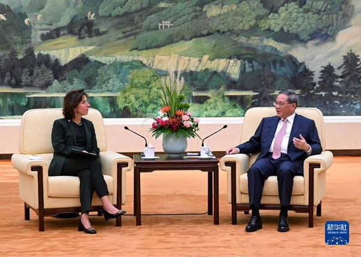

# 雷蒙多强调“无意遏制”，副防长渲染“军力竞争”，美频对华释放矛盾信息

【环球时报驻美国、德国、新加坡特约记者 李勇 青木 辛 斌 环球时报记者 丁雅栀
倪浩】29日，美国商务部长雷蒙多的访华行程进入第三天。当天，国务院总理李强，国务院副总理、中美经贸中方牵头人何立峰，文化和旅游部部长胡和平等分别在北京会见雷蒙多。“希望美方与中方一道努力，拿出更多务实有益行动，把中美关系维护好、发展好。”李强这样表示。雷蒙多说，拜登政府“无意遏制中国发展，不寻求同中国脱钩”。在外媒看来，将美中商业关系称为“世界上最重要的关系之一”的雷蒙多传递出与许多其他美国政界人士截然不同的信号，然而中美关系能否改善仍然很微妙，毕竟，美国对于中国经济崛起和所谓“主导亚洲”的过度焦虑依旧存在，不友好的言论和举动一直没有停止过。当地时间28日，美国国防部副部长希克斯就在国防工业协会会议上宣称，希望在18至24个月获得数千套自主武器系统来对抗中国在军事装备和人员方面的“数量优势”。美国“政治新闻网”分析说，美国想通过部署大量廉价、可消耗的无人机来应对所谓中国在印太地区的“威胁”。

_2023年8月29日下午，国务院总理李强在人民大会堂会见美国商务部长雷蒙多 图源 新华社_

**雷蒙多：我们的商业关系可以稳定政治关系**

29日会见雷蒙多时，李强指出，中美经贸关系的本质是互利共赢。把经贸问题泛政治化、泛安全化，不仅严重影响两国关系与互信，也损害两国企业和人民的利益，将给全球经济带来灾难性影响。双方应加强互利合作，减少摩擦对抗，共同推动世界经济复苏，应对全球性挑战。雷蒙多表示，拜登政府愿同中方保持沟通，维护美中正常经贸关系，推动两国关系稳定发展。

何立峰在同日会见了雷蒙多。其间，中方表达了对美方301关税、对华出口管制、双向投资限制等措施的关切。胡和平29日也会见了雷蒙多，双方同意2024年上半年在华举办第14届中美旅游高层对话。

28日，中美宣布成立一个工作组，由中美副部长级和司局级的政府官员组成，并有企业代表参加，以寻求解决具体商业问题的办法。此外，双方还启动了出口管制信息交流机制。根据美国商务部发布的消息，工作组第一次会议将于2024年年初在美国举行，而出口管制信息交流机制第一次会议于29日在北京举行。中国世界贸易组织研究会副会长霍建国29日对《环球时报》记者表示，中美之间的经贸沟通机制在美国前总统特朗普执政时期基本“停摆”，此次两国再次建立工作组和沟通交流机制，体现双方对经贸关系的高度重视。

多家外媒评论说，举行定期磋商是重建两国受损关系的最新举措。新加坡《联合早报》引述专家的观点称，这有助于缓解中美剑拔弩张的气氛，虽然战略竞争在短时间内难以逆转，且对话机制不见得能够解决问题，但这仍是一种正面信号。据彭博社报道，雷蒙多在28日的一场活动上表示，美方的计划和希望是，“如果处理得当，我们的商业关系可以稳定政治关系”。

霍建国说，对于美国而言，中国既是庞大的生产基地，也是巨大的市场，美国商界无法真正做到与中国割裂。雷蒙多代表美国工商界与中国就经贸问题展开沟通符合美国利益。《纽约时报》报道称，雷蒙多表示，为准备此次访问，她与近150名商界领袖进行了交谈，他们给出的一致意见是：我们需要更多的沟通渠道。

对于出口管制信息交流机制能否发挥作用，中国国际问题研究院美国研究所所长、副研究员沈雅梅29日对《环球时报》记者说，这有待观察。在对华出口管制措施上，美国通常是想拉着盟友共同实施，因为如果单边执行的话，就相当于把中国庞大的市场让给了其他国家。若美国在这个问题上拉拢盟友的做法没有变化，那么这一机制的作用可能就比较有限。

**五角大楼盯上中国军力的“数量优势”**

《日本经济新闻》29日说，中美关系的整体走向能否朝着改善前行还很微妙。美国总统国家安全事务助理沙利文此前宣称，他不认为雷蒙多访华能取得“重大成果”，更多的是管理复杂的关系。

这一“复杂关系”的根源其实在于美方。一方面，华盛顿在不到3个月的时间里接连派出4名高官访华寻求接触与沟通；另一方面，其渲染“对立”的言论、旨在“抗衡”的行动没有停止过。最新的一个例子是，美国副防长希克斯28日在一次会议上介绍了名为“复制者”的计划。她声称，中国的军事优势在于“数量”，即更多船舰、导弹和人员。为与之抗衡，美国必须投入更多资金获得更便宜、更容易制造以及可消耗的武器。

根据希克斯的说法，五角大楼计划在18至24个月之内获得数千套自主武器系统用于“多个领域”。《纽约时报》分析称，“多个领域”有可能是指应用于空军、海军和陆军。“我们将以自己的规模性武器去对抗解放军的规模性武器。”希克斯声称，美国的军队将“更难被预测、更难被打击、更难被击败”。

在美国“政治新闻网”看来，这项“雄心勃勃”的计划是五角大楼下一个巨大的“赌注”。希克斯拒绝透露在该计划框架内可能生产哪些平台和设备，比如哪些无人机或水面无人艇，理由是国防工业的“竞争格局”以及担心向中国露出底牌。她预计，这一项目将花费数亿美元。

美国“动力”网站解读说，“复制者”计划中的武器应该是足够便宜，以能够承受在高风险任务中被损耗，但同时又有能力执行这些任务。可负担性、可快速迭代的研发周期以及大规模生产的可能性是该计划的优先考虑因素。希克斯称，俄乌军事冲突表明，廉价的商用无人机可被有效地用于侦察、瞄准和攻击。

“从冷战时期开始，美军一直强调以质取胜，现在开始转向注重数量，说明在他们的潜意识里已经认为自身质量优势微弱，不足以抵消数量优势。”军事专家张学峰29日对《环球时报》记者说，以美国为首的西方军工集团多年来形成发展大型昂贵平台的生产体系，向小型、分布式作战平台的大规模生产转向需要一定时间，与中国相比，美国在这一领域没有优势。

**美国国务院敲定负责中国事务的高级官员人选？**

英国《卫报》28日担心地称，美国和中国仍处于冲突的轨道上，避免“碰撞”的第一步是美国认识到一些普遍存在的担忧是过度的，比如对中国经济崛起的焦虑以及对其“主导亚洲”的疑虑。华盛顿必须将自身战略限制在“降低风险”，在决定哪些行业纳入其“小院高墙”策略时，它必须避免走得太远。在台湾问题上，美国和中国应该努力达成新的共识，以化解局势升级的危险。中美两国需要采取有助于缓解经济和地缘政治紧张局势的政策，促进在气候变化和人工智能监管等全球问题上的健康合作。

“事实上，眼下的中美关系在经济、安全、人文、外交、全球治理等诸多领域都是以分歧、斗争、摩擦、竞争为主导，但由于美国无法做到压制中国，同时为缓解外界对中美关系的担忧，展示其能够理性地、负责任地处理好两国之间的矛盾，美国在对华态度上呈现出两面性。”沈雅梅说，这充分体现出美国一方面想要打压遏制中国，限制中国的发展空间；但另一方面美国意识到自己做不到，要么需要借助外力，要么通过与中国边合作、边打消耗战来实现自己的目的。

在拜登政府试图管理与中国的“激烈竞争”之际，路透社29日引述消息人士的话称，美国国务院已选中资深外交官兰博特担任分管亚太事务的副助理国务卿，他将成为该部门负责中国事务的最高级别官员，以填补华自强今年6月离职后留下的空缺。兰博特是亚洲问题专家，曾两度在美国驻华大使馆任职。但路透社认为，兰博特任职后不太可能改变华盛顿对北京的政策基调。

