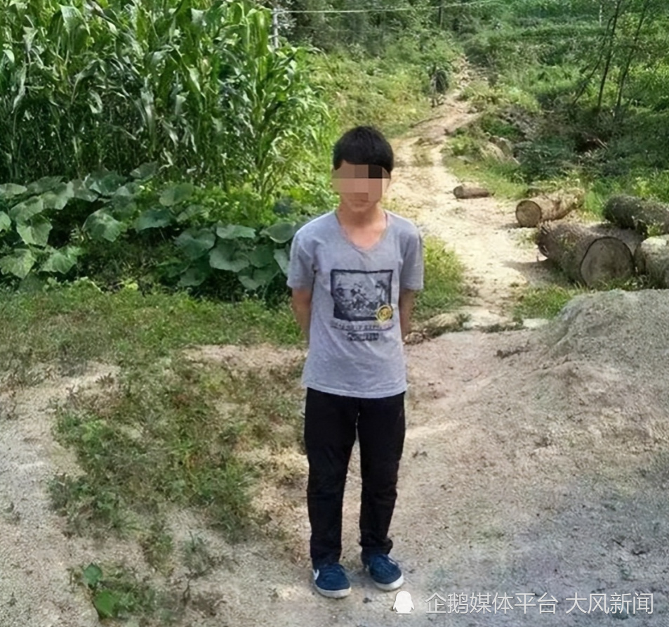
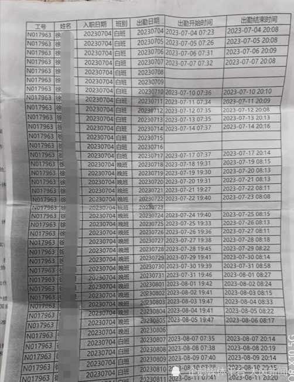

# 23岁小伙打工期间猝死宿舍：每天工作10小时以上，连上13天夜班

云南昭通人徐先生称，8月14日，23岁的弟弟打工期间不幸猝死在宿舍。因为难以认定工亡，目前家属与劳务公司及厂方尚未就善后事宜达成一致，希望媒体关注、帮助。

到新公司工作一个多月，不幸猝死在宿舍

8月29日上午，徐先生告诉华商报大风新闻记者：“父母在我们很小的时候就因病去世了，我和弟弟是孤儿，是奶奶含辛茹苦把我们养大的。”

徐先生称，弟弟小徐出生于2000年2月。由于父母离世早，弟弟很早就辍学外出务工。

_徐先生说，弟弟小徐平时身体很好，也没有家族遗传病_

2023年7月4日，在江苏苏州，小徐与一家名为“苏州蓝领通网络科技有限公司天长分公司”（家属称，最初签订合同的是另一个公司，后改为该公司）签订了劳动合同，被安排到“苏州佳世达”公司工作。合同自2023年7月4日起，至2025年7月3日止。

徐先生说，“苏州佳世达”是一家生产电子产品的企业，弟弟在厂里不定期上白班和夜班。

今年8月14日晚上11点多，徐先生突然接到当地警方电话，说他弟弟在苏州发生意外，人已猝死。“警方说，我弟弟是当晚8点半被发现猝死在宿舍的。”

警方除排他杀，

家属与劳务公司、厂方未就善后事宜达成一致

徐先生介绍，事发后，苏州当地警方委托司法鉴定机构对他弟弟的血液进行了鉴定。结论是：送检血液中未检出美沙酮、敌敌畏、乙醇等物质，排除他杀（刑事案件）可能。

事发后，徐先生咨询了当地的人社部门。对方说，像他弟弟这种非工作时间、工作地点发生的猝死，很难认定为工伤（亡），建议家属和劳务公司、厂方协商解决善后问题。

谈到为什么不做尸检，以弄清楚弟弟的猝死原因时，徐先生说，尸检费用较大，他工作时间不长，经济能力有限，所以暂时未做尸检。

但徐先生调查发现，他弟弟在“苏州佳世达”工作期间，劳动强度比较大，“每天的出勤开始时间至出勤结束时间都在12小时左右，除去吃饭时间，每天工作时间都在10个小时以上。”

徐先生提供的一份小徐工资单显示，8月10日至12日，小徐两天的刷卡工时为21小时，刷卡工资为360元。“也就是说，弟弟每天的工作时间达到了10.5小时”。

 _徐先生提供的弟弟考勤记录_

通过查询弟弟的出勤记录，徐先生还发现，7月24日至8月5日，小徐连续上了13天的夜班。“每天出勤开始时间为19时40分左右，出勤结束时间为次日8时20分左右，最晚的达到8时58分。”他认为，他弟弟的猝死与长期加班、连续上夜班有一定关系。

徐先生说，弟弟离世后，他与苏州蓝领通网络科技有限公司天长分公司相关负责人就弟弟的善后事宜协商多次，一直没有达成一致意见。“对方说，弟弟不是工伤（亡），在宿舍猝死与劳务公司和厂方没有关系。出于人道主义，他们愿意补偿我们3万元至5万元。后来，对方又说可以补偿8万元至10万元，我们对此不能接受。”

“奶奶75岁了，弟弟离世的消息我一直瞒着，至今不敢告诉她。”徐先生说，弟弟的遗体仍在殡仪馆存放，他希望善后问题早日解决，好让弟弟早日入土为安。

劳务公司：

已协商多次，家属索赔数额太高，将继续积极协商

徐先生反映是否完全属实？8月29日上午，华商报大风新闻记者联系了“苏州蓝领通网络科技有限公司天长分公司”相关负责人。

该负责人称，小徐的离世纯粹是一起意外事件。“我们和家属协商过多次，家属提出的补偿数额太高，我们无法满足。”

他称，小徐的猝死是一起非工伤（亡）事件。事发后，小徐的家人先是提出了150万元的赔偿要求，后面又提出了100万的赔偿要求。厂方和公司无法满足。“最初，出于人道主义，公司和厂方愿意补偿家属3万元至5万元。但家属不同意，我们只能建议家属找律师，通过诉讼依法维权。”

“第三次、第四次协商时，家属提出了28万多元的赔偿要求。我们提出，考虑到小徐家庭情况比较特殊，公司和厂方经过沟通，拿出最大诚意，愿意补偿家属8万元至10万元。此外，厂方再为小徐举行一场募捐活动，但家属依然不同意。”

该负责人称，事发前两天，即8月12日、13日是小徐的正常休息时间。8月14日，小徐没有上班，后来发现猝死在宿舍，因此很难认定为工伤（亡）。

他称，小徐是成人，之前配合企业加班符合法律规定。

“这件事情我们也不想拖，我们将继续和家属协商，也希望家属依法依规维权。”该负责人最后称，此事厂方委托他们处理，他们愿意和家属积极协商。

8月29日下午，“苏州佳世达”公司相关人员称，其不了解徐先生反映的情况，待其了解后回复记者。截至发稿，尚未等到回复。

律师说法：

建议死者家属进行尸检，以查明死亡原因、死亡时间

死者家属与公司、厂方无法就善后问题达成一致时，家属如何依法维权？

陕西浩公律师事务所律师崔腾指出，因为目前未做死因鉴定，因此无法明确死者死亡时间及原因，也无法明确死者死亡后果与用人单位用工的因果关系（包括且不限于连续加班、夜班等情况）。

“无法查明事实真相，就不能据此要求用人单位承担责任。”崔腾建议死者家属积极配合相关部门进行尸检，查明死者死亡原因及死亡时间，进一步查明案件事实。

“假如最终尸检报告可以明确死者死亡时间符合工作时间，并且死亡原因系工作原因导致，那么死者应当属于工伤（亡），由用人单位承担相关赔偿责任。如最终鉴定报告明确死者系因其他原因死亡，存在其他相关责任方及过错方的，应当由相关责任方或过错方承担赔偿责任。”

崔腾说，如最终鉴定报告明确死者死亡单纯系意外事件，不存在任何相关责任方及过错方的，也就没有相关方对此事件承担赔偿责任。“当然，出于人道主义，第三方公司和厂方从情理上可以给予死者家属一定补偿。”

**华商报大风新闻记者 陈有谋 编辑 董琳**

