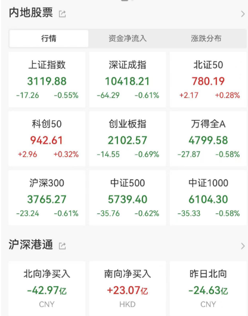
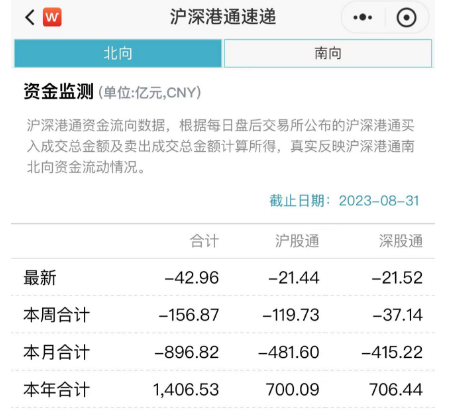
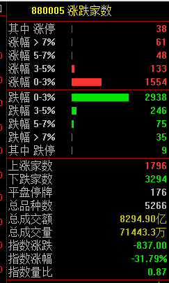
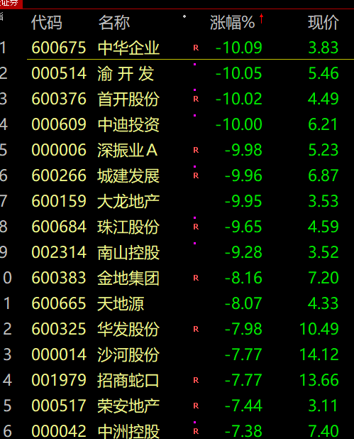
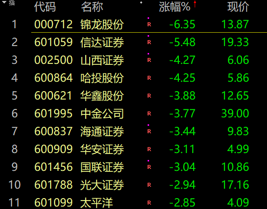
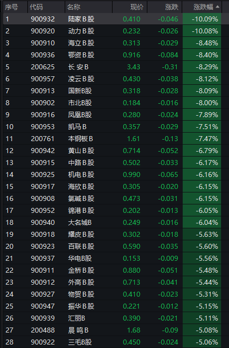
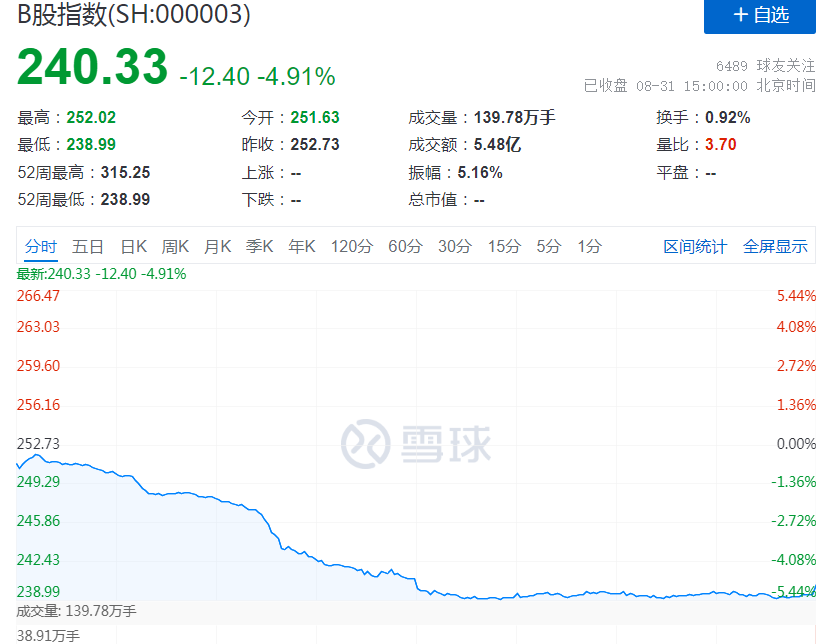
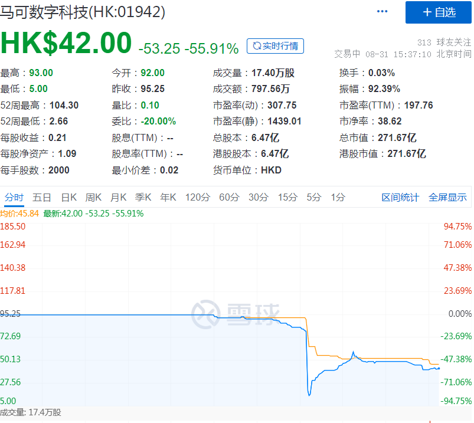
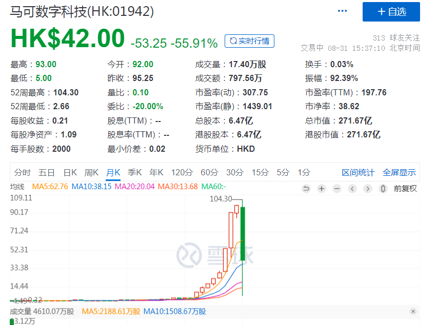

# A股全线收跌！外资8月累计减仓接近900亿元，单月净卖出额创历史新高

中国基金报 泰勒

兄弟姐妹们啊，今天收成如何？A股还是低迷，北上又跑了40多亿，一起看看今天发生了什么？

8月的最后一天，三大指数震荡调整，今日成交8292亿元。截至收盘沪指跌0.55%，深成指跌0.61%，创业板指跌0.69%。北向资金净卖出近43亿元。

8月北向资金接连减仓，月中创下连续13日净卖出的历史最长连卖纪录，8月7日以来仅有1日呈净买入态势。外资8月累计减仓接近900亿元，单月净卖出额创历史新高，此前净卖出额历史纪录仅为2020年9月创造的327亿元。

共1796只个股上涨，3294只个股下跌。

券商、房地产大跌。

B股崩了。

今天的A股勉强维持，而B股则是崩了。一度暴跌5%。多只B股放量下挫，陆家B股、动力B股跌停，国新B股、鄂资B股、凯马B股等跌超7%。

B股的正式名称是人民币特种股票，只是为了区别于“A股”、“H股”而取名为“B股”，并无实际含义。B股以人民币标明面值，以外币认购和买卖，是在上海证券交易所、深圳证券交易所上市交易的外资股。B股市场的公司的注册地和上市地都在境内，上海证券交易所的B股以美元计价，深圳证券交易所的B股以港元计价。

B股市场建立于1992年，是为了解决外资直接购买中国公司而创立的市场，2001年2月19日前仅限外国投资者买卖，此后，B股市场逐步对国内投资者开放。

近年来，A股加速对外开放，吸引大量外资涌入，还有很多优秀的中国公司在港股美股上市，这样一来，B股的玩家就少了，这个市场的融资能力也就弱了。B股逐渐被边缘化，B股的功能定位也在丧失，目前市场上仅剩85只个股。

B股暴跌主因仍在于个股流动性低迷造成股价剧烈反应。此前有一种说法是，B股大跌通常发生在A股成交低迷期间，或意味着A股市场正在酝酿反转行情。

此外，港股有一只股票也崩了。一度暴跌超90%。

该公司今日早盘停牌，午间发布公告称，执法机关8月29日就涉及公司股份交易的若干涉嫌罪行开展联合行动，前往公司的香港主要办事处，并取得若干合作文件。该公司股价此前3年多时间内，由最低0.32港元最高涨至104港元，累计涨幅超300倍。

市场就分析到这。

