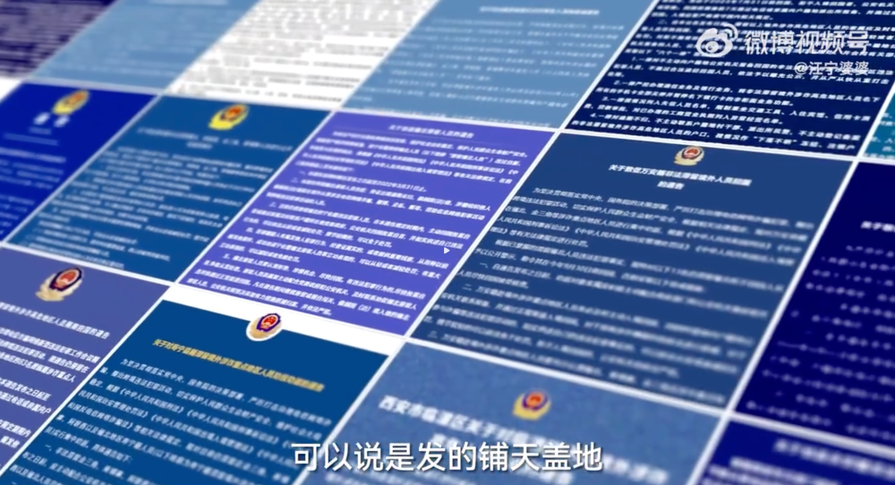
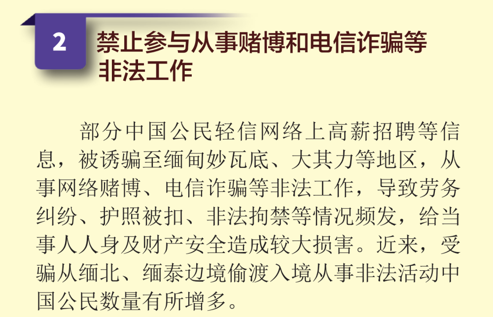

# “95%是自愿去缅北”如果是真的，那解决缅北电诈问题就需要新思路了

这两日，腾讯新闻谷雨实验室的一则报道《[反诈警察揭露缅北电诈真相：“95%的人都是自愿过去的”](https://new.qq.com/rain/a/20230828A07XCS00)》引发了许多人关注。文中的“公安干警老张”结合亲身接触到的案例，告诉大家，“即便了解去缅北从事电诈的风险，许多这样的年轻人还是禁不住金钱的诱惑。”甚至“有年轻人在被劝返回国后再次回到缅甸，不断走进循环。”

无独有偶，知名警务大V“江宁婆婆”近期也做了一个视频，题为《在境外做诈骗的真的都是被骗过去的吗？》，用了一些官方信息，包括中缅边境出入境相关政策、各地警方发布的“劝返通告”、警方发布的电诈人员忏悔“中国人不骗中国人”视频等等，告诉大家，在缅甸从事电诈的中国人，“绝大多数是非常清楚自己是去干什么的”。

_“江宁婆婆”视频展示的各地公安发布的劝返通告_

“自愿去缅北”这一说法，很大程度上扭转了“被骗去缅北”这一大家更为熟知的叙事——不管是过往看到的新闻、还是最近的反诈电影，都还在给人灌输这样的印象。
**但很多网友早就在怀疑，一个大活人是不是真的这么容易被骗出国？有没有可能是因为害怕被追究责任、爱面子、以及实际的利益因素，才在回国后谎称是被骗去缅北的？甚至于，那些“被骗去缅北”的故事，有没有可能纯粹就是迎合大众情绪，无中生有编造出来的？**

举两个最近的例子。一个是“22岁女大学生疑被贩卖到缅北”，指的是一张疑似缅北的聊天截图，有人称要“出两个人”，一个22岁的女大学生和一个17岁的孩子，“打包价16万”，还附有女大学生的身份信息。双方在聊天过程中多次提及“猪仔”“蛇头”“偷渡”等词，让人看了惊惧不已。结果，有媒体联系上女孩，证实人在国内，只是手机、身份证信息丢失而已。

另一个是“重庆某公司招聘员工，正常上班数月后以出国团建为由将员工送往缅北工业园”，也是一段聊天记录，非常吓人。但也有反诈专家看到这个说法时就立即质疑，“除非自愿，否则恐怖分子也做不到神不知鬼不觉带人出境呀。”后续重庆多个官方平台发声辟谣，表示根本就没发生类似的案件。

尽管如此，对于“自愿去缅北”这一说法，也有人提出了质疑。首先是质疑“95%”“绝大多数”的说法是否夸张，“就像一些信访工作人员说99%都是闹访，但你一说公开复查，立刻就变成属地办理”，毕竟，对于警方来说，“自愿去缅北”如果是真的，那“解救”这些人的迫切性就小了很多。其次，有人提出，如果去缅北的绝大多数都是自愿的、清楚内情的，那到处流传的“高薪工作”把人骗过去，还有必要吗？总不能说那些“高薪工作”的信息都是好事者编出来自娱自乐，与缅北无关吧？

最重要的是，中国驻缅甸大使馆于8月4日发布《旅居缅甸中国公民安全文明指南（2023年版）》明确提到——
**“部分中国公民轻信网络上高薪招聘等信息，被诱骗至缅甸妙瓦底、大其力等地区，从事网络赌博、电信诈骗等非法工作，导致劳务纠纷、护照被扣、非法拘禁等情况频发，给当事人人身及财产安全造成较大损害。”**
注意，这里明确说的就是“高薪诱骗”，而且是“频发”，并且受害者护照被扣、非法拘禁，与被劝返者能自由回来的说法，是有相当大差异的。

_引自《旅居缅甸中国公民安全文明指南（2023年版）》_

那么，到底是怎么回事？那些在缅北的中国人，到底是“自愿去缅北”，还是“被骗去缅北”？

其实仔细思考的话，这两种说法还真不一定有太大的矛盾。那些去缅北的人，很可能知道去那里要做的就是电诈，但是，对于待遇到底怎样，去到哪里是否有人身自由，以及是否会受到虐待等等，不一定能知道得很清楚——这毕竟是黑色产业，没亲身接触前很可能是搞不清相关细节。缅北犯罪集团的人，可能依然会利用他们想发财、想摆脱当前困境的心态，用诱惑手段促使他们下定决心，助推了一把——
**如果真是这样，那称之为“哄骗”也许是更恰当的描述，是一种介于“自愿”和“受骗”之间的一种情况。**

另外的可能性是，也许缅北的电诈行业开始时是比较来去自由的，但疫情这两年境外诈骗行业也出现了用工荒，出现了自愿去但却走不了的情况。如果是这样，那这些人某种程度上也应该被视为受害者。

**究竟是哪种情况，比例分别如何，急需更明确的说法。因为这事关解救缅北中国人有多急迫，事关普通人被拐、被骗去缅北的风险有多大。**
如果真的绝大多数——有网友甚至认为高达99%以上——都是自愿过去做电诈的，而且能自由返回，那“解救”这些人就没有那么急迫，我们要做的，是专注于打击电诈这种现象，以及救助被骗钱的人。而如果被骗、被哄骗过去而且失去人身自由的人数量其实不少，那就完全不一样——我们需要投入更多的资源解救他们，需要切断犯罪集团与他们的联系，需要更多防止被拐被骗的教育。

这些资源的分配，在很大程度上跟舆论是有关系的，而舆论如何，则很大程度上取决于对缅北电诈现象的描绘。期望媒体能够进行更加细致、深入的调查，也期望相关的执法部门、执法人员能够提供更多的信息，让人们更好地了解缅北电诈的真实图景是怎样的。

