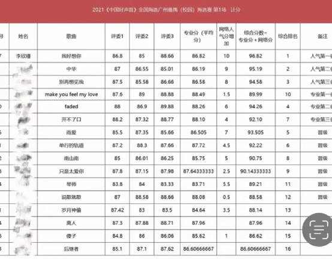
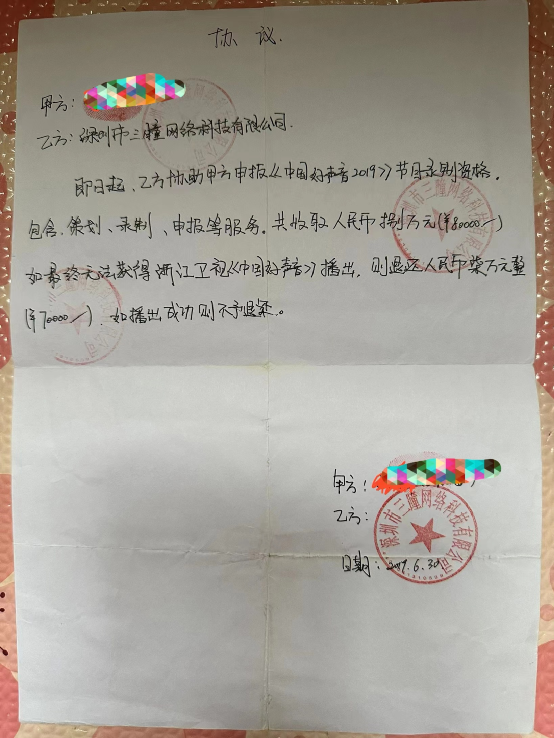

# 一年上万场活动，好声音的海选藏着什么秘密？

_图源：视觉中国_

特约作者 | 王不逊

编辑 | 陈弗也

出品 | 棱镜·腾讯小满工作室

8月25日11点，浙江卫视对外宣布，鉴于网友反映《中国好声音》节目的问题正在调查，该节目暂停播出。

在此之前，“好声音事件”发酵之后，网络上涌现了一批“学员”，控诉《中国好声音》的一些“乱象”。值得注意的是，这些“学员”当中，很多并没有在《中国好声音》的节目中出现过，他们参加的是《中国好声音》的“海选”。

“海选”是很多选秀节目的重要环节。不过因为这个环节乱象丛生、内幕众多，备受争议。

2021年5月，一份来自《中国好声音》节目组的“通知”在网上流传。一家媒体曾进行报道，该通知写道，停止2021年《中国好声音》全国所有的海选活动，原因是他们接到了有关部门通知，“要求停止一切综艺节目的海选活动”。

该报道还提到，“好声音”节目中出现的选手，并非来自海选，而是由导演组到全国各地挖掘。

不过，这个说法并不准确。《中国好声音》的制作公司为上海灿星文化传媒股份有限公司（以下简称“灿星文化”）。2020年，该公司曾试图在创业板上市，当时的招股书明确写道，2017年至2019年，海选渠道每年都为《中国好声音》推荐顶尖歌手。比如，2017年《中国新歌声》冠军扎西平措、2018年“好声音”亚军黎真吾、2019年“好声音”季军陈其楠。

事实上，即便是“好声音”发布停止海选的通知后，一些变相的海选活动仍然在进行。比如，《中国好声音》Channel V歌手大赛等，这个活动由灿星文化授权。

2022年5月，“好声音”节目组曾经集中发布多份声明，谴责一些企业在未经授权的情况下，变相开展海选活动。

那么，谁在运作这个鲜为大众所知的“海选”，他们与“好声音”是什么关系，为何在最近的“好声音事件”中备受争议。近日，作者查阅了大量资料，采访了多位“海选”学员，试图解开这个“隐秘角落”的谜团。

**每年上万场线下活动**

2019年，余诗嘉（化名）来到了一个“高光时刻”，她获得了当年“好声音”一个市级赛区的季军。

余诗嘉毕业于一家艺术类院校，从小学的就是音乐的，曾参加过不少比赛，目前从事金融行业。但是，回想起那段时间，她高兴不起来，反而有一种被骗了的感觉。

“进了初赛，就想要进复赛，进了复赛又想进决赛，决赛完了还有省赛，省赛后又会被告知如果想要上节目还要再花20万。”余诗嘉向作者感叹，“像缅北电信诈骗的套路，一步一步让你陷进去。”

在海选环节的遭遇，让她对“好声音”失去了好感。

不少选手以为，通过层层“海选”之后，就可以站在“好声音”的舞台上。在这个过程中，他们不仅要付出很多精力，还要投入不少财力，但最后却发现，“海选”并非通向“好声音”舞台的主要途径。

作者获得的一份2023年《中国好声音》Channel
V歌手大赛的运营规则图显示，这个大赛分为三级，市/县级赛、省级赛、全国总决赛，前两级赛又分为初赛、复赛、突围赛、冲刺赛等多个环节，全国总决赛则被一些学员称为是“国赛”。

通过国赛的选手，则可以参加2023年《中国好声音》的全国巡演，但是，这个“全国巡演”并不是浙江卫视曾经热播的《中国好声音》。

在此之前，得益于《中国好声音》的热播，灿星文化一度在全国各地开展海选活动。2020年灿星文化的招股书显示，当时，他们的海选活动已深入覆盖全国31个省、自治区、直辖市，300多个地级市，800多个县，“每年共有上万场线下海选活动”。

公开资料显示，一家名为“腾扬广告”的公司是这些海选活动的主办方。

根据工商资料，腾扬广告成立于2015年8月，注册资本5000万元，其大股东为合肥瀚洋广告有限公司，这是一家来自合肥的民企。

根据招股书，灿星文化最早的商业化活动是2015年4月的贵州省《中国好声音》推介会。此后，他们与腾扬广告合作，后者获得了“好声音”海选活动的授权。“中国好声音全国海选组委会”百科词条写道，腾扬广告是2016-2020年“好声音”海选唯一授权单位。

对于灿星文化来说，他们可以从这些海选活动中，获得一笔不小的授权费用。

根据招股书，2017年、2018年、2019年，腾扬广告一直都是灿星文化“衍生业务”的第一大客户。这三年间，他们每年向灿星文化支付4851.75万元、5256.06万元、6341.77万元的海选授权费用。

当然，对于《中国好声音》这个超级综艺IP，这些海选授权费用只是其中很小的一部分，以2019年为例，当年，灿星文化的总营收为17.3亿元。

腾扬文化又是如何每年运营上万场海选活动呢？《新黄河》曾在2021年报道过腾扬广告的模式，他们以《中国好声音》全球海选的名义，把赛区分割到省级，省级代理商又转包给不同市级公司，市级代理甚至会再转包给县级公司。

作者获得的两份民事判决书也显示，腾扬广告获得授权后，可以独家运营“好声音”的地面海选活动，可以使用“中国好声音”的品牌及logo，也可以就不同区域海选赛事运营权洽谈地方合作的第三方公司。

在层层转包的过程中，腾扬广告与一些代理商产生了纠纷，在运作“海选”活动时，一些乱象开始出现。

多份腾扬广告和下级代理商的合同纠纷判决书显示，代理商让参赛学员包装、买课等，他们也要给腾扬广告支付一笔昂贵的授权许可费，同时将比赛收入给腾扬广告分成。

比如，2018年，在河南地区的“好声音”海选中，作为大赛评委，驻马店音乐节协会常务理事张华和多位参赛选手接受当地自媒体《国产实验室》采访时，爆料主办方要选手们交钱“包装一下”才可晋级，后来，他们愤而发声明退出海选。

**获得季军的代价，10万元**

阿珂（花名）是“好声音”海选环节的一位“老人”，早在2013年、2014年就曾连续两年参加海选，2020年再次参加。最近，他连发了多条短视频讲述自己参加三届“好声音”海选的内幕。

他的专业是美术，音乐只是一个爱好。2013年时，他陪朋友一起去参加比赛，自己就顺便报了名。那是他第一次参加“好声音”的海选，当时紧张得忘词，在台上站了半天就被淘汰了。第二年，他又赶到了云南丽江参加“好声音”海选，这一次也很快就被淘汰了。

据他向作者讲述，那个时候，还没有网络投票，不需要通过投票的方式来争取名次。

2020年，他的事业正处于低谷，他也第三次报名“好声音”海选活动。这一次，刚唱了半段，就有评委按了铃，他以为自己又要被淘汰了，没想到是自己竟然晋级了。

当时，一位自称《中国好声音》四川赛区组委会的工作人员加了阿柯的微信，给了他一个不同寻常的任务——建群。按照工作人员的说法，这个群主要是用于召集粉丝进行网络投票，赛制规定，专业评委的打分占80%，网络投票则要占20%。

阿柯向作者表示，他本以为晋级是以专业为主，可真正比赛了才发现，评委打的专业分数相差不大，“第一名和最后一名，差距就10分”，真正决定名次的正是网络投票。

这样的说法得到了多位参赛学员的认可，有学员向作者提供了一份广州一赛区2021年海选打分单，第1名和第16名差距在3分以内。决定胜负的是网络投票，排名第一名加10分，第二名加9分，第三名加8分，以此类推。

_受访者供图_

随着比赛推进，选手拉的人越来越多，票也越来越高，阿柯向作者感叹，“竞争的感觉就出来了”。

当时，每个微信号每天只能投5票，超出部分则需要花钱买礼物。据阿柯讲述，一开始选手们还保持着默契，“大家都不刷票，越到后期，越没有这种默契，都想往前冲”。

最终，阿柯也开始刷票，他向作者表示：“我唱了80分，对手唱了60多分，他的网络票数比我高几个名次，他就能加分。你肯定也不甘心让一个唱得不好的人超过你，你肯定还得再刷点”。

阿柯认识的选手几乎都刷票了，在他印象中，只有四川音乐学院的一名硕士生没有刷，这位硕士生告诉阿柯“想靠自己的实力进一下”，结果几个非专业的都晋级了，就他被淘汰了。

为了帮助阿柯晋级，亲戚朋友们七拼八凑为他刷了七八千块钱的票，他也最终止步于成都赛区总决赛。家境更为优渥的余诗嘉不仅进入了市级赛区的决赛，还拿到了季军的成绩，但是余诗嘉告诉作者，达到这个成绩的代价是10万人民币。

据了解，粉丝们刷票的一个重要入口是《中国好声音》APP，星空华文招股书显示，截至2022年6月30日，这款APP注册用户已经高达120万。

2021年5月，《中国好声音》曾经对外表示，节目组在学员选拔过程中，不设置任何付费投票环节。在一些新闻报道中，节目组也否认这些“海选”活动与他们有关。

不过，即便到了今年，用“好声音”、“海选”等关键词进行检索，依然可以搜索出不少地方还在举行海选，这些海选活动也往往会被当地的官方媒体进行宣传报道。

**以“上电视”为饵，主办方要学员付费**

对于很多选手来说，拼命刷票，争取好的名次，最终的目的是能够站在“好声音”的舞台上，出现在全国亿万观众的电视机里。

2019年中，正在准备参加省赛的余诗嘉突然发现，《中国好声音》已经在浙江卫视播出了，有一些选手来自于她所在的城市，但是，这些选手并没有参加过当地的海选。余诗嘉将这个消息告诉了阿珂，阿柯意识到，所谓“海选”其实就是一场骗局，他也决定及时止损，不再去参加更高级别的海选。

李路（化名）从来没有期待过通过海选上电视，他是2023年“好声音”南方一省级赛区的冠军，此前就有朋友告诉过他，“这完全是两个事情”，海选是海选，好声音是好声音，即便拿到了海选冠军也不能上节目。

不过，知道这个“秘密“的人并不算多。李路向作者感叹：“这个事儿不是明面的，但参加更高级别的‘国赛’之后，选手们就都会知道这个事情了。”

虽然灿星文化在招股书中曾经写到，他们每年会通过海选活动向“好声音”节目输送一百余名学员参加试音，但是根据李路的经验，能否登上中国好声音的试音环节，关键在于能否通过选角导演的考察。

他认为，比起参加导演见面会、熟人内推，海选是所有渠道中概率最小的一个。

李路拿到了省级海选的冠军后，也是通过内推渠道，参加了《中国好声音》的试音。他告诉作者，海选国赛前几名能拥有机会试音，“让他们去一下浙江卫视的录制现场，但这种试音只是象征性的，一是为了照顾舆论，二是能照顾选手的情绪。”

同时，这些海选选手哪怕参与了节目录制，画面也没有播出的机会，李路向作者直言：“我的一个朋友做了八年的选角导演，这八年里，没有一个海选选手能播出的，通过海选，根本上不了电视”。

对于这样的结果，海选活动的主办方并非不知道。

一份腾扬广告和温州全力广告的民事纠纷判决书，就介绍了腾扬广告和地方代理商之间的合作协议，他们对是否能参与好声音节目录制有着明确规定：“参与全国海选的学员是否能到主节目现场试音，由《中国好声音》导演组决定。”

一位曾经拿到海选地区冠军的选手，为了晋级花费了十万去刷票，后来她也了解到根本上不了电视。她向作者感叹：“如果早知道不一定有机会上节目，就不会在那疯狂去刷票。”

正是利用了学员们对上电视的渴望，一些海选活动的主办方甚至以上节目为诱饵让学员们交钱，实施诈骗。

多份判决书显示，2019年，深圳赛区里多位选手接到了主办方之一深圳三瞳科技公司负责人的电话，他告诉这些选手，可以付费让他们出现在浙江卫视的《中国好声音》节目中。

一位选手告诉作者，她和三瞳科技签订了服务合同，如果试音环节在浙江卫视播出，要向该负责人支付8万元。如果没有播出，则退回7万元。但是，在支付了8万元后，这位选手却联系不上对方了，至少有三名学员和她有一样的遭遇。

最终，法院判决该负责人还钱，可选手们却发现，“他名下已经没有可以执行的财产了”。

 _受访者供图_

“我掏了1万多的律师费，哪怕他不还，我也要他得付出代价，让他公开道歉，让后面的人都要知道，不要再被骗了。”该选手向作者表示。

尽管自己被骗了，但这位选手仍然庆幸没有继续参加省赛和国赛，那可能要花更多的钱。这个事情过去之后，这位23岁的选手也很少再唱歌，原本她对音乐充满了热爱，但这件事情让她心灰意冷。

“选手们都热爱音乐，拿我们的热爱来骗我们，真的会让很多喜欢这一行的人寒心”。这位选手说。

