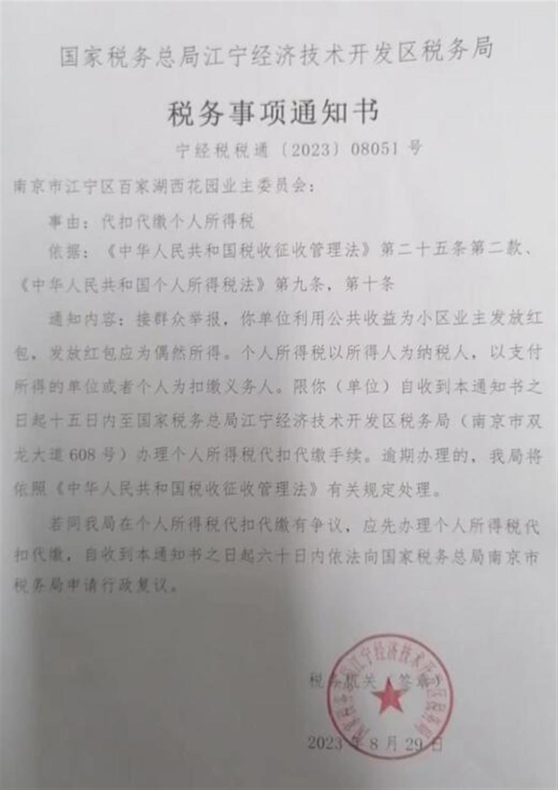

# 业主收小区发的200元红包要缴40元个税？税务局称是偶然所得按20%征税

极目新闻首席记者 丁鹏

8月30日，南京市江宁区一小区业主向极目新闻（报料邮箱：jimu1701@163.com）报料，该小区业主委员会（以下简称业委会）日前将小区部分公共收益以红包的形式发给业主，每户200元。29日，业委会却收到当地税务部门的通知，称该笔收入为业主偶然所得，每户业主需缴纳40元的个人所得税。对此，有业主认为这笔钱不属于偶然所得，即使缴纳个人所得税，也不应按偶然所得的税率来交。

江宁经济技术开发区税务局工作人员告诉极目新闻记者，此事是举报人举报该小区业主这笔收入属于偶然所得，并附有一篇小区发红包时当地媒体的新闻报道，但此事定性尚有争议，他们将与业委会进行沟通处理。

律师表示，此事争议的焦点在于业主这笔收益是否为偶然所得，将业主的这笔200元所得直接认定为偶然所得，属于法律适用错误。应首先判断该笔所得的性质，再考虑是否属于个人所得税的征收范围及税目。

**业主：业委会发200元红包，为何要缴40元税？**

_小区业委会收到的税务事项通知书（受访者供图）_

8月30日，南京市江宁区百家湖西花园小区业主龙先生（化姓）向极目新闻报料，近日他领取了小区业委会发放的200元公共收益红包福利，但29日上午，小区业委会却收到通知，因发放红包为偶然所得，每户业主要缴纳20%的个人所得税。龙先生认为，这笔钱本身就是小区业主的税后公共收益，发到每户业主手里不需再缴纳税款，而且这笔红包也不能定义为偶然所得。

该小区业委会相关负责人明先生（化姓）也向记者介绍，小区公共账户上的钱是多年收益累积的，应是前物业完税后按照比例分给小区全体业主的，是税后收入，无须再缴税。但江宁经济技术开发区税务局认为，发放红包福利，属于偶然所得，每户应该缴纳个人所得税40元，并向业主委员会送达了税务事项通知书，还让业委会代缴代扣个人所得税。

极目新闻记者获取的上述税务事项通知书照片显示，江宁经济技术开发区税务局称接群众举报，百家湖西花园业委会利用公共收益为小区业主发放红包，发放红包应为偶然所得。个人所得税以所得人为纳税人，以支付所得的单位或者个人为扣缴义务人。限业委会自收到通知书之日起至国家税务总局江宁经济技术开发区税务局办理个人所得税代扣代缴手续。逾期办理的，该局将依照《中华人民共和国税收征收管理法》有关规定处理。通知书还称，若对代扣代缴有争议，应先办理代扣代缴，自收到本通知书之日起六十日内依法向国家税务总局南京市局申请行政复议。

明先生表示，业委会没有代缴代扣税款的权限，即使该笔钱款需要缴纳税款，也不应该由业委会代扣代缴，而应由业主自行到税务机关缴纳。但是，业主们认为，该笔收入不该被定性为偶然所得。

**税务局：定性有争议，将与业委会进一步沟通**

龙先生告诉极目新闻记者，今年5月27日，百家湖西花园业委会开始向每户业主发放200元红包福利，时间持续到8月31日。红包福利来源于小区公共收益，包括室内外广告收入、临时摊位费、公共物业用房租金和临时停车费等，物业公司与全体业主按三七开比例分成，款项直接打入小区公共账户。该小区有3400多户业主，通过业主大会投票，经全体业主同意后，发放了公共收益中的部分金额，共计60多万元。

_5月27日，小区开始为每户业主发放公共收益（受访者供图）_

记者获取的小区物业服务合同显示，小区公共收益分成按照全体业主的共有收益扣除（实际开票税金）后，按业主70%，物业30%分成。明先生认为，据此合同条款，打到小区账户上的公共收益，应为物业缴税后的收益，业委会进行二次分配，不存在主体之间的转移，无需再缴税款。

江宁经济技术开发区税务局工作人员向极目新闻记者介绍，此事是该局收到了举报，举报人认为这200元以红包的形式发放，属于业主的偶然所得。按红包来算，确实属于偶然所得，通常是需要缴纳20%的个人所得税。他们将税务事项通知书送达后，该小区部分业主也向上级税务部门进行了投诉，此事定性还有争议，他们也将与小区业委会进一步沟通处理。

该工作人员表示，此事的妥善处理方法是业委会出代表把事情理清楚，如果情况确实比较复杂，他们将对个案进行请示，因为此事涉及面比较广，执行风险也比较大，他们要经过法制部门商讨研究处理。如果他们决定不了，也会向上级机关请示。对于小区的公共收益，很多税务机关是按业委会层面做临时税务登记，因为按企业所得税法，它属于取得收入的其他组织，有收入肯定要交一笔所得税，但他们到底有没有交这笔所得税，现在税务机关也不知道，因为没有任何资料。

上述工作人员还称，因为此事在定性上还有一点争议，目前的税务事项通知书确有一些表述上的瑕疵。因为业主说是公共收益，但没有出示相关证明材料，而举报人提供的也只有一篇新闻报道，业委会的账目等材料并没有拿出来。可以确定的是，业委会没有进行税务登记。现在业委会要把资料收集好，跟税务局再进行沟通，然后相关部门决定到底要不要交这个税。

_百家湖西花园小区（受访者供图）_

**律师：不属于偶然所得，适用法律错误**

河南泽槿律师事务所主任付建表示，此事争议的焦点在于业主这笔收益是否为偶然所得。该业委会将小区的公共收益发放给了全体业主，每户发红包200元，可以视为业主获得了财产转让所得，因此需要缴纳个人所得税。但从业主公共账户转到业主私人账户是否算偶然所得，则需要根据具体情况来判断。一般来说，偶然所得是指与个人劳动、经营、投资等直接相关性较小的收入，如中彩票、继承财产等。

北京市京师律师事务所涉税法律事务部邱继岩主任认为，将业主的这笔200元所得直接认定为偶然所得，属于法律适用错误。对于业主的该笔所得首先要判断所得的性质，再考虑是否属于个人所得税的征收范围及税目。该小区公共收益主要为室内外广告收入、临时摊位费、公共物业用房租金和临时停车费等，对这些收益所形成的个人所得，一般应定性为个人所得税的财产租赁所得。税务部门应先对这些公共收益进行合理定性，扣除法定费用后，再来确认业主是否需要缴纳个人所得税。

（来源：极目新闻）

