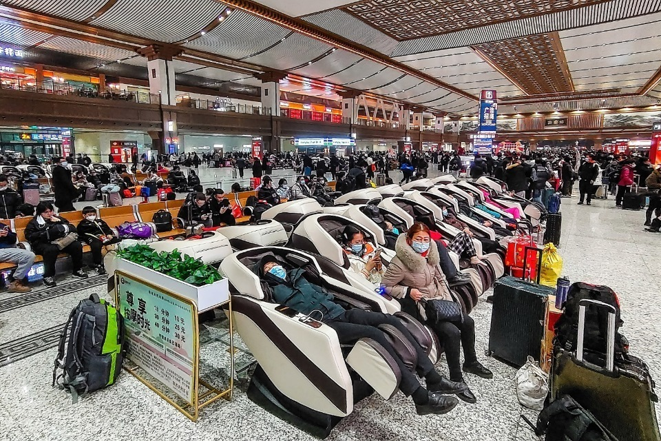

# 按摩椅进高铁站：5年超2.5万张，收益分成可高达65%

 _自2017年6月起，有高铁站开始对外招商按摩椅。（视觉中国/图）_

2023年8月10日，有网友爆料称，山东省泰安高铁站内共享按摩椅的数量远超普通座椅，导致候车座椅减少，不少乘客席地而坐。

8月17日，中国铁路对泰安站多功能候车座椅（按摩座椅）经营服务问题进行了通报批评，并要求设置多功能候车座椅的车站，必须确保候车区域旅客候车座椅总数不减少，多功能候车座椅数量不得超过全部候车座椅的20%。

这些按摩椅是通过招投标进入车站的。南方周末记者在“国铁招商”平台上以“共享按摩椅”“共享座椅”为关键词搜索，能得到超100条结果。

“国铁招商”由国铁物资有限公司负责运营，后者由中国铁路投资集团有限公司与18个铁路局集团公司合资组建。

剔除补充、变更信息的公告后，南方周末记者统计了85条招标公告及相关中标结果，时间覆盖2017年6月至2023年3月。其中，共有57条招标公告明确给出共享按摩椅的招商数量，加起来超过2.5万张。

合作模式

2016年被业内称为“共享经济元年”，共享按摩椅碰上了风口，发展迅速。

曾就职于按摩椅头部企业的林倩向南方周末记者表示，共享按摩椅在高铁站、机场的铺设从2017年就开始了。“当时是行业最火热的时候，大家都有钱，竞标是很激烈的。”

据“国铁招商”，自2017年6月起，有高铁站开始对外招商按摩椅。

据南方周末记者统计的85条招标公告中，共有57条写明共享按摩椅的招商数量。例如， 2018年5月，郑州东等15个高铁站合计招商按摩椅3560个。

另外28条公告中，有5条明确提出按摩椅的投放数量应受到限制，例如控制在总座椅数量的20%或30%内。

85个招商项目中，写明合作期限为1年、2年、3年、5年的分别有4个、7个、49个、7个。

至于合作方式，有15个招商项目采取缴纳年租金的方式，18个采取收益分成的模式，11个采取保底租金和收益分成两者取其高的模式。

以泰安站为例，高铁站和中标公司就是采取收益分成的合作模式。

2021年1月，中国铁路济南局集团控股的山东济铁旅行服务有限公司发布一则共享按摩椅项目招商公告，为济南站、泰安站、枣庄站、日照西站、岚山西站合计招标1678个座椅。其中，泰安站招商237个。

据央视财经报道，被铁路部门通报批评后，8月17日，泰安站共撤除多功能候车座椅六百多个。

该招商项目的合同期限为3年，采取营收全额进入旅服公司账户，每月按照约定提成比例进行结算的合作模式。其中，泰安站的提成比例（旅服公司）为45%。

据公告，该项目的中商候选人为山东康泰实业有限公司（下称山东康泰）。山东康泰主要生产按摩椅和汽车零部件两大类产品，旗下按摩椅品牌为“荣康”。

据上述85个招标公告，大多数高铁站提出的收益分成比例在30%至45%之间，最低为10%，最高达65%。

2023年1月，百色站、平果站、田东北站、隆安东站合计招商68台按摩椅。据招商公告，拟定租金为1200元/季/台或营业额的65%，二者取其高。该项目3年起租，但最终流标。

共享按摩椅的收益除了来自收取的用户使用费，还可来自广告投放。不过，有的高铁站会在招标公告中强调，中商人不能随意利用按摩椅开展广告业务。

拿下10%的高铁站

在上述85条招标公告中，爽客智能设备（上海）有限公司（下称爽客）中标了10条，涉及云南省、山东省、广西等地的高铁站。

爽客在官网上宣称，其是最早把共享按摩椅铺进高铁站、机场等交通枢纽的公司。2023年6月，爽客宣布已入驻二十多家机场、三百多家高铁站，投放超过25万台。

工商信息显示，爽客成立于2011年5月，最初叫做艾迈斯按摩椅（上海）有限公司，对外销售品牌名称为“艾迈斯”的智能按摩椅。

据官网，爽客的前CEO王纯表示，公司在2014年为一家酒店集团研发了一款适合放在客房里的按摩椅，但在成交前，对方认为投入太高。

恰逢微信支付开始兴起，王纯想到把按摩椅免费提供给酒店，客人按次扫码付费使用。

但王纯发现，酒店里的按摩椅盈利点不高。据“爽客服务”微信公众号，2016年4月，爽客还在一家P2P平台“人人投”上融资，融资总额为36万元，“预计年化收益可达22%”。“人人投”的运营公司已在2018年被列入失信被执行人名单。

王纯开始寻找其它场景，发现高铁站存在市场需求。“所以我给很多高铁站的领导提出了我的设想。”2018年5月，爽客表示，中国有700个高铁站，公司拿下了10%以上。

林倩表示，对旅客来说，比起高铁站原本放置的铁椅子，按摩椅是要更舒服的，对场地方和运营方来说，能产生收益，其实是双赢。

但她指出，每个点位的情况不同，投放到高铁站的收益不一定比其他场景高。

有高铁站的共享按摩椅招商项目会遇到流标的情况。2021年11月、2022年1月，河南省新乡市新乡东高铁站两次拿出62平方米的共享按摩椅点位招商，均因参与报价家数不足流标。

南方周末记者以场地投放方的身份向一家上海共享按摩椅的运营经理了解到，收益主要看投放点位的人流量及其停留时长。比如，卖衣服的商场人流量大，但留不住人，综合性商超的收益会更好些。

该运营经理表示，投放到好的点位，一个月就能回本，投放到差的地方，三年都不一定能回本。他公司的回本周期在10-12个月左右。

天眼查显示，2018年9月，爽客获得了顾家集团的投资。经过多轮股权变更后，目前爽客由顾家集团的子公司宁波欣途品牌管理有限公司控股。顾家集团名下有顾家家居（603816.SH）等子公司。

 _较早进入的一批玩家有定价权。（视觉中国/图）_

散兵游勇

按摩器具生产商荣泰健康（603579.SH）也是最早一批做共享按摩椅的企业。在2016年，荣泰健康就通过子公司上海稍息网络科技有限公司创建共享按摩椅品牌“摩摩哒”。

“摩摩哒”在当时成为荣泰健康一个新的营收增长点。据财报，荣泰健康2017年体验式按摩服务的营收为2.33亿元，约占总营收12%。和爽客不同，“摩摩哒”主要与影院合作。

荣泰健康在2017年1月上市时，就计划将募集资金中的1.33亿元用于共享按摩椅项目。

同年4月，爽客宣称拿到了一笔6250万元的融资。3个月后，爽客宣布，公司共享按摩椅的铺设量已超过6万台，场景包含酒店、高铁站、影院等。

除了爽客和“摩摩哒”，专注于购物中心场景的品牌“乐摩吧”在2018年初拿到了5000万元的A轮融资。

“乐摩吧”在机场、高铁站也有布局。据官网，“乐摩吧”目前在商业场景的市场占有率为70%，入驻了全国42个机场、81个高铁站。

林倩表示，较早进入的一批玩家有定价权，是能吃到红利的。在红利期，抢占到优质点位的商家，甚至能在三个月内回本。

但林倩表示，随着竞争白热化，租金被抬高，很难能实现盈利。“租金在疯狂地涨，越好的场地越贵，能获利的就只有场地方。”

以荣泰健康为例，公司通过“摩摩哒”获取的营收逐年减少。2018年-2022年，公司体验式按摩服务的营收分别为3.66亿元、2.54亿元、7383万元。

毛利率也逐年下滑。据财报，2017年-2020年，荣泰健康体验式按摩服务的毛利率分别为42.04%、23.38%、-7%、-33.61%。

2021年10月，荣泰健康以10万元出售了稍息网络67%的股权，剥离掉共享业务。“摩摩哒”品牌及电商销售仍归荣泰健康所有。

林倩表示，现在共享按摩椅行业里多是散兵游勇，大玩家只剩下几个。“消费端的需求是存在的，但这一行的市场容量没有想象中那么大，只能容纳有限的玩家。”

高铁站共享按摩椅项目的中商人也有“小玩家”。

据“国铁招商”，2022年5月和12月，和田站、巴楚站和克拉玛依站分别招商共享按摩椅15台、18台和20台，中商人均为头屯河区西园街大旺角便利店。天眼查显示，这家个体户成立于2016年7月，注册资金仅3万元。

上述运营经理表示，2019年新冠疫情以前，能投放共享按摩椅的场景很多，“放到一个理发店都能赚钱”。但现在大部分商家不会把按摩椅投放到理发店、汽车4S店、健身房、KTV等地方，而是做机场、高铁站、医院、商场等场景。

2023年8月底，南方周末记者以场地提供方的身份向爽客的工作人员了解到，主要考虑人流量的因素，目前爽客已暂时停止与超市、KTV等场地合作，只接受在医院、地铁、高铁、机场之类的大型场所投放。

（应受访者要求，林倩为化名）

南方周末记者 封聪颖 南方周末实习生 史钰晗

责编 冯叶

