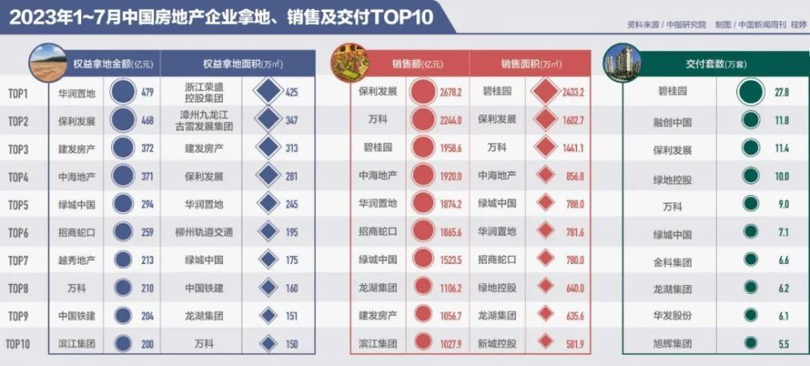
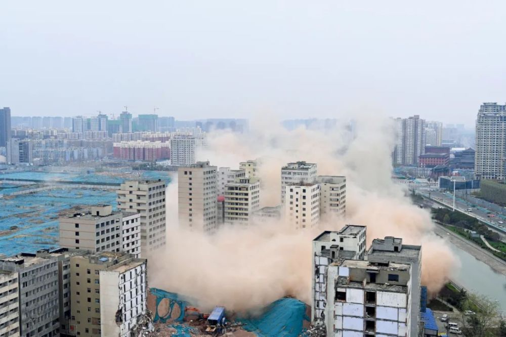
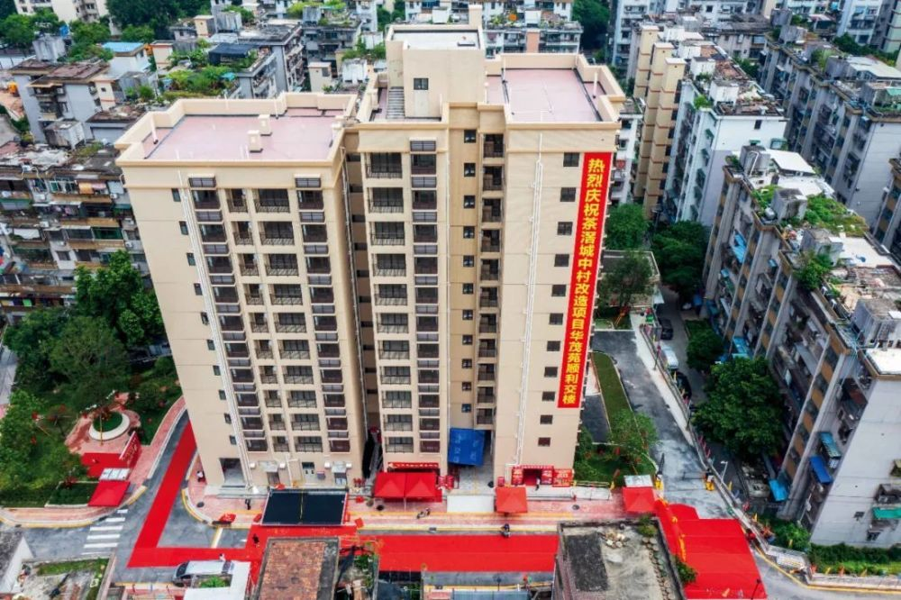
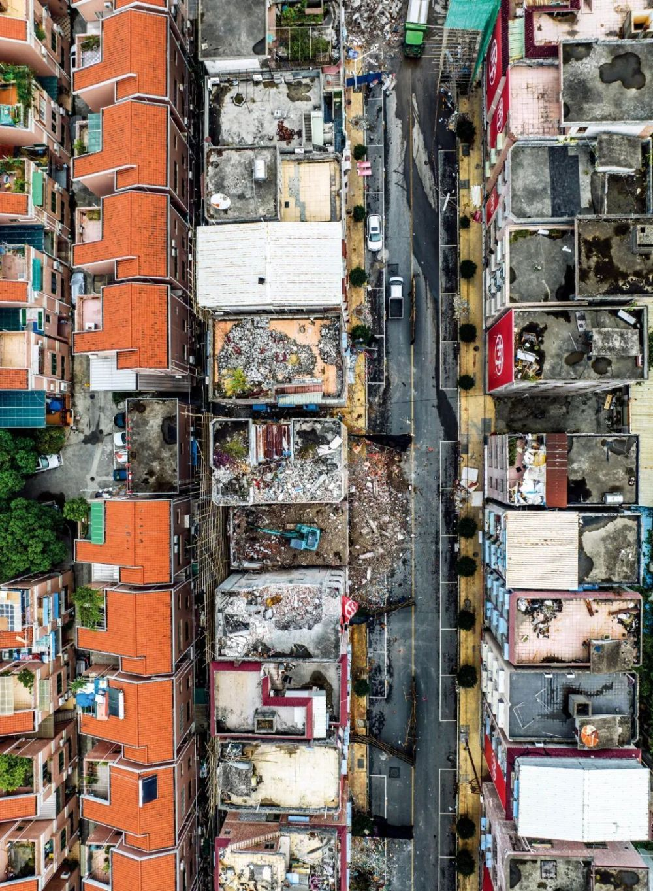

# 新一轮城中村改造，能否激活楼市？

郑汴路是郑州市区的一条主干道，河南省人民检察院位于道路南侧，对面便是当地一处颇具名气的商品房楼盘。如果站在这处楼盘的高层向南眺望，会发现不远处一片红色屋顶的独栋房屋，当地人会告诉你，“那是村民的房子”。

这些散落在城市中的村庄，被快速发展的城区包围，形成了城市中的农村聚落，往往拥有密集的村民自建房屋，并普遍出租。这样的城中村在中国的城市中并不鲜见，对它们的新一轮改造正在开启。

7月21日，国务院总理李强主持召开国务院常务会议，审议通过《关于在超大特大城市积极稳步推进城中村改造的指导意见》（下称“指导意见”）。会议指出，在超大特大城市积极稳步实施城中村改造是改善民生、扩大内需、推动城市高质量发展的一项重要举措，要优先对群众需求迫切、城市安全和社会治理隐患多的城中村进行改造，成熟一个推进一个，实施一项做成一项。

7月24日的中央政治局会议也指出，要加大保障性住房建设和供给，积极推动城中村改造和“平急两用”公共基础设施建设，盘活改造各类闲置房产。

中央政治局会议与国务院常务会议都要求推动城中村改造，这被认为是新一轮城中村改造强力启动的信号。

 _2022年5月28日，广东广州市番禺区钟村。图/视觉中国_

**新一轮规模有多大？**

不同于以往的“棚户区改造”，这轮城中村改造聚焦超大、特大城市。根据国务院发布的《关于调整城市规模划分标准的通知》，城区常住人口达1000万以上的城市为超大城市，城区常住人口达500万以上1000万以下的城市为特大城市。

目前，国内共有7个超大城市，分别是上海、北京、深圳、重庆、广州、成都、天津。14个特大城市，分别是武汉、东莞、西安、杭州、佛山、南京、沈阳、青岛、济南、长沙、哈尔滨、郑州、昆明、大连。

在房地产市场低迷之时决策层推动城中村改造，无疑希望其可以激活当前的楼市，这也是外界关注的重点。

城中村改造此前一直在各地推进，一些城市已经推进数十年，甚至已经度过城中村改造的高峰期。

如杭州早在2004年就颁布了《关于继续深入开展撤村建居与城中村改造的实施意见》。2016年，杭州启动“主城区城中村改造五年攻坚行动”，目标是“十三五”期间基本完成主城区246个城中村改造。截至2020年，杭州市全市共启动266个城中村改造，基本完成主城区“城中村”改造。

近年国家部委出台的政策文件中，多将城中村改造置于“城市更新”之下，与老旧小区改造、老旧厂区、老旧街区等并列于“三区一村”改造之中。国家发改委在2021年新型城镇化和城乡融合发展重点任务中便提到，要在老城区推进以老旧小区、老旧厂区、老旧街区、城中村等“三区一村”改造为主要内容的城市更新行动。

“其实在城市更新的概念下，各个城市，以及城市中不同区域的侧重点与方式也不一样。比如北京东、西城区一些老旧的平房区，改造的方式早已从‘拆迁’转变为‘申请式退租’，居民依据自愿原则搬入安置房，由城投公司进行整修后进行适度经营。”有参与北京城市更新项目的城投公司负责人告诉《中国新闻周刊》，这样的城市更新项目偏重于保护与通过综合治理改善居民生活环境。

而此次在7月底国务院常务会议、中央政治局会议层面单独聚焦城中村改造，足见决策层对其重视程度之高。联系到当下房地产市场低迷的状态，人们很容易将这一轮城中村改造视为“二次棚改”。

2008年国际金融危机爆发，官方开始在全国范围内大规模推进城市、国有工矿、国有林区（林场）、国有垦区（农场）等各类棚户区改造，使其作为城镇保障性安居工程的重要组成部分。特别是在“十三五”期间，棚改目标定为2000万套。最终，从2016年到2020年8月，全国开工改造各类棚户区2300多万套，超额完成目标任务。

但此次针对超大、特大城市的城中村改造，显然与上一轮不分城市大小、全面铺开的棚改不同，集中于超大、特大城市也被认为更加符合当前中国楼市的供需关系。

上海金融与法律研究院研究员刘远举便认为，随着人口向一线城市聚集，三四线城市的房地产市场存在库存过剩、房价过高、债务风险等问题。但一线城市的房地产需求却被限制。这一轮城中村改造，思路顺应人口向大城市聚集的经济规律。

同时，城中村改造也并不一定意味着“大拆大建”。

2021年，住建部曾发布《关于在实施城市更新行动中防止大拆大建问题的通知》，强调不大规模、成片集中拆除现状建筑，原则上城市更新单元（片区）或项目内拆除建筑面积不应大于现状总建筑面积的20％。原则上城市更新单元（片区）或项目内拆建比不应大于2。

城中村改造的强度，可能也并不像外界想象的那般剧烈，从一些城市透露的城中村改造方案中可以看到，往往是拆除重建和综合整治并重。

如济南就在2021年~2035年的城市更新专项规划中明确提及，“以多种更新方式推动城中村改造”，其中在二环以内、城市建设重点片区和城市重大设施建设涉及的城中村采取拆除重建方式；其他一般地区的城中村，通过综合整治方式改善基础设施，消除安全隐患，增加公共服务设施，提升空间品质，改善人居环境。

同一时间段内，青岛针对城中村的规划是“拆除重建为主、改造提升为辅”。而成都则在2022年~2025年的城市更新规划中提出，按照“少拆多改，注重传承”的原则，推进31片城中村改造。

尽管7月底以来外界已经对于这一轮城中村改造的规模有过众多期待，测算其年均投资体量约万亿元。不过华泰证券在研报中认为，规模与周期上，预计城中村改造影响周期较长，短期规模不宜夸大。

特别是在当前的房地产市场环境中，一个重要问题是谁来改造城中村？

**谁来改造？**

陈砦曾是郑州最著名的城中村，被称为“小香港”，也是众多“郑漂”来郑后最先租住的区域。在0.6平方公里的800多栋建筑中，曾经挤下18万人。2012年到2016年间，郑州曾提出三环之内城中村全部拆迁的口号，“小香港”便在那之后逐渐消失。

与陈砦相距不远，便是金水升龙广场，其更为人们熟知的名字是“曼哈顿广场”，在几年前整顿房地产项目“洋名”时更名，这是郑州最早的城中村改造项目之一，由闽系房企升龙集团开发。

“谁来操盘城中村改造项目，多少能看出当地房地产行业的变迁轨迹，2010年前曾有不少闽系房企涌入郑州。在如今陈砦的城中村改造进程中，占据主角的是郑州本地房企美盛置业，这也是当下为数不多保持健康的民营房企。”郑州房地产业资深人士透露。

尽管国常会审议通过的“指导意见”提到，“充分发挥市场在资源配置中的决定性作用”，但是多位房地产业内人士的共同担忧是，还有多少房企有意愿、有能力参与城中村改造项目？

对于此前已经出险的房企而言，此前参与的城中村改造、城市更新项目仍有待盘活。截至今年6月30日，恒大参与旧改项目78个，其中34个位于深圳。“旧改项目周期较长，理应在出险后及时出手，但是位于深圳的旧改项目显然相比于恒大众多位于三四线城市的项目更具价值，涉及资金体量较大，加之恒大惜售，旧改项目出手并不容易。”有业内人士向记者分析说。

今年4月，因为几份招标公告，深铁置业接盘恒大深圳龙岗区四联社区排榜村城市更新项目才被外界知悉，项目计划总投资超过464亿元。排榜村早在2016年年底便被列入《2016年深圳市城市更新单元计划第六批计划》，更是以近50.6万平方米的拆除重建面积成为所处的横岗社区最大的旧改项目。此前，招商蛇口、深圳市级地产纾困平台安居建业也曾接盘恒大位于深圳的多个旧改项目。

_2021年3月19日，河南郑州市，陈砦村的几栋高楼被爆破。图/IC_

显然，相比于民营房企，央企、国企以及地方城投被认为应该在新一轮城中村改造中发挥更大作用。不过，作为广州国资系房企越秀地产，面对广州今年城中村改造投资达983亿元这块蛋糕也颇为谨慎。

在8月底召开的业绩会上，越秀地产副董事长、执行董事兼总经理林峰坦言，城市更新项目的周期比较长，与一手市场不同，还涉及拆迁、回迁等问题，所以首先要控制风险。“对城市更新项目，我们要求的投资标准比公开市场招拍挂市场更高，如对其净利率、毛利率要求会更高，这样就能留足一些安全垫，以防出现一些风险。”

他认为，对旧改项目要有评判，即拆迁的难度多大，项目所在地区未来有没有发展潜力，是不是位于城市产业、人口、资源、公共建设配套重点投放的区域。

“城中村改造虽然有极强的政策导向，但是如果房企通过招拍挂摘下城中村改造地块，那就是企业行为，从拆迁开始，投入较多、周期较长，这也是为什么此前一些企业参与旧改项目时资金链断裂的原因。”前述城投公司负责人告诉记者。

华泰证券在研报中认为，目前来看，民营房企现金流紧张的状况仍待缓解，地产销售走弱下偿债风险或进一步上升，预计短期内民营房企竞标城中村改造项目实施主体的积极性较低，但可能通过输出代建、提供物业服务、存量商品房回购为保障房等多元化途径参与。而龙头国资房企，可能是未来参与城中村改造的主力。

“新一轮城中村改造，有几个新特征，比如国企主导代替民企，综合改造（比如市政和公服补短板）代替房地产单一改造，公共属性回归代替完全的市场化。因此，改造的资金投入非常大，而且期限错配很严重，后期不管是运营回收资金还是卖地回收资金，周期都很长，而且存在较大的不确定性，特别是地能否卖出去。因此，解决资金问题、解决资金期限错配是头等大事。”广东省规划住房政策研究中心首席研究员李宇嘉向记者解释说。

在“谁来改造以及钱从哪里来”问题的背后，涉及是否还要遵循过往“征地拆迁”的开发逻辑？农村集体建设用地能否入市？这同样是外界对于这一轮城中村改造的期待。

原中房集团公司党委书记、董事长孟晓苏对于新一轮城中村改造推动集体土地和国有土地“同等入市、同权同价”有所期待，他撰文指出：今后的“城中村改造”除了政府把土地征为国有这种传统形式，还可以采取集体建设用地与国有土地“同等入市、同权同价”的方式，以实现农村建设用地充分利用。它将逐渐破除城乡二元结构，让农民财富成倍增值，加快促进城乡融合发展。

国有土地上的房屋可以交易，农村集体土地上的房屋只能在村集体内部流转，这种严格的城乡二元结构在集体建设用地建设租赁住房上撕开一个缺口。早在2010年，北京便曾试点利用集体土地建设公租房；2017年，13个城市开展集体建设用地建租赁住房试点。

根据国务院发展研究中心农村经济研究部第三研究室副主任伍振军对北京早期试点项目的调查，认为其缓解了保障房建设项目的土地、资金压力。“而且相比征地补偿，村集体建设租赁房的土地收益大幅度提高。”

_2022年8月28日，广东广州市荔湾区，茶滘城中村改造项目83套安置房顺利交付。图/视觉中国_

**房票的意义**

市场对于城中村改造感到兴奋，不仅因为较大的投资体量对于投资与经济的提振作用，其更被视为拉动当前楼市低迷需求的一招。因为不管是建设安置房，还是货币化安置，总归会创造新的住房需求。

2015年，房地产市场同样陷入低谷，正是因为棚改，特别是货币化安置推动大规模棚改，最终重启楼市。所谓棚改货币化安置，就是指政府部门直接以货币的形式补偿被拆迁棚户区居民，而后居民再到商品房市场上购置住房。

住建部原部长陈政高曾公开表示，棚改货币化安置，第一，提高了效率。老百姓从棚户区搬出以后，就可以住进楼房，而建设房子至少要三年甚至四年时间；第二，可以自由选择，包括地段、楼层选择，新房、旧房选择，物业选择等。

2014年全国棚改货币化安置比例为9％，2015年快速上升为29.9％，2016年这一比例更是上升到了48.5％。官方数据称，2016年棚改货币化帮助地方消化了2.5亿平方米的楼市库存。虽然自2017年后，住建部门不再公布全国棚改货币化安置比例，但其去库存的效果可见一斑。

_2023年8月15日，广东东莞市东城街道，拆迁中的城中村火炼树社区。图/视觉中国_

外界期待新一轮房票的发放在当下可以起到类似的效果。日前，在网络上流传的《广州市城中村改造房票安置实施办法（建议稿）》（下称“建议稿”）中已经具体描述了“房票安置”的细节，这份建议稿随后也被证实。

“房票”指的是被征收人的房屋安置补偿权益进行货币量化后，征收人出具给被征收人购置房屋的结算凭证，可以说是货币化安置的具体形式。

建议稿提及，“房票安置”适用于广州市行政区内各类城中村改造项目的拆迁安置工作，包括政府收储、统筹做地和“三旧”改造等不同模式下的城中村改造项目。原则上各区发放的房票优先在本辖区内统筹兑换安置，对本辖区范围内房票房源不足以满足安置需求的，报市政府研究同意后，可在广州市内其他区统筹存量房源。

房票票面金额包括基础补偿金额、政策性奖励等。在房票资金结算方面，建议稿提及，政府部门以分期支付的方式与地产开发商结算房票资金，被征收人完成房票购房后支付票面金额的10％，城中村土地拆迁平整后支付票面金额的20％，城中村土地出让（划拨）后支付票面金额的70％。参与房票安置工作的房地产开发企业，按照企业自愿参与原则公开进行征集，鼓励央企、国企和有实力的民企积极参与房票安置工作。

在这一轮楼市的下行周期中，房票并非第一次出现在地方政府的工具箱中。郑州，是此轮房地产下行周期中，首个推行房票安置政策的省会城市。2022年6月，河南郑州发布了大棚户区改造项目房票安置实施办法。但从实际情况来看，房票政策并未带动市场的有效恢复。

据中指院统计，郑州推出房票安置政策首月，即2022年7月，郑州商品住宅周均销售由6月前三周的1191套降至1016套，市场在6月传统旺季销售短暂回升后再次下滑，房票安置政策实施对成交无明显拉动效果。

但从解决缓解改造资金压力的角度看，房票有独特价值。李宇嘉解释，一方面，房票安置不需要改造主体支付拆迁安置费用或建设安置房；另一方面，可以拉长与入库开发商（被拆迁人拿房票选房）的结算周期，比如签订销售合同付10％，土地平整完支付20％。这样，前期最大的一块资金投入就解决了，再加上资金投入由市场化资金（信托、私募、更新贷等）变为公共资金投入（专项债、更新基金等），融资成本降低，这样就极大地降低了资金压力。

他建议可以将二手住房纳入到房票安置的范畴，这样房票对新房、二手房库存去化有明显的效果，也能满足居民多样化的居住需求，还能降低改造成本。

发于2023.9.4总第1107期《中国新闻周刊》杂志

杂志标题：新一轮城中村改造，能否激活楼市？

记者：陈惟杉

