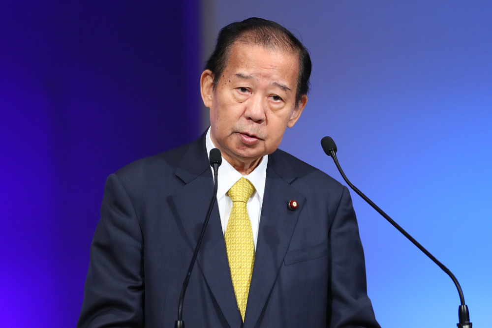

# 日媒爆料：岸田拜托二阶访华，借“人脉”协助两国关系走向正常

【环球网报道】日本共同社8月31日援引消息人士的话曝出，日本首相岸田文雄向日本自民党前干事长二阶俊博表示，希望后者访华为日中两国关系走向正常给予协助。共同社声称，岸田提出这一请求的原因是，中方反对日本核污染水排海，岸田拜托拥有对华人脉的二阶为两国关系走向正常给予协助。然而事实上，对于日方出于一己之私利给当地民众乃至世界人民造成二次伤害的举动，中方连日来多次表示坚决反对和强烈谴责，要求日方停止这一错误行为。

_岸田文雄 资料图 图源：视觉中国_

共同社称，岸田30日曾与二阶进行会谈。岸田声称，“能与中国说上话的只有您。政府也在努力完善环境，如果条件具备，希望您能访问中国。”据共同社了解，二阶表示会考虑。

 _二阶俊博 资料图 图源：视觉中国_

报道称，日本官房长官松野博一8月31日在记者会上也称，“二阶为日中关系做出了很大贡献，期待今后也能为加强两国的交流和沟通而尽力”。不过，他未透露岸田和二阶的会谈内容。

_松野博一 资料图 图源：视觉中国_

对于日本不顾外界警告执意将核污染水排海，中国外交部发言人汪文斌在8月31日下午举行的例行记者会上再次重申，一直以来，中方始终基于科学和事实，在双多边交流当中反复向日方表达中方专业部门的意见和关切。中国、俄罗斯也迄今向日方提出了三份联合技术问题单，对日本福岛核污染水排海提出疑问，日方不仅未能做出有诚意的答复、解决我们的关切，反而对邻国表达正当关切无端指责，并最终强行启动核污染水排海，这不是解决问题的正确态度和做法。“我要强调的是，如果日方真的有诚意，就应该立即停止排海，与包括邻国在内的利益攸关方，就所有相关问题进行充分沟通，解决邻国和国际社会的关切。”汪文斌说。

日本核污染水排海也持续引发日本各界不满。8月27日，由日本在野党、工会等全国多个团体组成的“反对东电核污染水排海全国行动实行委员会”在日本福岛县最大港口小名滨港的海鲜市场附近举行集会，一致要求，日本政府立即撤销核污染水排海计划，中止排海作业，保护当地渔业从业者的生计。此外，韩国最大在野党共同民主党党首李在明26日在集会上批评说，“日本越过了不可逾越的界限”，日方启动核污染水排海“是向太平洋沿岸国家宣战”。李在明说，“日本应该向距其最近的国家韩国道歉，韩国是遭受最严重损失的国家。”李在明还批评尹锡悦政府支持日本核污染水排海计划并为其辩护的举动。

据日本《每日新闻》27日报道，最新民调显示，岸田文雄内阁支持率从7月的28%跌至26%。

