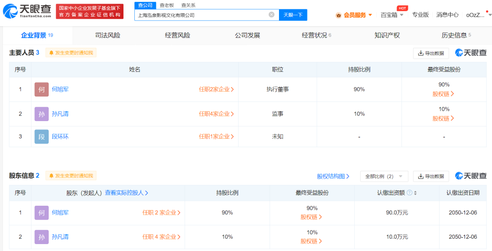
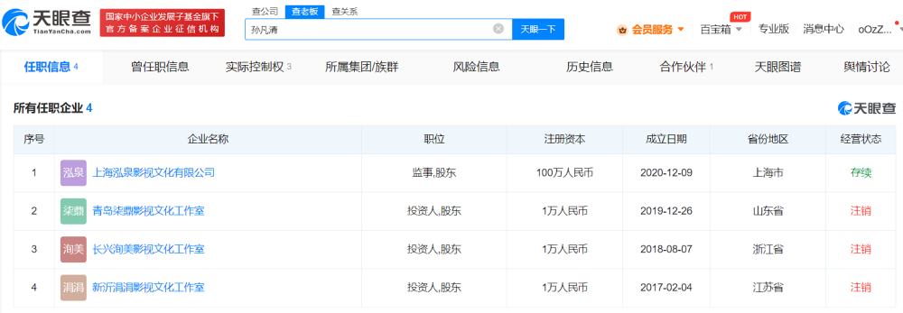
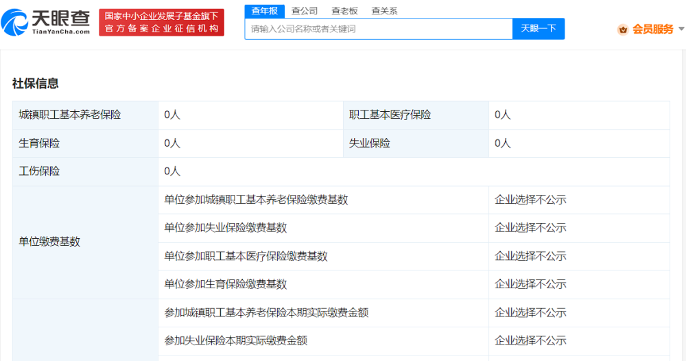

# 演员宋祖儿被举报偷税漏税，3家工作室均已注销

近日，演员宋祖儿被举报偷税漏税引发网友关注。

天眼查App显示，宋祖儿（孙凡清）共关联4家企业，其中，由其个人独资的青岛柒鼎影视文化工作室、长兴洵美影视文化工作室、新沂涓涓影视文化工作室均已注销，目前存续状态仅剩上海泓泉影视文化有限公司1家。

泓泉影视文化公司成立于2020年12月，注册资本100万人民币，法定代表人、执行董事、大股东为何旭军，宋祖儿担任监事并持股10%。年报信息显示，该公司参保人数为0。

潇湘晨报综合

