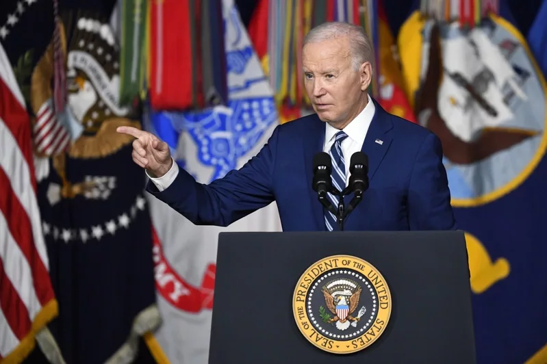

# 美媒曝“美政府批准首次对台军事融资”，岛内网友痛批美国：不安好心

【环球网报道】据美联社等媒体报道，根据美国国务院30日向国会发布的通报文件，拜登政府已批准首次通过所谓“外国军事融资”（FMF）计划向台湾地区提供8000万美元军事融资贷款。对此，有岛内网友讽刺解读，“没钱买了是吧，没关系，老子放高利贷给你……”还有网友痛批美国“黄鼠狼给鸡拜年，不安好心”。

_拜登 资料图_

美联社声称，虽然此次批准的金额不算大，但由于FMF通常援助对象为主权国家，预计此举会激怒中国大陆。

台湾“联合新闻网”称，美国务院并未如过去军售一样，公布通知国会的文件内容。美联社掌握的文件也未具体说明，拜登政府通过FMF将对台湾提供哪些军事装备或系统。

对于美国在对台军售上这一最新举动，一些岛内网友在相关评论区留言痛斥，“拉基米国（美国）恨不得两岸马上打起来，莱猪党就是战争代理人”“（死老美）这个动作，正好应验了（天下没有白吃的午餐）！因为，黄鼠狼给鸡拜年，不安好心！”

还有网友讽刺解读称，“没钱买了是吧，没关系，老子放高利贷给你……”

也有网友痛批，“丑老美又来掏空台湾！要台湾帮老美守第一岛链的前线，居然要看门犬自带狗粮、买警棍，真是邪恶的帝国主义，怎么台湾这么喜欢被殖民，过去是日本，至今有一堆皇民还怀念日本母国，如那个助日代表；现在的一群人则被老美殖民，年年上贡，吃莱猪莱牛都笑纳！”

一段时间来，美方一些人在台湾问题上变本加厉采取错误言行，企图在军事上武装支持“台独”分裂势力，鼓动两岸对抗。上月，美国政府决定向中国台湾地区提供价值约3.45亿美元的军事援助。对此，国台办发言人陈斌华回应表示，我们坚决反对美国向中国台湾地区提供武器，这一立场是明确的、一贯的。民进党当局顽固坚持“台独”分裂立场，企图“倚美谋独”“以武谋独”，不断乞求美国向其售武或提供军援，强化与美军事勾连。他们的所作所为正在把台湾变成“火药桶”“弹药库”，加剧台海兵凶战危。如任由民进党一条道走到黑，青年只能当炮灰。

陈斌华说，“台独”是绝路，无论民进党当局、“台独”分裂势力花多少台湾老百姓的纳税钱，买多少美国武器，都动摇不了我们解决台湾问题、实现祖国完全统一的坚定意志，都抵挡不了我们维护国家主权和领土完整的强大实力。

