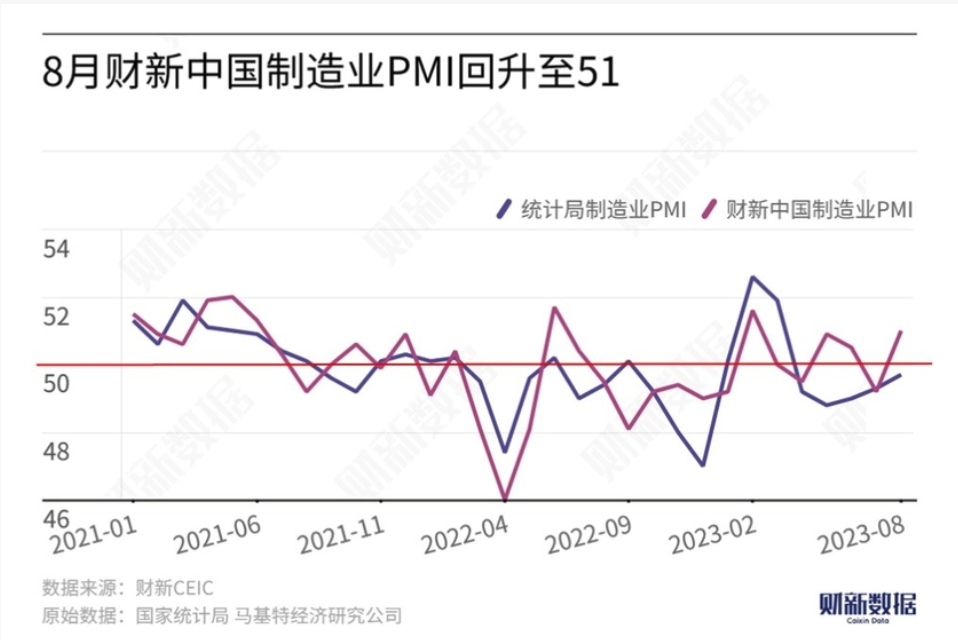

# 8月财新中国制造业PMI升至51.0 重回扩张区间

在7月短暂跌至收缩区间后，8月中国制造业重现扩张，供需改善。

9月1日公布的8月财新中国制造业采购经理指数（PMI）录得51.0，较7月回升1.8个百分点，重回临界点以上。

这一走势与国家统计局制造业PMI一致。国家统计局8月31日公布的数据显示，8月制造业PMI录得49.7，高于7月0.4个百分点，连续五个月处于收缩区间，但最近三个月连续攀升。

从财新中国制造业PMI分项指数看，8月制造业供需均恢复扩张，制造业生产指数和新订单指数反弹至荣枯线以上。在市况改善、销售回暖的拉动下，虽然部分企业因气温偏高而减少开工天数，但整体产量仍有增长。当月消费品类和投资品类制造业的产量和需求上升，中间品类产量大致持平。外需依然疲弱，8月新出口订单指数在收缩区间小幅回升，三大品类出口需求均下滑。

供求好转带动制造业就业情况明显改善，8月就业指数六个月来首次升至扩张区间，且为2010年4月来最高。调查结果显示，企业的扩张计划支撑了当月用工回升，在三大品类中消费品用工好转较为明显。

在7月轻微收缩后，8月制造业采购活动同样重现扩张，但原材料库存指数降至收缩区间，部分厂商表示，一些原材料成本较高，对库存量保持审慎，还有企业表示销售相对疲弱，导致不愿增加库存。

企业生产大于销售，同时部分企业发货延误，导致8月产成品库存继续增加。不过原料供应改善，供货商产能充裕，交货速度改善，供应商配送时间指数从反弹至扩张区间。

8月金属等部分原材料价格上涨，推动原材料购进价格指数4月以来首次回到临界点上方。虽然成本上升，但市场竞争激烈，制造商议价能力较弱，当月出厂价格指数仅在收缩区间小幅回升。

制造业企业家对未来一年的增长仍保持乐观，但8月生产经营预期指数降至近11个月来最低。部分企业担忧国内外市场需求疲弱。

财新智库高级经济学家王喆表示，8月中国制造业景气度改善，除了出口不振，供给、需求、就业指数均位于扩张区间，但内部需求不足和弱预期的问题或在更长时间形成负面循环，叠加外需的不确定性，经济下行压力恐不断加大。当前，稳预期和增加居民收入仍是施策重点。内外部经济环境形势日趋复杂，相关支持政策的紧迫性和必要性进一步增加。

