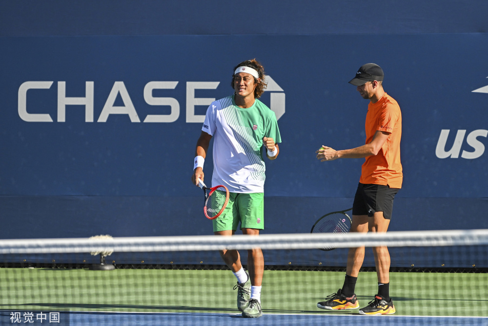
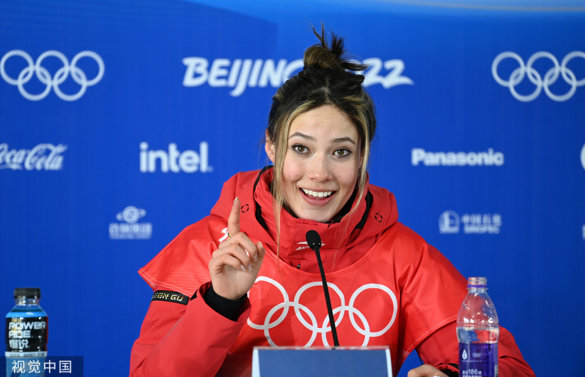
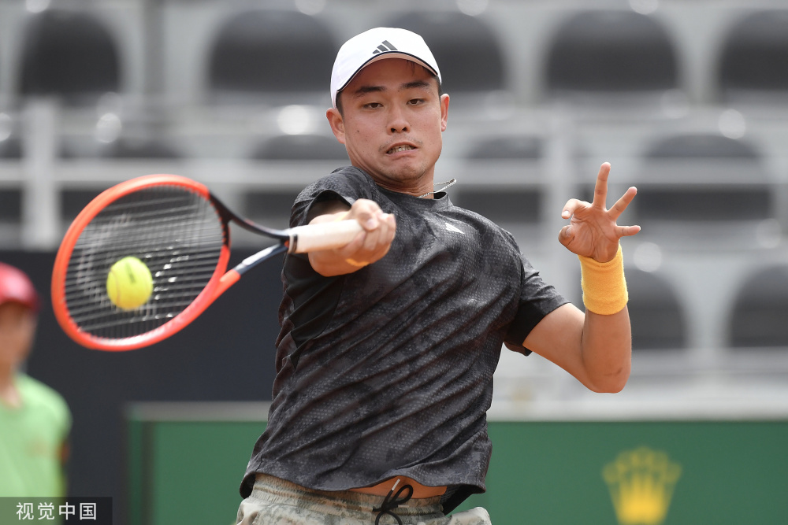
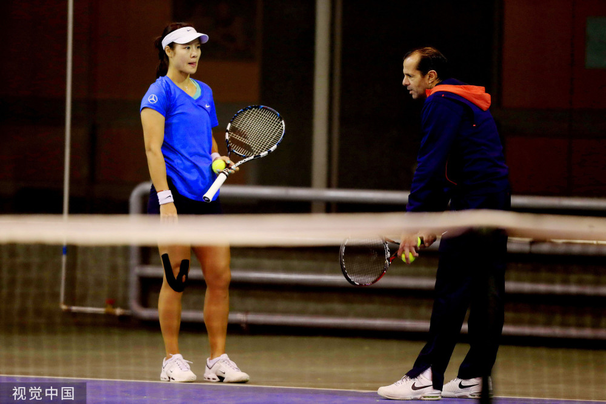

# 体谈 | 培养张之臻花费2000万，但中国网球的张之臻正越来越多

在中国网坛新星张之臻创造历史的背后，是中国体育人才培养的新路径：经济的持续高速发展，造就了一大批颇具身家的中产阶级家庭，他们往往愿意在子女的教育上花费巨额的投资，培养多方面的兴趣爱好，尤其是在体育方面，更是不吝惜于送到国外培养，从小开始对接先进的职业体育梯队教育。这意味着，在这个领域里，中国人里必将出现越来越多的顶级玩家，中国军团也会有极大概率在此类项目里占据一个极为重要的生态位。

**撰文丨霍森**

**编辑丨冯小**

中国网球迎来了又一个里程碑。

美网男单第二轮，中国选手张之臻在5盘鏖战之后，击败上届亚军、ATP当前排名第四的卡斯珀·鲁德，成功晋级。
**这不仅是中国大陆男网选手第一次战胜了ATP前五的选手，也是中国大陆男网选首次在大满贯赛场上击败ATP前10的选手，为中国网球书写了新的历史。**

 _图说：张之臻击败ATP前5的对手，创造纪录。_

除了张之臻外，本届美网，中国军团的表现亦是极为亮眼，男女选手7人携手进入了第二轮，其中，王欣瑜首次杀入32强，朱琳横扫名将阿扎伦卡，王雅繁力克赛事7号种子加西亚……这强势的表现，不禁让人惊呼，网球的“中国时代”难道就要来临了吗？

这并非没有可能。

**或许在不远的将来，我们就可以看到，网球、高尔夫这类需要大量金钱投入的高度职业化个人运动，中国人里必将出现越来越多的顶级玩家，中国军团也会有极大概率在此类项目里占据一个极为重要的生态位。**

01 职业好手经济打底

对于下一代的教育，我们国家自古以来就有“穷文富武”的说法，很显然，相比起读书来，习武、或者说打磨身体，需要承担的花费成本会更高。

不过在中国，情况又有所不同。

90年代中期，国家体育总局定下了奥运争光计划之后，整个国家体育的资源倾斜方向都集中到了“小巧难女少”的重点项目上，并因此迅速成为了奥运金牌大国，但这种举国体制也带来了相应的弊端，那就是——国家重点扶持培养的这些项目，几乎都不具备商业化前景，如果离开了国家的财政补贴，运动员几乎无法依靠项目本身来养活自己，关于这一点，可以参考本栏目此前的文章[体谈丨7岁小将5金2银背后的心酸或许说明我们还不是体育大国](https://new.qq.com/rain/a/20230820A03IXT00)。

所以，很长一段时间内，国内的体育明星几乎等同于奥运冠军，并且其中大多数出身于贫寒之家，大家所熟知的全红婵、朱婷、谌利军、刘洋、王曼昱、王军霞……几乎莫不如是。

由此可见，对于绝大部分普通民众而言，读书是一条不管前景还是试错成本都远优于体育的道路，只有当家境贫寒到连义务教育都无法减轻家庭负担的时候，家长才会考虑将小孩送到体校就读。

不过在近十几年来，这样的情况发生了很大的改变。

**中国经济的持续高速发展，造就了一大批颇具身家的中产阶级家庭，他们往往愿意在子女的教育上花费巨额的投资，培养多方面的兴趣爱好，尤其是在体育方面，更是不吝惜于送到国外培养，从小开始对接先进的职业体育梯队教育。**

现在，瓜熟蒂落，成果终于逐渐显现。

张玉宁、谷爱凌、周冠宇……这些各自项目领域里的青年俊才，几乎都是这种精英培养模式下诞生的职业好手。

_图说：谷爱凌。_

而在网球项目中，目前活跃在ATP赛事里的知名中国选手，张之臻、商竣程和吴易昺，也无一不是这样。

那么，培养出张之臻这样一名准ATP前50水平的职业网球手，需要花费几何呢？张之臻的父亲张卫华在接受记者专访的时候给出了答案：

**“这些年算下来，培养一个打进世界前100名的网球选手大约要花费2000万（没有特殊说明皆为人民币，下同）。”**

“经济条件变好后，一些中国家长把10岁左右的孩子送到国外的俱乐部练习网球，一年下来，吃住和训练费用大概要100万，如果家长一直跟着，还要多5-60万的开销。”

而另一位男单名将吴易昺的母亲吴芳女士也坦言，
**吴易昺幼时学球花费不菲，15岁之前的花费就已经超过100万，而此后历年的训练和比赛花费，加起来也超过了1000万。**

 _图说：网坛潜力之星吴易昺。_

刚刚击败阿扎伦卡的朱琳，她的父亲朱剑明曾经是一名私营企业的掌门人，在财富自由之后，放弃了事业，陪着女儿四处训练、征战，其中投入的金钱虽然没有明言，但总归不会是小数。

**按照目前国内的市场行情，网球场地费一次至少上千，私教费用500起步，一周三练的话年投入就已经超过了20万，如果要到欧美训练和比赛，这个数字恐怕还要再加到50万以上。**

虽然这个数字并不一定具备普适性，比如，接受培训的孩子如果没有展现出相应的天赋，后续自然也不会一直追加持续的投入；又比如，在国外俱乐部练球和家长陪同的花费，其中因为各自家庭条件的不同，也会产生相应的上下浮动……

但很显然，不管这个浮动的幅度是多少，花费绝对不是一般家庭所能承受的。

张玉宁的父亲为了自己和孩子的足球梦，卖掉了八套房；谷爱凌从小到大的训练费用，更是常人不敢想的天文数字。

这是一条被金钱浇灌出来的职业体育成材路径。

02 成才之路路越走越多

既然张之臻他们的成材模式并非一般家庭所能承受，是不是就意味着这条道路不适用于我国国情呢？

那倒也不尽然。

网球其实是一个很特殊的体育项目，高度职业化带来了无数的巡回赛，而任何一位有志于在职业生涯上有所建树的职业网球手，都需要面对密集而紧张的赛程。

对一名网球运动员而言，自身的技术训练固然重要，但应对漫长赛季的体能储备、战术准备和医疗康复，都至关重要。

在网球项目里，经验丰富的全职教练、有针对性的技术指导、体能教练和康复师、以及其他各方面的保障人员，这些人所组成的教练团队，他们对选手的成绩，起到了至关重要的作用。

而不同于体制内普遍的“国家队”模式，这种高度职业化的项目，教练团队里的所有成员，都必须靠职业选手自己掏腰包养着。所以，虽然各个网球巡回赛的奖金收入都不低——比如张之臻此次战胜鲁德挺进下一轮之后，手握的奖金收入已经来到了19万美元——但其中在教练团队上的开销并不少，比如著名的网球选手德约科维奇，每年在自己教练团队上的花费就达到了近千万美元。

换句话说，在网球项目里，如果你很强，能一直赢得比赛奖金，那么就能雇佣到更好的团队成员；但如果你不那么强，只要愿意砸钱，也一样能够找到好的教练，说不定也能取得不错的成绩。

_图说：中国网坛名将李娜聘请教练指导自己提升球技。_

**网球是小球类项目，对技巧的要求极高，比起需要大量身体对抗的足球和篮球，本身就比较适合黄种人，而既然砸钱又能砸出不错的成绩来，某种程度上也降低了青少年成材试错的不确定性。**

早年的中国网球，并没有摆脱传统的三从一大体训模式，虽然出现了李娜这样的特殊个例，但总体而言，依然与世界网坛发展潮流格格不入。

直到前女排功勋队长孙晋芳走马上任网管中心主任之后，鼓励球员单飞，支持他们摆脱体制的束缚，前往更高的舞台磨炼，这才有了此后中国网坛百家争鸣的局面，但总体而言，依然还是“省队国家队为主+特殊球员单飞”的传统改良模式。

但如今，在一众成功前辈的开拓和引领下，网球职业化的春风不知不觉之间已经开出了令人期待的鲜艳花朵。

**根据2021年ITF发布的《全球网球报告》显示，中国的网球教练人数已经超过了1.1万人，约占全球比例7.6%，排名全球第五，仅次于美国、德国、法国、西班牙等传统网球强国。网球场数量更是来到了接近5万（49767）片，位列全球第二、仅次于美国，同时在ITF拥有青少年排名的中国球员超过了100位，排名全球第11位……**

_图说：张之臻、特日格乐、吴易昺、布云朝克特都是中国网坛有潜力的未来之星。_

这个市场普及度与人才储备，已然足够支撑起职业化的大框架。

而就青少年网球人才培训体系来说，从张之臻的成长经历来看，有天赋的青少年网球手既可以选择从国内体校起步，兑现了一定天赋之后再转向海外培养，从而走上独立自主的职业道路，这是一条完全符合中国现有国情的方案，也是网球项目对国内职业化体育改革交出的一份试探性答卷。

03结语

张之臻的成功既是个人的偶然，也是我国经济发展状况以及职业化体育改革探索的必然，而中国网球如今的方兴未艾之势，不仅有赖于运动员个人的不懈奋斗和家庭锲而不舍的坚持，也依托于传统体训模式的基础打底和现代职业化体育的捏合。

这同时也说明了，只要找准道路，即便不需要太多的行政干预，现代的职业化体育项目也足以通过各种商业手段为自身的普及和发展找到最为适合的路径。

当然，作为一项“贵族运动”，网球普及的成功道路并不一定完全适用于其他项目，但对比起国内的足球和篮球，多年市场化和职业化改革之后的一地鸡毛，更显得网球项目的小小成功嫩芽难能可贵。

当传统的、单纯依靠各级体校的人才培养路径被打破之后，通过公私合办、民办公助、民间独资、体教结合等多元化模式，鼓励社会力量的加入，实现举国体制与市场机制的双管齐下，最终走向完全的市场化和职业化——这或许才是“张之臻”模式带给我们的最重要的启示。

