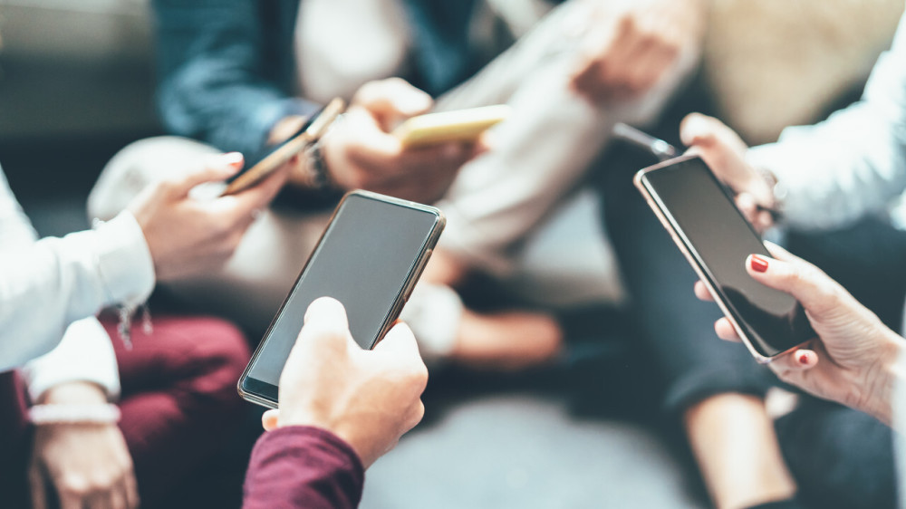
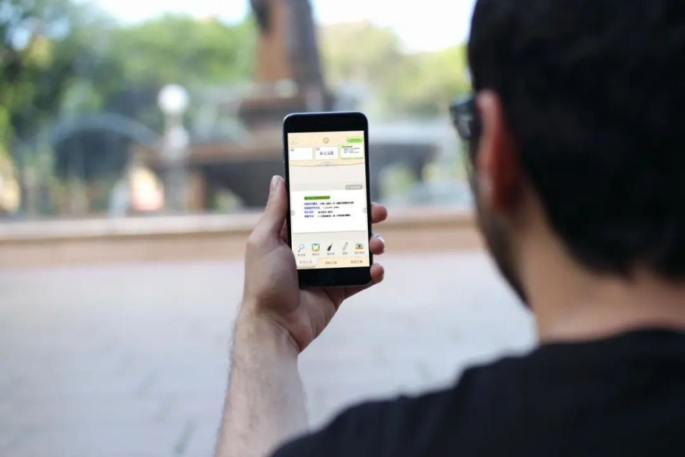

# 单店月亏20万，手机行业回暖成虚妄

“真回暖了，我们的日子至于这么难过吗？”正坐在手机店里贴膜的店主张杨叹了口气，补充道：“至少在我看来，近几年在手机行业做生意别亏就行了”。

张杨的手机店坐落在武汉某大学城旁，入行6年始终经营着这间不大的店铺。

张杨所言也并非空话。据 Canalys
公布的2023年手机市场Q2数据显示，中国智能手机市场出货为6430万部，同比下滑5%，这已然是手机市场连续八个季度出货量下滑。

不过，近段时间来，市面上有言论称手机行业存在回暖迹象，且华为Mate 60
Pro的悄然面世也确实火爆，所以我们尝试通过消费者、线下手机零售商以及厂商的视角解决以下问题：

**·** 现在的消费者愿意换新，还是愿意持旧？

**·** 线下手机零售商，他们认为2023年的手机行业是冷是暖？

**·** 国内OV荣米格局再生变，厂商们意识到市场存在变化了吗？他们又为此 做了哪些改变？

带着疑问，《新立场》走访了一些手机店主、店员和消费者，一探究竟。

01、钉子户与新机型的较量

“手机对我而言就是打电话、刷视频、社交、拍照的工具，既然该有的功能我都能实现，何必追求高性能，钱又不是风刮来的”，孙蕊坦率地谈到。

孙蕊是一名刚刚从学校毕业一年的00后。她告诉《新立场》，她手上使用的IQOO
Neo3使用时长已经有两年之久，至今也没有想要更换手机的想法，譬如8月31号发布的全新IQOO
Z8就毫无心动可言。并且，孙蕊也表示，她会有这样的想法，更多确实是源于自己没钱，但是有钱也不会全部花在手机上。

而这样的说法在多名受访者里也获得了一致认同。

在拼多多以及屡屡超越预期的时代里，消费愈发趋于理性。从存量来看，除了少数不会用手机的老人和受到家庭管制的未成年人，智能机早已几乎是人手一台，甚至好几台手机的盛况。于是，比起花费好几千块钱换新机，“将这部分钱花在合理的地方”成为居民们的第一志愿。

**毕竟，并非每位手机使用者都追求极致的性能。**
但凡手机不是损毁或者卡顿的不能用，都可以“将就将就”。除此之外，当今生产出来的手机之间差异正在无限缩小，手机同质化问题愈发严重。

在各大品牌的高中低端产品里，价格下至1千出头，上至5千多。
**一分价钱一分货，这些产品可能确实在充电速度、处理器性能，以及外观材质方面“悬殊”巨大，然而在大多数消费者眼中，这些“悬殊”不算什么。**
只要能正常使用、耐久，就很难有消费者愿意花费金钱去换取一些细小的提升。

甚至，多名消费者还对此表示：感觉现在的“小米6”其实越来越多了。相信很多米粉都有听说过这句话：换新不换旧要换就换小米6，当初拥有小米6的那批人基本上是在4年多左右的时间才完成换机，是名副其实的钉子户。
**可现在居然有手机厂商打出来24G内存+1TB存储的口号，说明当下的手机“钉子户”趋势已经相当明显，甚至厂商都只能被迫适应这一趋势。**

这也就意味着，近几年的机型只要不是数百元的入门级机器，使用时长并不会短，很难再出现在性能上新款秒杀老款的机器。并且，据此前平安证券的研报显示，用户换机周期已经拉长至43个月。

值得注意的是，在这种情况下，各大厂商们却保持着子品牌和各类机型的高频率更新态势。

比如从子品牌来看，小米有小米数字系列、MIX系列、POCO系列、黑鲨系列、civi系列，Redme系列；OPPO旗下就有有OPPO、realme与一加三个品牌；vivo则有IQOO、NEX系列（已砍）、X系列（已砍）、Y系列、Z系列众多产品线。

有数据统计，自2023年开年，截至8月底，国内市场所有厂商便拢共发行了50个左右系列机型。其中，仅OPPO的所有旗舰级＋子品牌便发行了10个系列，每个系列种类2-4个不等，最终发行数量可想而知。或许也是源自于此，在中国手机市场2023年第2季度销量排行榜中，OPPO、vivo分别以17.7%和17.2%的市占率跻身前二。

“我朋友就经常说，刚买的手机，才过三个月就沦为老款了。 **看上去像他们厂商天天打架，最后才发现背刺的都是我们消费者** ”，孙蕊吐槽。

02、零售商在夹缝中生存

**“现在没有能靠光卖手机就能活下去的手机店了”。**

张杨在贴完手机膜后语重心长的告诉我们，手机的利润越来越低，愿意买手机的也越来越少。他表示，本来想着靠7、8月暑期档的销售旺季能挣点挣点，可实际情况却是两个月销售量还赶不上6月一个月的销售额。
**而造成这种现象的原因就是今年暑期官方给的补贴太少了。**

多家手机店老板也证实了这一点：往年的同价位机型能便宜5-7百元不等，可今年却只有400元或者更低的补贴。

“就因为这个，光这两个月，我手里其中一个店铺，单店月亏又超过了20万元”，该店主做的是市级连锁，激动之处还拍了拍桌子。

**对于销量的骤降，张杨还打听到了另一个原因：“好像说的是今年618很多厂商想做出成绩，就让很多大代理商、渠道商在618和消费者一起下单，再降价卖给消费者，现在这两个月没那么大补贴，消费者自然不愿意买单。”**

这也导致整个手机行业出现了严格的利润链条，一般情况下苹果是最高。“一部8000元的苹果手机，最多来到200-300的毛利，可有的时候还要送各种优惠，能赚100的毛利都难能可贵。”张扬提到。

那么生存空间狭隘的情况下，手机店主们又靠什么生存下去呢？张杨表示，只能通过手机零配件、维修服务、运营商合作、二手机等多方向发展，才勉强找到了坚持下去的动力。更有甚者，有些同行还接手了电子烟、杂货铺等营生。

**“以手机壳、数据线、平价耳机为例，始终是门店的收入大头，可能几块钱进的一根数据线，能有十几块钱的毛利”，张扬并没有避讳，“可惜现在配件也不行了。”**

因为现在拼多多、抖音等电商平台已让手机价格非常透明了，而线上购买又很方便，除非是特别着急的顾客才会选择在实体店购买，压根无法通过走量的方式在配件上赚取利润，维修亦然。

**不过，这些手机店主也并非真的赚不到钱，毕竟，只是卖新机不赚钱，又不是二手机赚不到钱。**

当下，许多消费者为了追求更高性价比，将目光更多投向了二手手机。根据IDC的估测，2022 年，包括官方翻新智能手机在内的全球二手智能手机出货量将达到
2.826 亿台，同比增长11.5％，而且这一增长还将持续，预计到2026 年将达到 4.133
亿台，2021年至2026年的复合年增长率（CAGR）甚至高达10.3％。

有二手机贩告诉《新立场》，目前在二手机市场，光靠倒腾二手机，单人单月便能稳定入账一万有余，若是碰到苹果、高端机换代赚的更多，甚至超过了一些经营不善的手机门店。

所以，有的线下手机店还会“铤而走险”与二手机贩合作，以“以旧换新”为由拿到上游利润。或许对他们而言，这类行为并非本意，也明知难以借此翻身，但也足以解渴，在手机行业中艰难生存下去。

03、看似回暖，实则耐寒

而针对市面上的回暖言论，有位小米店员或许告诉了我们答案： **“可能是买高端机的更多吧，反正在这之前在店里下单小米13的客人蛮多的”。**

事实果真如此？据Canalys的数据显示，Q2中国大陆智能手机市场出货3500元以上的，同比增长21.8%。并且在相关Q2数据中发现，在手机细分市场中，600美元（折合人民币4300元）以上的高端市场是本季度唯一增长的细分市场，占比超过五分之一。

但是这能算是整个手机行业开始回暖吗？

要知道，在整体消费降级的前提下，中低端机型销售量堪忧。工信部在最近公布的《2023年上半年国内手机市场的出货量和生产量》中提到，今年1到6月国内智能手机生产总量达到了5.07亿。然而，整个国内市场1到6月智能手机总出货量只有1.24亿，国内各大厂商的实际销售额可想而知。

**可是，在这种条件下，高端机型却能不降反升，并不能说明手机行业正在回暖，或者有回暖迹象，只能说明高端机型较为“耐寒”罢了。**

因为在中低端市场的用户在意的是价格，而高端市场用户在意的则是品牌。一名刚刚大二的学生小何告诉我们，其实当她刚刚打完暑假工，挣的钱想换手机，但并不想买手上昂贵的苹果13PM，但是她朋友说的是，“买苹果贬值不会太严重，到时候不想用了卖二手的价格也能换一台好的国产机”，所以才忍痛下单。

故而，更注重价格的消费者自然舍不得频繁更换手机，市场自然逐渐趋于冷淡。反倒高端市场源于品牌价值的稳定性，在注重性能是否匹配价格时，更注重品牌溢价为机型所带来的保值效果。

这一点其实在消费品领域通用。以白酒行业为例，这类产品在经济上行时，高中低端产品各有各的价值，都有着符合各个档位的消费人群。但在经济下行，社会消费降级时，中低端用户只会退而求其次，甚至部分销售商为了回笼资金低价抛货，市场成交价低于出厂价。可相关高端产品却不受影响，或许出现了降价现象，出货量也不降反升。

**换句话说，消费行业中没钱的消费者越来越没钱，可有钱的依旧有钱，只要是身处行业经济周期的末期，消费者的贫富差距自然而然会被越拉越大。**

想当初，在iPhone14系列刚刚出来时遭到全网群嘲，认为肯定没人买，毫无创新且与iPhone13区别不大。但结果呢？在苹果官方宣布小降价后，先后两次销售一空，截至今天，iPhone14系列仍居榜首。

**综合来看，手机行业的整体下行趋势影响的大部分是售卖低端机的渠道商、线下门店，对高端厂商和渠道商其实影响并不大，或许某种程度上还能促进业绩的增长。**

04、写在最后

或许厂商在明知道中低端机型难卖的情况下仍做加法，想的是用中低端的“绿叶”承托旗舰机的优越。

然而，厂商们在做这些动作的时候，更应该反思高端战略是否在产品端提供了足够匹配价格的创新，反思子品牌战略是否建立了与主品牌的相关性以及差异化定位与竞争壁垒，是否在命名的细节、内涵、产品定位与体验的差异化、产品线布局建立了足够的辨识度。

有句老话是“贪多嚼不烂”，只做加法不做减法其实是一种机会主义，好产品永不过时，十款平庸的次品可能也卖不过一款经典之作。

**绿叶也易毁红花，品牌最忌抹污点，行业回暖不拘泥于一时一刻，这个道理OV荣米们当然明白。**

*题图及文中配图来源于网络。 

