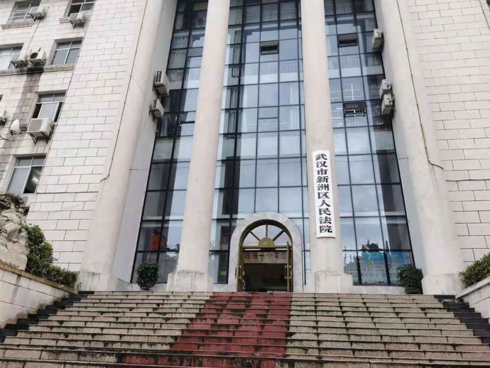

# 员工上班期间私自回宿舍做饭意外身亡，法院判决：不构成工伤

极目新闻记者 孙婷婷

通讯员 杨琳 董星星

员工工作时间私自回宿舍，在做饭期间突发疾病死亡，可以认定工伤吗？近日，武汉市新洲区人民法院审理了一起工伤待遇认定行政案件，依法判决驳回员工家属要求认定工伤的诉讼请求。

王某生前是某单位管理人员。2022年6月14日上午9时许，王某到达工作岗位，在处理完相关事务后，便在10点半左右离开了，回到其在单位内的住所。不久后，王某的家人来到该单位的办公区，向王某的同事求助，说王某在厨房炒菜时突然晕倒。

王某的同事赶到王某家中后，发现王某侧躺在厨房地上。王某的同事立即将其送医救治，但因抢救无效，王某当天中午被宣告死亡，死因为心源性猝死。

_武汉市新洲区法院_

2022年7月，王某的亲属向当地人社部门申请工伤认定。当地人社局认为王某不符合视同工伤的情形。王某的亲属不服，将当地人社部门告上了武汉市新洲区法院，请求撤销当地人社局作出的《不予认定工伤决定书》，并要求人社局重新作出工伤认定的决定。

法院经审理认为，根据相关规定，职工有下列情形之一的，视同工伤，即在工作时间和工作岗位，突发疾病死亡或者在 48
小时内经抢救无效死亡的。本案争议的主要问题在于，单位宿舍是否属工作岗位合理延伸的问题。本案中，王某工作的职责应是在单位办公楼或者与单位事务有关的区域。而王某突发疾病时，是在其单位宿舍，并非工作岗位，也非处理工作事务的其他场所，不符合在工作时间和工作岗位突发疾病视同工伤的情形，故判决驳回王某的亲属要求视同工伤的诉讼请求。

该判决作出后，王某的亲属不服，提起上诉，近日，二审法院判决驳回上诉，维持原判。

承办法官介绍，工伤保险是为了保障因工作遭受事故伤害或者患职业病的职工获得医疗救治和经济补偿的法律制度。视同工伤制度主要是针对在工作时间、工作岗位上突发疾病，不能坚持工作，需要紧急到医院进行抢救的情况而设定的，系考虑到在工作时间和工作岗位上突发疾病死亡或在
48
小时内经抢救无效死亡，可能与工作劳累、紧张等因素有关。实质上将工伤保险的保障范围由工作原因造成的事故伤害扩大到了在工作时间、工作岗位突发疾病死亡的情形，最大限度地保障了主观上无恶意的劳动者因工受伤后能够获得救济。因此，对“在工作时间和工作岗位”的理解不宜再扩大。工作岗位通常是指日常履行工作职责所在的场所，也包括受单位指派的其他工作岗位。本案事故发生时，王某未在工作岗位，也非处理工作事务，不符合视同工伤的情形。

承办法官提醒，用人单位作为劳动规则的制定者，通常在劳动关系中处于优势地位，为了保障作为弱势群体一方的劳动者，劳动法律法规偏重对劳动者合法权益的保护，以平衡双方地位。通过对“工作岗位、工作时间”进行延伸，扩大了工伤保险制度保障的范围，但这种保护并非无限制的。为此，广大劳动者、用人单位均应正确理解“视同工伤”的情形，从而正确对待工伤保险制度。

（通讯员供图）

（来源：极目新闻）

