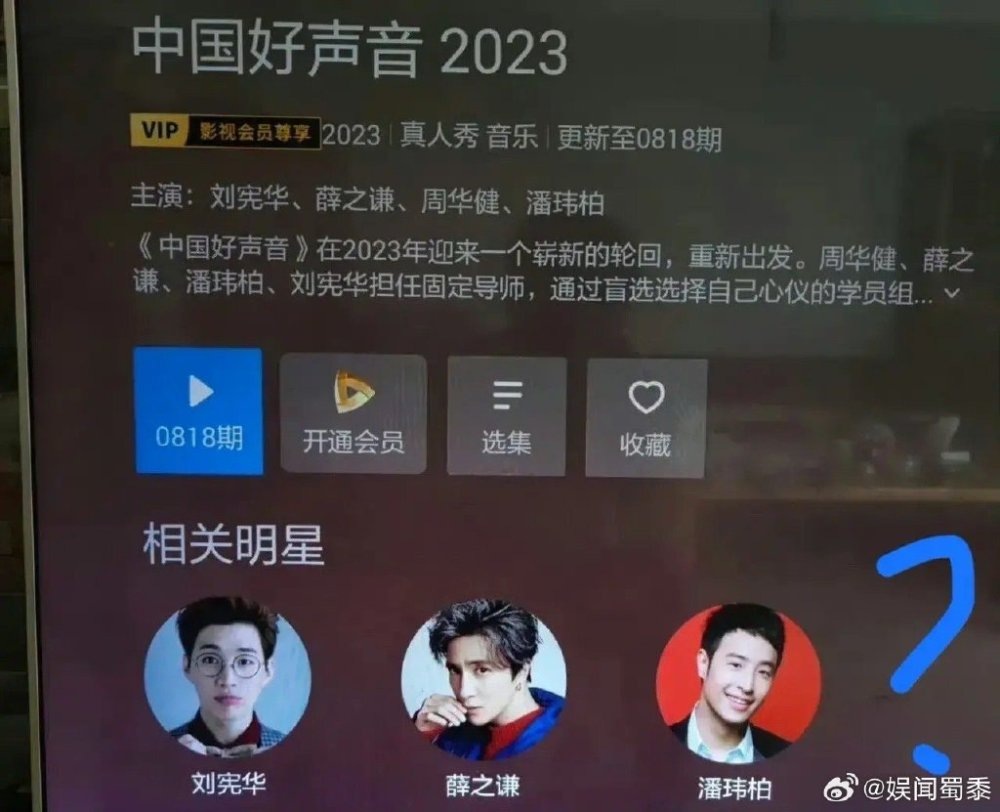

# 好声音节目组发律师声明，否认3000万买冠军、赔偿赞助商7亿等传言

9月1日，《中国好声音》制作方灿星文化委托律师发布声明，辟谣相关传言。

律师所表示就有关互联网平台上故意捏造散播虚假不实信息、损害委托人形象的网络造谣行为作出声明，诸如学员转身费50万元、学员3000万购买冠军、境外资本控制好声音、好声音导师退出、赔偿赞助商7亿、工作人员被带走等皆为谣言，系恶意捏造误导社会公众，给灿星文化造成巨大经济损失，

声明中指出，经调查发现，散布谣言的账号大部分是今年8月注册。

律师声明透露已取证，接受委托代为提出民事诉讼，依法起诉至法院追责，要求侵权主体删除相关内容，相关平台停止为谣言提供传播服务。

据悉，这是《中国好声音》制作方灿星文化第二份声明，此前节目组曾回应李玟录音事件，称与曾有误会但已经消除，指录音系恶意剪辑。

律师声明中指出“相关谣言给委托人造成巨大经济损失”，想必是指两方面，一方面是浙江卫视早前宣布暂停播出，直接打乱了节目组的播出安排及代言广告的播出，另一方面是灿星文化的母公司星空华文股价暴跌，从124港元跌到9月1日的24.7港元，市值已经不足100亿，直接蒸发了数百亿的市值，可谓损失惨重。

8月25日，星空华文就曾在港交所发布公告稳定股民情绪，称全力支持浙江卫视的决定，积极配合并提供一切协助。

此前，有传周华健已经退出节目组，节目组已经将其头像撤掉，但周华健经纪人火速否认，表示没有解约，会继续担任本季的导师。

到了9月1日，网传主持人华少被带走调查，消息传得沸沸扬扬，华少发文否认，并公开定位，自证清白。

